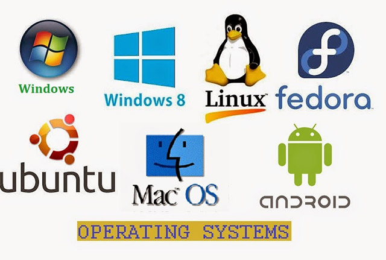

# `Hệ điều hành (Operating System-OS)`
## `Khái niệm`
Hệ điều hành là tập hợp các chương trình được tổ chức thành một hệ thống với nhiệm vụ đảm bảo tương tác giữa người dùng với máy tính, cung cấp các phương tiện và dịch vụ để điều phối việc thực hiện các chương trình, quản lý chặt chẽ các tài nguyên của máy, tổ chức khai thác chúng một cách thuận tiện và tối ưu.

## `Chức năng`
Các chức năng của hệ điều hành:
- Tổ chức giao tiếp giữa người dùng và hệ thống.
- Cung cấp các tài nguyên cho các chương trình và cách tổ chức thực hiện các chương trình đó.
- Tổ chức lưu trữ thông tin trên bộ nhớ ngoài, cung cấp các công cụ để tìm kiếm và truy cập thông tin.
- Quản lý các tài nguyên phần cứng, phần mềm trên máy như:
     + Các thiết bị đầu vào như chuột, bàn phím, màn hình cảm ứng, camera, micro
     + Các thiết bị đầu ra như màn hình, máy in và máy scan, loa
     + Các thiết bị mạng như modem, router, ăng-ten, modem WiFi, thẻ SIM
     + Các thiết bị lưu trữ như ổ cứng, USB, ổ SSD, bộ nhớ flash
- Cung cấp các dịch vụ tiện ích hệ thống.

Mỗi chức năng được một nhóm chương trình trong hệ điều hành đảm bảo thực hiện. Các nhóm chương trình này là các thành phần của hệ điều hành.

Về cơ bản các phần mềm đều có thể giao tiếp được với phần cứng, tuy vậy các phần mềm hiện nay đều viết cho hệ điều hành nhằm tận dụng các thư viện tiện ích chung, giúp lập trình viên không phải lo lắng vấn đề phần cứng.
## `Thành phần`
1. `Nhân (kernel)`
Nhân của hệ điều hành có vai trò kiểm soát những tính năng cơ bản của tất cả các thiết bị phần cứng trên máy. Vai trò chính của Kernel là đọc và ghi dữ liệu vào bộ nhớ, xử lý các lệnh thực thi, xác định cách thức nhận và gửi dữ liệu của các thiết bị như màn hình, bàn phím và chuột và xác định các diễn giải dữ liệu nhận được từ mạng.
2. `Giao diện người dùng UI`
- Giao diện dòng lệnh (Command Line Interface - CLI) nơi người dùng giao tiếp với hệ thống bằng các câu lệnh. VD: command prompt trong window.
- Giao diện người dùng đồ họa (GUI): sử dụng chuột click vào các biểu tượng. GUI của mỗi hệ điều hành cũng sẽ khác nhau.
3. `Giao diện lập trình ứng dụng (API)`
Thành phần cho phép các nhà phát triển viết code dạng module. API đóng vai trò quyết định cách hệ thống hoặc các thành phần khác có thể sử dụng một ứng dụng nhất định.

VD:  hệ điều hành windows chỉ có thể được sửa đổi và phân phối bởi chính công ty chủ quản. 
Trong khi Linux là phần mềm tự do mã nguồn mở