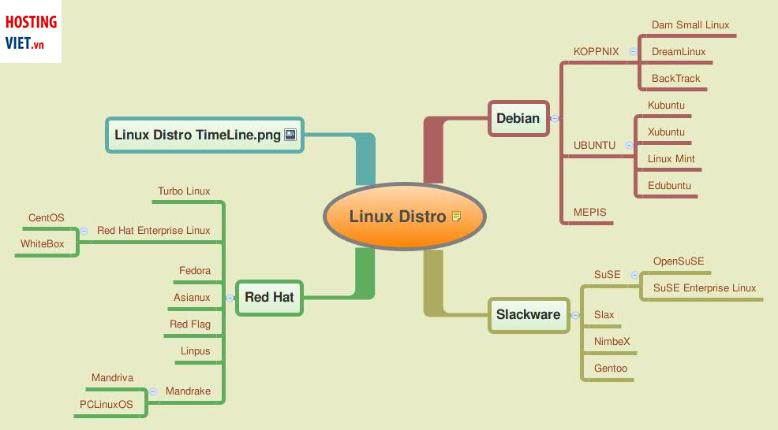
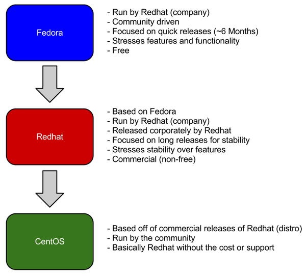

# `Distro Linux`
Bản phân phối Linux (Distro) là một tập hợp các ứng dụng, các gói ứng dụng (package), trình quản lý gói và các tính năng chạy trên nhân Linux, như vậy nhân Linux là dùng chung cho các bản phân phối – có đôi khi nhân này được tùy chỉnh lại theo tổ chức bảo trì bản phân phối.
## `Các bản distro linux`
Mỗi distro Linux sẽ hướng đến một nhóm đối tượng và phục vụ nhu cầu sử dụng khác nhau. Vì mã nguồn mở nên người dùng dễ dàng tùy ý điều chỉnh và đặt tên theo sở thích, miễn là tuân thủ theo quy định.

Hiện nay các distro linux được chia thành 4 nhóm chính:
-  `Nhóm 1`: Arch, Gentoo và Slackware  
Các các bản distrolinux này nhắm vào người dùng am hiểu Linux. Do đó, phần lớn các phương thức xây dựng, cũng như cấu hình của hệ thống được thực hiện qua dòng lệnh.
- `Nhóm 2`: Debian, Fedora 
Nhóm này nhắm đến sự chuẩn hóa quá trình phát triển phần mềm, nhằm tạo ra hệ thống hoạt động nhịp nhàng và hạn chế tối đa lỗ hỏng bảo mật.
- `Nhóm 3`: Centos, RHEL, SUSE EL 
Các bản distrolinux nhắm vào thị trường máy chủ, doanh nghiệp, cơ quan… Vì chúng có sự ổn định cao, thời gian ra phiên bản mới lâu, khoảng 3 – 5 năm tùy distrolinux.
- `Nhóm 4`: Ubuntu, Open SUSE, Linux Mint 
Đối tượng khách hàng của nhóm 4 là người mới bắt đầu dùng Linux và người dùng cuối. Rất thân thiện với người sử dụng -> cho người mới làm quen linux.

Tại Việt Nam, khi vấn đề bản quyền vẫn còn chưa được chú trọng thì hầu như giá trị các phần mềm cũng không được đầu tư thỏa đáng. Vì chúng có giá không hề rẻ. Điển hình như bản Windows 10 Home bản quyền giá $119.99. Giá trị này khá lớn với một cá nhân. Còn đối với doanh nghiệp thì khi nhân lên số lượng máy đang sử dụng, chắc chắn sẽ ra một con số ngân sách không hề nhỏ.

Vì thế, xu hướng tìm các bản phần mềm có key lậu ngày càng nhiều. Điều này dẫn đến rủi ro bị đánh cắp thông tin, cài mã độc, … khi bạn sử dụng chúng.

-----> Centos là lựa chọn tối ưu cho máy chủ (Red hat phải mất phí)
## `So sánh Red Hat Enterprise Linux và CentOS`

- `Giống`: Cả 2 đều dựa trên bản phân phối Red Hat Linux đã dừng phân phối vào năm 2004. Ngay khi Red Hat Linux biến thành Red Hat Enterprise Linux, nó đã hợp nhất với Fedora Project và CentOS (Community ENTerprise Operating System) ra đời.

CentOS ban đầu được hình thành sau khi Red Hat Linux đổi tên thành RHEL vào năm 2004, dưới dạng phiên bản cộng đồng của RHEL, được cung cấp miễn phí cho mọi người.

- `Khác`: CentOS được xây dựng trên mã nguồn từ RHEL, vì vậy chúng có nền tảng gần như giống hệt nhau. Cả hai đều rất đáng tin cậy với vai trò bản phân phối cho máy chủ.

Khác biệt duy nhất là RHEL được bảo hành và phát triển bởi Red Hat (tập đoàn) nên phải trả phí còn CentOS do cộng đồng phát triển nên không được đảm bảo. 
Tuy vậy CentOS rất phổ biến ở VN do độ tin cậy không kém RHEL và miễn phí. 
RHEL dành cho những tập đoàn có điều kiện và muốn cảm giác được an toàn khi có Red Hat chịu trách nhiệm. RHEL và windows server đang cạnh tranh nhau trên lĩnh vực server.
- `2 HĐH này sử dụng đuôi file: .rmg vì vậy các file .deb trên ubuntu hay debian đều không dùng được trên 2 hđh này`
## `So sánh Debian và Ubuntu`
Debian là một hệ điều hành chỉ bao gồm các phần mềm mã nguồn mở miễn phí hoạt động từ năm 1993, dự án này từ lúc ra đời đến nay luôn nhân được tôn trọng lớn trong cộng đồng các nhà phát triển.

Ubuntu là một nhánh của Debian. Về cơ bản sáu tháng một lần, Ubuntu sử dụng nhánh "không ổn định" của Debian (thực sự hoạt động khá tốt), tùy biến riêng của họ (về mặt UI là đáng kể) và phát hành nó.

Ubuntu có một bản phát hành mới cứ sau sáu tháng. Debian có một chính sách hơi khác: chúng có ba nhánh - ổn định, thử nghiệm và không ổn định. (đơn giản hóa một chút ở đây.) Nhánh không ổn định sẽ nhận được các gói mới ngay khi chúng được tải lên. Nếu bạn muốn phiên bản mới nhất của gói, Debian không ổn định là thứ bạn muốn. Nhánh thử nghiệm của Debian khá giống, ngoại trừ việc có thời gian gia hạn hai tuần giữa khi một gói chuyển từ không ổn định sang thử nghiệm. Và hầu hết thời gian, thử nghiệm là nơi chúng dừng lại - một phiên bản không ổn định mới được phát hành, được đưa vào thử nghiệm, và cứ tiếp tục như thế. Tuy nhiên, hàng năm hoặc lâu hơn, Debian sẽ đóng băng nhánh thử nghiệm và chuẩn bị nó trở thành bản phát hành ổn định tiếp theo.
`-> Vì được kiểm chứng như vậy nên Debian nhánh ổn định thích hợp làm hđh server.`
- Ubuntu rẽ nhánh từ Debian năm 2004
- Ubuntu phát hành phiên bản mới cứ sau 6 tháng trong khi Debian phát hành 2 năm một lần
- Ubuntu được cài đặt sẵn các chương trình Mozilla trong khi Debian chạy các phiên bản sửa đổi giống nhau
- Ubuntu có một công ty hỗ trợ nó trong khi Debian được phân cấp
- Ubuntu là bản phân phối Linux hàng đầu với Debian đứng thứ hai
- Ubuntu là bản phân phối Linux phổ biến nhất và Debian nằm ở đâu đó trong danh sách
- Ubuntu tốt hơn cho người mới bắt đầu so với Debian