<h1 style="color:orange"> Vim</h1>
Trong hệ thống Linux (nhất là quản trị các Server Linux) để soạn thảo một file text như các file config thường dùng trình soạn thảo tại dòng lệnh, phổ biến là sử dụng trình soạn thảo dòng lệnh `Vim` hoặc `Nano` 
Vim thường được sử dụng để gõ lệnh trên terminal, vì vậy nếu bật vietkey hay chương trình tương tự sẽ xảy ra lỗi trong vim.

- Muốn mở tùy chỉnh file = vim sử dụng:

       # vim example.txt
- Nếu chưa có vim thì sử dụng lệnh:
       
       # sudo apt-get install vim (ubuntu)
       # yum install vim (CentOs)
<h2 style="color:orange">Các chế độ trong Vim</h2>
<h3 style="color:orange"> Insert mode</h3>
Khi đang trong chế độ nhập lệnh bạn gõ "i" hoặc nhấn INSERT sẽ vào chế độ INSERT
(Ở cửa sổ lệnh có hiện thị chữ -- INSERT --)

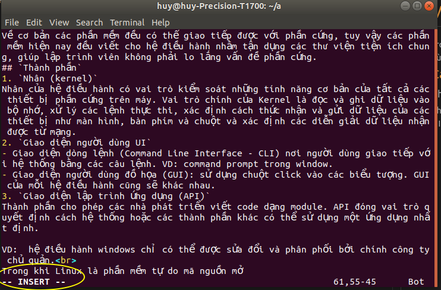
Khi ở chế độ INSERT thì có thể gõ chữ để chèn nội dung mới vào. Khi đã chỉnh sửa xong nội dung quay trở về chế độ nhập lệnh bằng cách nhấn phím ESC

<h3 style="color:orange"> Command mode</h3>
Command mode (normal mode) là nơi gõ lệnh. Bật vim lên là vào mode này luôn.

<h3 style="color:orange"> Visual mode</h3>
- Là nơi chọn text để chỉ thao tác trên đó

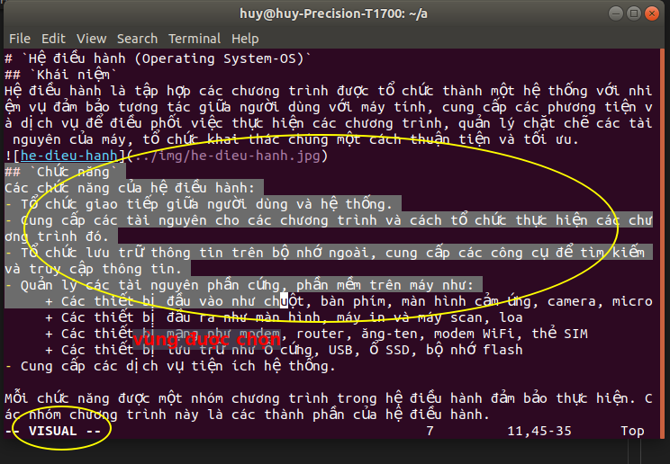
Để chọn vùng text trong vim ấn phím "v" và "V"
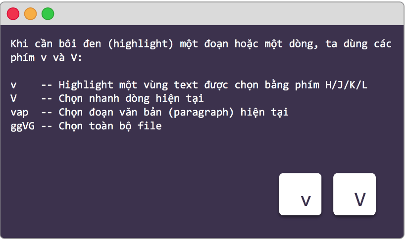
Ngoài ra, có thể dùng v + số số dòng muốn di chuyển + phím mũi tên lên hoặc xuống để bôi đen nhanh.
<h2 style="color:orange">Các lệnh cơ bản trong Vim</h2>

- `Trở lại thay đổi trước` 
Nhấn phím "`u`" để quay lại thay đổi; tương tự `Crtl + Z` trong windows
- `Di chuyển con trỏ trong file` 
Đầu tiên là 4 phím quan trọng nhất khi sử dụng VIM, đó là H, J, K, và L:

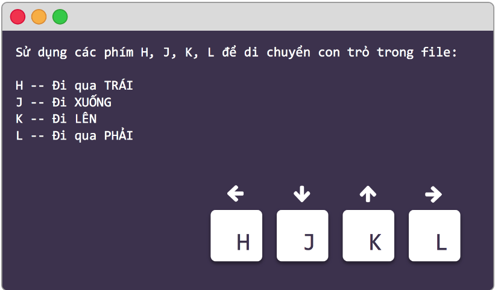

Di chuyển nhanh về đầu và cuối dòng có "$" và "0":
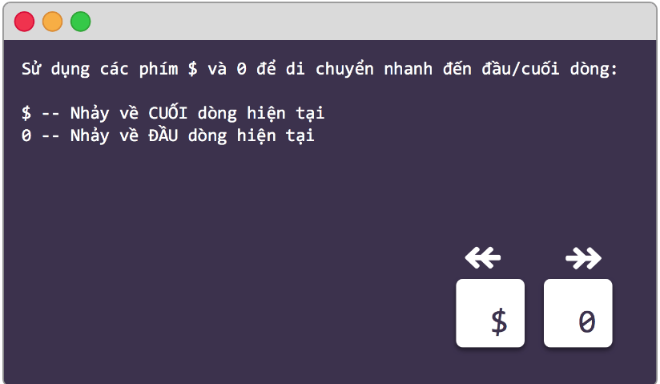
Để dịch chuyển nhanh về đầu hoặc cuối file có phím "gg" hoặc "G":
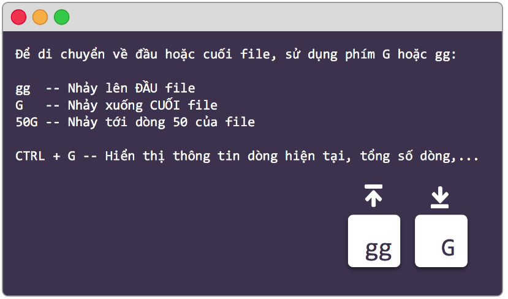
Ta có thể sử dụng ":25" để move tới dòng 25 của file

- `Tìm kiếm:` 
Để tìm kiếm nội dung trong file sử dụng "/","?","n"
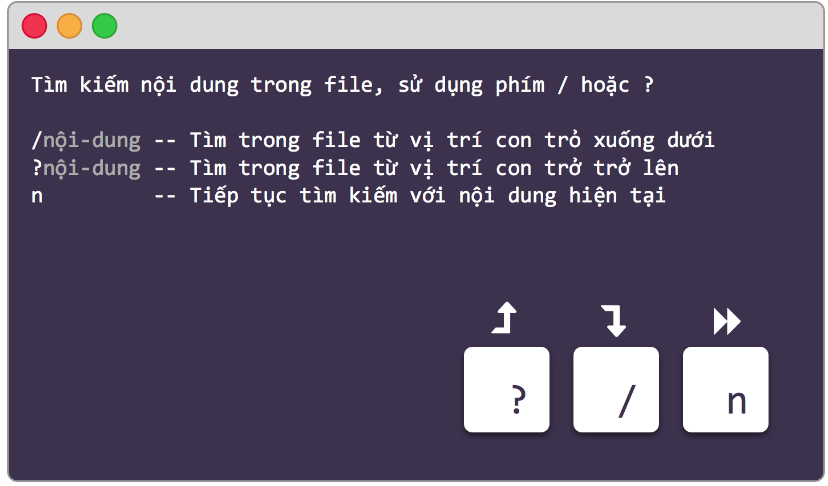

- `Chỉnh sửa trong vim:` 
Để vào các mode chỉnh sửa trong vim
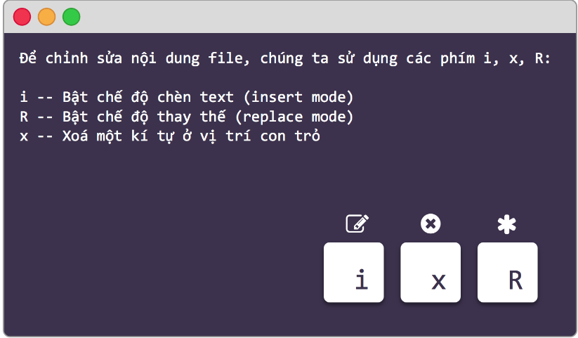

- `Lưu và thoát file Vim:`
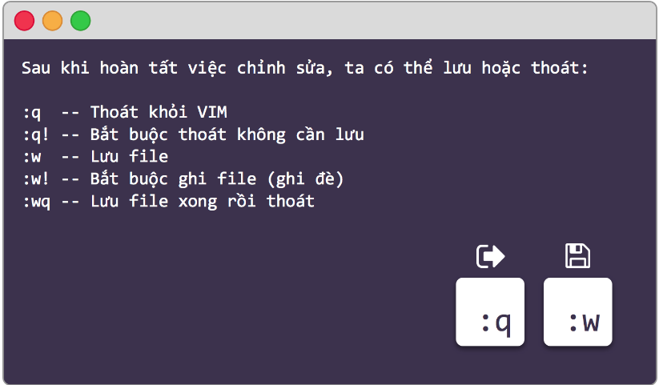

- `Cut,Copy,Paste` 
    - `y` để copy text được chọn (bôi đen bằng "v")
    - `p` để paste
    
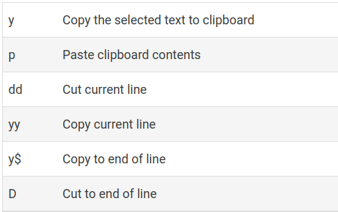
- `Đánh dấu`: 
Khi trong 1 file có quá nhiều thông tin thì phải đánh dấu lại để tìm cho dễ .
    -  `m {a-z}` để đánh dấu chỗ hiện tại của con trỏ
    - `{a-z}` để truyển tới vị trí được đánh dấu
    - `''` để truyển tới vị trí trước đó
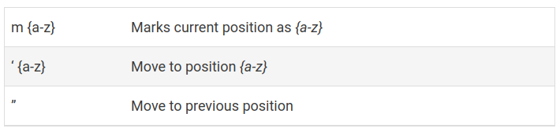
VD: đánh dấu vị trí hiện tại gõ `m`
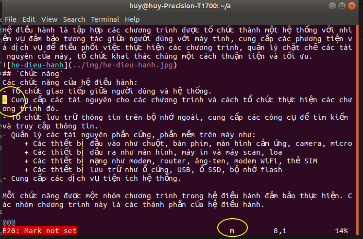 
 rồi nhấn `a` đánh dấu vị trí hiện tại

<h3 style="color:orange">Các lệnh khác</h3>

- `vU` để biến toàn bộ text được chọn thành viết hoa

- `sh` tạm thời quay lại terminal
- `$exit` quay lại vim
- `:set nu` để hiển thị số dòng
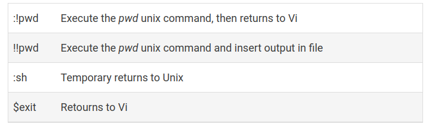