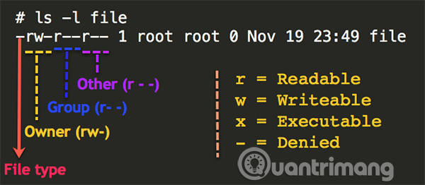
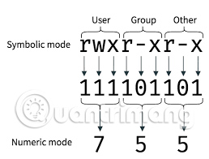
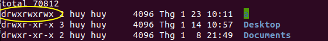

<h1 style="color:orange">Lệnh CHMOD</h1>
Linux phân chia người dùng như sau:

- Mỗi file đều có chủ sở hữu `(owner)`, xác định “user class” (lớp người dùng) của file. 
- Mỗi file cũng có một nhóm `(group)`, xác định “group class” (lớp nhóm) của file. 
- Bất kỳ người dùng hệ thống nào không phải là chủ sở hữu và không thuộc cùng một nhóm đều được xác định là thuộc lớp khác `(others)`.
<h2 style="color:orange">Quyền truy cập</h2>

Định dạng đầu tiên được gọi là `symbolic notation` (ký hiệu tượng trưng), ​​là một chuỗi gồm 10 ký tự: Một ký tự đại diện cho loại file và 9 ký tự đại diện cho các quyền đọc (r), ghi (w) và thực thi (x) của file theo thứ tự chủ sở hữu, nhóm, và những người dùng khác. Nếu không được phép, biểu tượng dấu gạch ngang (-) sẽ được sử dụng.

- Ở đây, `file type` có 2 TH:
     - `-` là files
     - `d` là directory (thư mục)

Định dạng thứ hai được gọi là `numeric notation` (ký hiệu số), là một chuỗi gồm ba chữ số, mỗi chữ số tương ứng với user, nhóm và các quyền khác. Mỗi chữ số có thể nằm trong khoảng từ 0 đến 7 và mỗi giá trị của chữ số có được bằng cách tính tổng các quyền của lớp:

0 có nghĩa là không có quyền nào được cho phép. 
+1 nếu lớp có thể thực thi file. 
+2 nếu lớp có thể ghi vào file. 
+4 nếu lớp có thể đọc file. 
Nói cách khác, ý nghĩa của từng giá trị chữ số là:

0: Không được phép thực hiện bất kỳ quyền nào 
1: Thực thi 
2: Viết 
3: Viết và thực thi 
4: Đọc 
5: Đọc và thực thi 
6: Đọc và viết 
7: Đọc, viết và thực thi 
Vì vậy, ở ví dụ: -rwxr-xr-- sẽ là 754 trong ký hiệu số. Đó là quyền đối với file Linux một cách ngắn gọn.

<h2 style="color:orange">Định dạng lệnh</h2>
Lệnh `chmod` có định dạng:

    # chmod [permissions] [file]

- Danh sách các option: 
     - R: Recursive, áp dụng cho tất cả các file và folder bên trong
     - f: force, set quyền trong cả trường hợp xảy ra lỗi
     - v: verbose, hiển thị đối tượng đã xử lý

Quyền có thể được cung cấp trong ký hiệu số, đây là định dạng tốt nhất để sử dụng khi bạn muốn gán quyền cụ thể cho tất cả các lớp:

    # chmod 644 /home/Documents/example.txt
Nếu muốn áp dụng một nhóm quyền cụ thể cho tất cả các file và mục trong một thư mục cụ thể sử dụng tùy chọn -R và nhắm mục tiêu tới một thư mục:

    # chmod -R 755 /home/Documents/example_directory
- Quyền cũng có thể được cung cấp trong ký hiệu tượng trưng, ​​rất hữu ích khi bạn chỉ muốn sửa đổi các quyền của một lớp cụ thể. Ví dụ:

        # chmod u=rwx example.txt 
        # chmod g=rw example.txt 
        # chmod o=rw example.txt 
Bạn có thể sửa đổi quyền cho nhiều lớp, chẳng hạn như ví dụ này cho chủ sở hữu quyền đọc/ghi/thực thi nhưng nhóm và các người dùng khác chỉ có quyền đọc/thực thi:

      # chmod u=rwx,g=rw,o=rw example.txt
Khi gán cùng một quyền cho nhiều lớp, bạn có thể kết hợp chúng:

    # chmod u=rwx,go=rw example.txt
Nhưng lợi ích của việc sử dụng ký hiệu tượng trưng sẽ được thấy rõ khi bạn chỉ muốn thêm hoặc xóa quyền cho một hành động cụ thể đối với một lớp.

Ví dụ, lệnh sau thêm quyền thực thi cho chủ sở hữu file:

    # chmod u+x example.txt
Và lệnh này loại bỏ quyền ghi và thực thi cho người dùng khác:

    # chmod o-wx example.txt

Ở mode 777 file hoặc thư mục có màu xanh:

<h1 style="color:orange">Lệnh CHOWN (Change owner)</h1>
Nếu một người dùng bình thường muốn chỉnh sửa file, superuser có thể dùng lệnh chown command này để thay đổi ownership và cho phép họ chỉnh sửa

Cấu trúc lệnh của CHOWN có dạng:

     # chown [OPTIONS] [USER][:GROUP] filename(s)
VD:
1. Khi muốn đổi user của 1 file:
     
        # chown huy file1.txt (user huy)
2. Khi muốn đổi chỉ group 1 file:
        
        # chown :nhom1 file1.txt (group nhom1)
3. Khi muốn đổi cả user và group:
       
        # chown huy:nhom1 file1.txt
- Để kiểm tra owner và group 1 file gõ: ls -l sẽ trả ra kết quả. VD: 

      -rw-r--r--  1 huy nhom1  0 Feb 19 22:01 file1.txt 
<h2 style="color:orange">CHOWN cho thư mục</h2>
Chown command áp dụng lên thư mục, tuy nhiên, nếu dùng thông thường thì không áp dụng được cho file và thư mục con bên trong thư mục áp dụng. Vậy để thay đổi ownership cho toàn bộ thư mục con và file bên trong thư mục đó, chúng ta cần thực hiện lệnh một cách đệ quy. 
Rất đơn giản, chúng ta chỉ cần thêm tùy chọn -R khi chạy lệnh:
   
     # chown -R [USER][:GROUP] Directory
VD: 
     # chown -R huy:nhom1 /home/user/system
<h2 style="color:orange">CHOWN cho link</h2>
Chown command có thể được dùng trên symbolic link và soft link. Symbolic link là liên kết tham chiếu tới vị trí file gốc vật lý đã tồn tại. Lệnh ln được dùng để tạo soft links. Ví dụ như file chownSample.txt, tạo symbolic link bằng lệnh sau:

     # ln -s tên-file tên-link
     # ln -s file1.txt link1
Lệnh có cấu trúc tương tự đổi file. Tuy vậy nếu muốn thực sự đổi ownership thì phải thêm option -h:

     # chown -h [USER][:GROUP] linkname(s)
     # chown -h huy:nhom1 link1