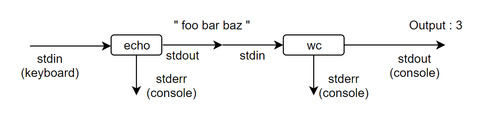

<h1 style="color:orange">Pipe command</h1>
Ý nghĩa : sử dụng đầu ra của lệnh này làm đầu vào của lệnh khác .

Sử dụng lệnh đường ống pipe sẽ giúp kết hợp các lệnh 1 cách linh hoạt và mang lại nhiều lợi ích cho việc lọc dữ liệu kết quả.

    # command_1 | command_2 | command_3 ...

vd: Xét lệnh sau

    # echo "foo bar baz" | wc -w

