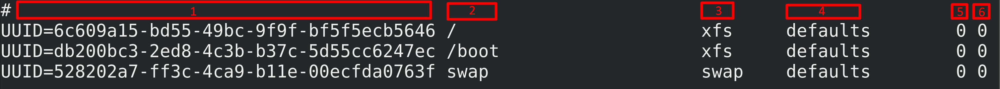
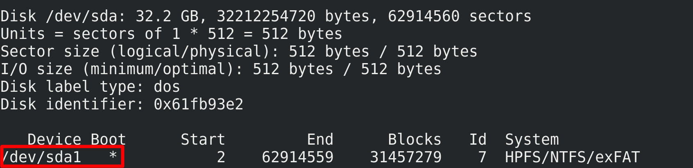
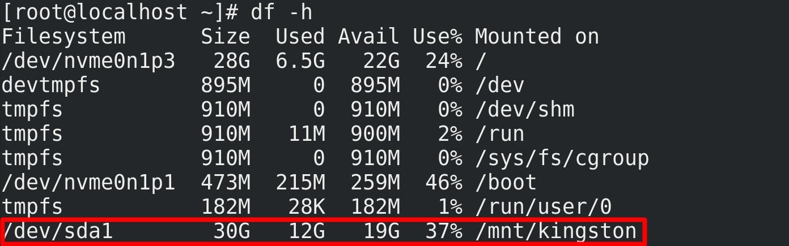

<h1 style="color:orange">1.file /etc/fstab</h1>
Fstab ( file system table ) là 1 bảng lưu trữ thông tin các thiết bị , mount point và các thiết lập của nó .

Khi khởi động , Linux sẽ đọc thông tin trong file này và tiến hành tự động mount thiết bị .

Vì file fstab được lưu dưới dạng plain text nên có thể chỉnh sửa dễ dàng .

Xem nội dung file fstab :

    # cat /etc/fstab

- `Cột 1` : Lưu tên thiết bị ( UUID ) hoặc đường dẫn tới file thiết bị trong thư mục /dev
- `Cột 2` : Cho biết mount point ( thiết bị được mount đến thư mục nào)
- `Cột 3` : Định dạng file system của thiết bị . Thông thường là ext3, ext4 , reiserfs , swap , ISO 9660 , vfat , ntfs , nfs , xfs , auto ...
- `Cột 4` : Các tùy chọn . Nếu có nhiều tùy chỉnh thì chúng được phân cách bởi dấu phẩy . Dưới đây là 1 số tùy chọn đáng chú ý : 
.auto : tự động mount thiết bị khi khởi động 
.noauto : phải chạy lệnh mount khi khởi động hệ thống 
.user : cho phép người dùng thông thường được quyền mount 
.nouser : chỉ có user root mới có quyền được mount 
.exec : cho phép chạy các lệnh nhị phân ( binary ) trên thiết bị 
.noexec : không cho phép chạy các lệnh nhị phân ( binary ) trên thiết bị 
.ro ( read-only ) : chỉ cho phép quyền đọc trên thiết bị 
.rw ( read-write ) : cho phép quyền đọc / ghi trên thiết bị 
.sync : thao tác nhập xuất ( I/O ) trên file system được đồng bộ hóa 
.async : thao tác nhập xuất ( I/O ) trên file system diễn ra không đồng bộ 
.defaults : tương đương các tập tùy chọn rw, suid, dev, exec, auto, nouser, async 
- `Cột 5` : là tùy chọn cho chương trình sao lưu file system ( dump ): 
.0 - bỏ qua việc sao lưu 
.1 - thực hiện sao lưu 
- `Cột 6` : là tùy chọn cho chương trình fsck dò lỗi file system :
.0 - bỏ qua việc kiểm tra 
.1 - thực hiện việc kiểm tra 
<h2 style="color:orange">2.Tên các thiết bị trong linux</h2>

1. CD ROM: đĩa CDROM / DVD
2. hd* : ổ đĩa IDE , ATA
- hda : ổ cứng thứ nhất
- hdb : ổ cứng thứ hai 
hdb1 : phân vùng thứ nhất của ổ cứng thứ nhất
3. sd* : ổ đĩa SCSI , SATA ( SSD , HDD ) , USB
- sda : ổ cứng thứ nhất
- sdb : ổ cứng thứ hai 
sdb1 : phân vùng thứ nhất của ổ cứng thứ nhất
4. nvme0* : ổ cứng SSD NVMe
- nvme0n1 : ổ nvme thứ nhất
- nvme0n2 : ổ nvme thứ hai 
nvme0n2p1 : phân vùng thứ nhất của ổ nvme thứ nhất
5. tty* : cổng giao tiếp ( COM ,...)
6. eth*: cổng Ethernet
<h2 style="color:orange">3.Mount thiết bị trong linux</h2>
Cấu trúc lệnh:

    #  mount [options] [device_name] [mount_point]
Options :
- -v : chế độ chi tiết , cung cấp thêm thông tin về những gì mount định thực hiện
- -w : mount hệ thống tập tin với quyền đọc và ghi
- -r : mount hệ thống tập tin chỉ có quyền đọc
- -t : xác định lại hệ thống tập tin được mount . Những loại hợp lệ là ext2 , ext3 , ext4 , vfat , iso9600 ,...
- -a : mount tất cả các hệ thống tập tin được khai báo trong fstab
- o : remount ( fs ) chỉ định việc mount tại 1 file system nào đó

VD: Mount USB Kingston 32gb vào server
1. B1: kiểm tra xem máy nhận USB chưa = lệnh:

        # fdisk -l

2. B2: Tạo thư mục để mount trong /mnt

        # mkdir /mnt/kingston
3. B3: mount
        
        # mount /dev/sda1 mnt/kingston
4. B4: 
        
        # df -h
để kiểm tra

Unmount thiết bị ( để ngắt thiết bị khỏi hệ thống ) :

    # umount /mnt/kingston hoặc
    # umount /dev/sda1