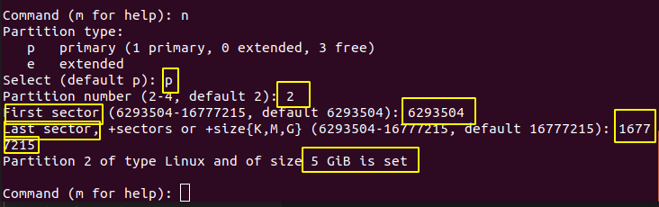

<h1 style="color:orange">Chia ổ cứng CentOS7</h1>
Đầu tiên sử dụng lệnh
  
    # fdisk -l
để hiển thị dung lượng ổ đĩa

Ở đây đã có sẵn 1 ổ 10Gb của hệ thống và được phân 2 vùng: 
/dev/sda1 
/dev/sda2 
Và ổ sdb 8Gb chưa được phân vùng.
<h3 style="color:orange">Bước 1</h3>
Để tiến hành phân vùng chúng ta sử dụng command: 
    
    # fdisk <ten_o_dia>
    Ở đây là fdisk /dev/sdb
 
Ấn m để xuất hiện bảng trợ giúp 
 
<h3 style="color:orange">Bước 2</h3>
Ấn "n" để bắt đầu chia ổ: 

 
Ấn p để chọn ổ primary 
Ấn e để chọn ổ extended 

Ở đây chọn p để tạo ổ primary 
 
- 1 là số thứ tự
- First Sector: 2048 là điểm lưu trữ đầu tiên của ổ cứng
- Last Sector: +3G để quy định dung lượng của ổ được chia
và cuối cùng là `Partition 3GiB được set`(1 Gib xấp xỉ 1,074Gb)

Tương tự lấy ổ 2 là phần còn lại: 5Gb
 

Cuối cùng ấn "w" để lưu:

    # fdisk -l lại 
    hoặc # lsblk 
để xem kết quả

<h3 style="color:orange">Bước 3</h3>
Để phân vùng ổ cứng có thể mount được ta phải format phân vùng đó

Sử dụng lệnh: # mkfs
 
mk -> TAB sẽ ra các kiểu file system lưu trữ. SỬ dụng lệnh:

    # mkfs.ext4 /dev/sdb1
để mount ổ sdb1:

<h3 style="color:orange">Bước 4. Mount phân vùng</h3>
Dùng lệnh:

    # mount /dev/sdb1 /root/b
để mount phân vùng ổ cứng.

Sau đó dùng lệnh # df -h để kiểm tra cho kết quả như hình.
<h3 style="color:orange">Bước 5. Lưu mountpoint vào fstab</h3>
Lưu mountpoint vào file /etc/fstab với câu lệnh:

    # echo dev/sdb1 /root/b ext4 defaults 0 0 >> /etc/fstab
hoặc chỉnh sửa thủ công bằng lệnh:
    
    # vim /etc/fstab

<h2 style="color:orange">2. Để xóa partition đã chia</h2>
Sử dụng lệnh:

     # fdisk <tên_ổ_đĩa>
     VD: # fdisk /dev/sdb

Nhấn "d" để thực hiện lệnh xóa ổ 
----> Chọn phân vùng (ở đây chọn 2) 
----> "w" để lưu.