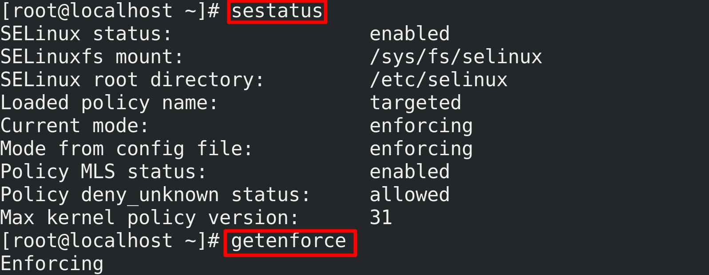
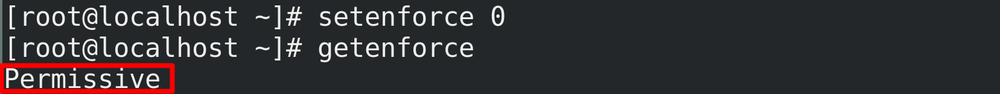
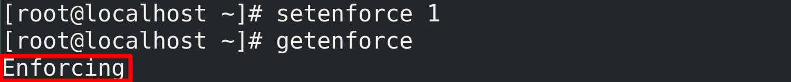

<h1 style="color:orange">1.SELinux</h1>
SELinux (Secure-enhanced Linux) là 1 tính năng bảo mật của Linux kernel, được thiết kế để bảo vệ máy chủ chống lại cấu hình sai và/hoặc các compromised daemons(các chương trình chạy nền). Nó đặt các giới hạn và chỉ thị cho server và các chương trình: những file nào user có thể truy cập và những hành động nào user có thể thực hiện bằng cách đưa ra một chính sách bảo mật.
<h2 style="color:orange">2.DAC (Discretionary Access Control - Truy cập theo quyền)</h2>
DAC có sẵn trong linux. 
DAC giới hạn một ứng dụng (tiến trình) chạy trong hệ thống dưới user hoặc (UID, SUID) hoặc 1 group, user hoặc group đó được phân các quyền tương tác với các đối tượng của hệ thống như các file, socket, các tiến trình khác.

Tuy vậy, nhược điểm của DAC là khi hacker tấn công vào chương trình (ứng dụng) thì nó có thể  tác động vào tất cả file thuộc quyền của user hoặc group đó, bao gồm cả file hệ thống.
<h2 style="color:orange">3. MAC (Mandatory Access Control)</h2>
SELinux cung cấp MAC, tích hợp trong nhân Linux (MAC có sau DAC) được NSA và cộng đồng phát triển.

SELinux cho phép quản trị viên máy chủ xác định các quyền khác nhau cho tất cả quy trình. 
Phương pháp này thực thi theo nguyên tắc" quyền tối thiểu " và an toàn hơn . Các chương trình khi chạy chủ có thể làm những gì chúng cần để thực hiện nhiệm vụ , ngoài ra không được làm gì khác
VD: Một người dùng apache với sự cho phép đầy đủ chỉ có thể truy cập thư mục /var/www/html, nhưng không thể chạm vào các phần khác của hệ thống như thư mục /etc.

Về cơ bản, `SE Linux` vẫn giữ nguyên các đặc tính của `DAC` và thêm vào các chức năng trên giúp hệ thống an toàn hơn rất nhiều.
<h2 style="color:orange">4. Có nên tắt SElinux?</h2>
Nên nhận thức rằng , khi tắt SE Linux đi , tức là đang loại bỏ 1 cơ chế bảo vệ hệ thống khỏi những rủi ro bảo mật . Nhưng cũng nên hiểu rằng SE Linux là 1 cơ chế bảo mật Linux thuộc dạng nâng cao của CentOS/RHEL nên việc tìm hiểu cách sử dụng thông thạo cũng rất mất thời gian . Và tất nhiên nếu đã biết dùng SE Linux thì sẽ thật tuyệt khi hệ thống CentOS/RHEL được mang 1 lớp áo bảo vệ .

Tuy nhiên , với những người dùng cơ bản như quản lý VPS / Hosting hay những người không cần sự rườm rà thì hãy tắt ngay SE Linux đi , vì khi cài đặt và vận hành hệ thống Linux trên CentOS/RHEL sẽ rất hay vướng phải các rule xử lý quyền hạn của SE Linux gây mất thời gian tìm hiểu và xử lý vấn đề , gián đoạn các hoạt động dịch vụ khác.
<h2 style="color:orange">5. Tắt SElinux</h2>

1. Kiểm tra trạng thái hoạt động SElinux

       # sestatus (enabled hoặc disabled)
       # getenforce (enforcing hoặc permissive)

2. Tắt SElinux tạm thời
Chỉ tắt SE Linux tạm thời trong thời gian hệ thống còn đang chạy. Nếu hệ thống restart lại thì tính năng SE Linux sẽ khôi phục lại trạng thái ban đầu trước khi bị tắt tạm thời

Để tắt SE Linux tạm thời ( permissive ):

       # setenforce 0
Để bật lại: 
       # setenforce 1

3. Tắt SELinux vĩnh viễn (không tự động bật khi reboot)

Chỉnh sửa lại file /etc/selinux/config, thay đổi giá trị cấu hình SE Linux từ Enforcing sang disabled.
 
     # vi /etc/selinux/config

Có 2 cấu hình tắt SE Linux :
- permissive : chuyển chế độ SE Linux sang chế độ cho phép mọi hoạt động truy cập thực thi từ tiến trình và file trên hệ thống được thông qua ( tạm thời )
- disabled : SE Linux sẽ chuyển cơ chế tắt hoàn toàn tính năng quản lý truy cập của SE Linux trong kernel

Kiểm tra:
     
      # sestatus