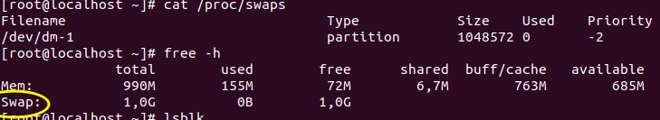
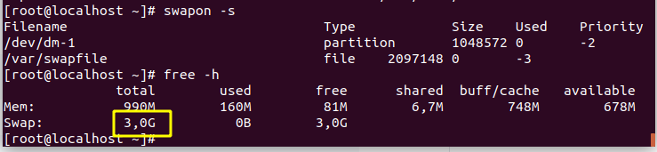

<h1 style="color:orange">Swap</h1>

- Swap là khái niệm bộ nhớ ảo được sử dụng trên Linux . Khi VPS/Server hoạt động , nếu hết RAM hệ thống sẽ tự động dùng 1 phần ổ cứng để làm bộ nhớ cho các ứng dụng hoạt động.
- Với những server không có swap , khi hết RAM hệ thống thường tự động stop service MySQL do đó hay xuất hiện thông báo lỗi "Establishing a Database Connection"
- Do sử dụng ổ cứng có tốc độ chậm hơn RAM, nhất là những Server không dùng SSD, do đó không nên thường xuyên sử dụng swap, sẽ làm giảm hiệu năng hệ thống.

<h2 style="color:orange">2. Swapiness</h2>
Swappiness là mức độ ưu tiên sử dụng swap, khi lượng RAM còn lại bằng giá trị của swappiness (tính theo %) thì swap sẽ được sử dụng.

Swappiness có giá trị từ 0 -> 100: 
.= 0 : swap chỉ được dùng khi RAM bị sử dụng hết 
.= 10 : swap được sử dụng khi RAM còn 10% 
.= 60 : swap được sử dụng khi RAM còn 60% 
.= 100 : swap được sử dụng ưu tiên như là RAM 
=> Do swap chậm hơn RAM => nên đặt swappiness về gần 0 (hoặc chỉnh là 10)
<h3 style="color:orange">2.1. Kiểm tra Swapiness</h3>
Kiểm tra swap bằng lệnh:

    # cat /proc/sys/vm/swappiness
<h3 style="color:orange">2.2. Cấu hình Swapiness</h3>

- Chỉnh thông số swappiness mặc định thành 10

        # sudo sysctl vm.swappiness=10
- Lưu thông số swappiness vào file /etc/sysctl.conf
        
        # sudo vim /etc/sysctl.conf
=> Thêm dòng "vm.swappiness =10" 
=> Dùng lênh:
        
        # reboot
        hoặc sysctl -p để áp dụng

<h2 style="color:orange">3. Cách tạo swap</h2>

1. Bước 1: Kiểm tra phân vùng swap:
     
        # cat /proc/swaps
        hoặc swapon -s
        hoặc free -h

Ví dụ ở đây swap có giá trị là 1gb. 

2. Bước 2: lệnh 
     
        # lblsk
để xem phân vùng ổ cứng

3. Bước 3 :Tạo file Swap:

        # dd if=/dev/zero of=/var/swapfile bs=1M count=2048
Trong đó: 
.bs là đơn vị tính ( M , G , K) 
.count là số lượng bs cấp cho swap file 
=> swap file có dung lượng = count*bs 

4. B4 : Tạo phân vùng swap :

       # mkswap /var/swapfile
5. B5 : Kích hoạt swap :

       # swapon /var/swapfile
6. B6 : Kiểm tra lại trạng thái swap :
       
       # swapon -s

7. B7 : Lưu cấu hình vào file /etc/fstab :
       
       # echo /var/swapfile none swap defaults 0 0 >> /etc/fstab
8. B8 : Bảo mật file swap :
       
       # chown root:root /var/swapfile
       # chmod 0600 /var/swapfile
<h2 style="color:orange">4. Cách thay đổi dung lượng swap</h2>

1. B1 : Tắt swap :

       # swappoff /var/swapfile
2. B2 : Xóa file swap :

       # rm -f /var/swapfile
3. B3 : Tạo mới lại file swap với dung lượng mong muốn :

       # dd if=/dev/zero of=/var/swapfile bs=1M count=4096
4. B4 : Tạo phân vùng swap mới :

       # mkswap /var/swapfile
5. B5 : Kích hoạt swap :

       # swapon /var/swapfile
6. B6 : Bảo mật file swap :
       
       # chown root:root /var/swapfile
       # chmod 0600 /var/swapfile
7. B7 : Kiểm tra lại swap :

       # swapon -s