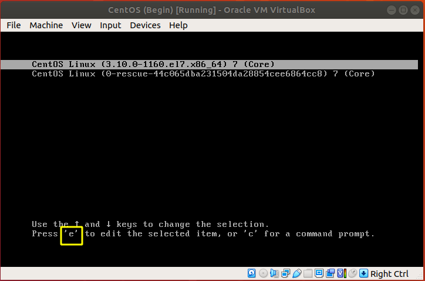
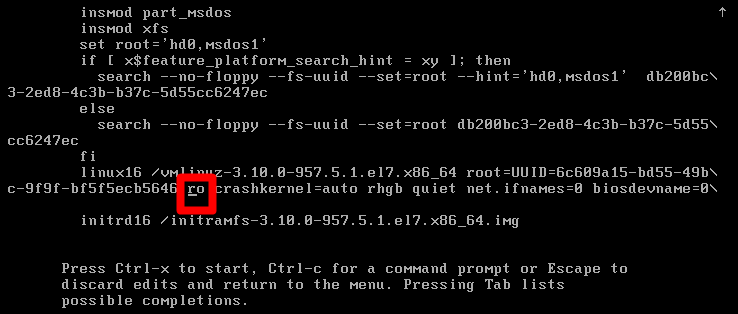
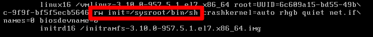
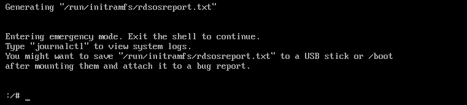
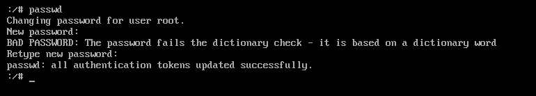
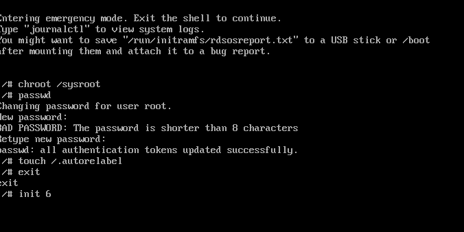

<h1 style="color:orange">Root password recovery</h1>
Trường hợp quên password root, có thể lấy lại từ lúc boot centos
<h2 style="color:orange">1.Bước 1: tại màn hình khởi động centos 7</h2>

<h2 style="color:orange">2.Bước 2: Thay thế "ro" => "rw init=/sysroot/bin/sh"</h2>

<h2 style="color:orange">3.Bước 3: Crtl + x để vào Single user mode</h2>

<h2 style="color:orange">4.Bước 4: Truy cập hệ thống bằng lệnh</h2>

     # chroot /sysroot

<h2 style="color:orange">5.Bước 5: Tạo mật khẩu mới cho user root</h2>

    # passwd

<h2 style="color:orange">6. Bước 6: Update thông tin vào SELinux và thoát khỏi chế độ chroot</h2>

    # touch /.autorelabel
    # exit

=> reboot lại và vào centos7 bằn mật khẩu mới tạo.