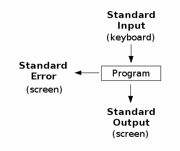
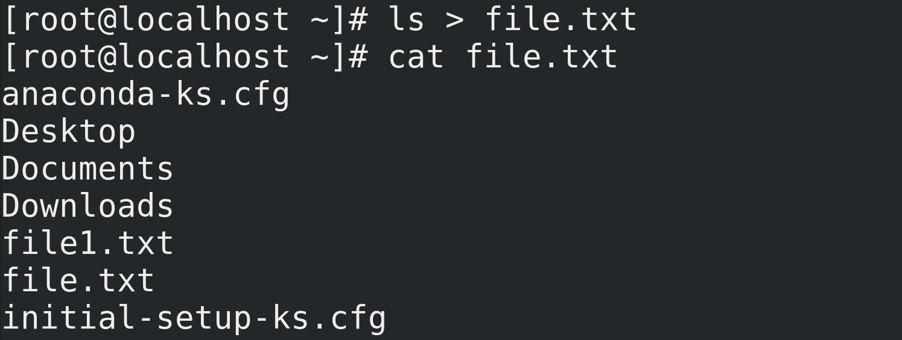
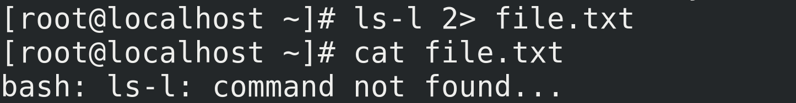
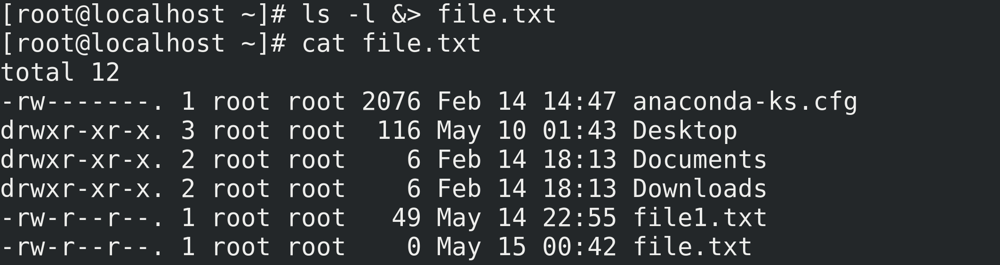
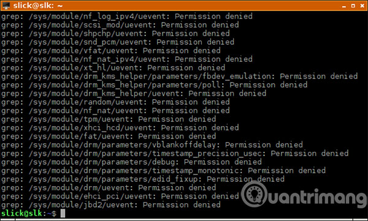
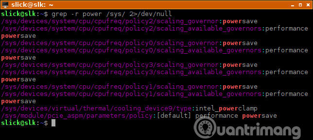

<h1 style="color:orange">Stdin-Stdout-Stderr</h1>
Trong hệ thống Linux, tất cả chương trình đều mở ra 3 tập tin khi chúng được gọi bởi shell

1. Đầu vào chuẩn là standard in
2. Đầu ra chuẩn là standard out
3. Báo lỗi chuẩn là standard error
<h2 style="color:orange">1. Redirection trong linux</h2>

Kỹ thuật redirection là kỹ thuật dùng toán tử  `>`. redirect từ luồng stream này sang luồng stream khác. Thông thường giúp người dùng thêm nội dung vào trong file. Có 2 kiểu redirection:

1. `>`: Trancate
2. `>>`: append

<h2 style="color:orange">2. Stdin-Stdout-Stderr</h2>
Standard Input ( stdin - 0 ) : dữ liệu vào chuẩn
Standard Output ( stdout - 1 ) : dữ liệu ra chuẩn
Standard Error ( stderr - 2 ) : dữ liệu ra lỗi

1. Chuyển hướng stdout ra file:

        # [command] > file.txt
 
Bản chất command `>` chính là `1>` (stdout) 
Ở đây lệnh nhập vào là stdin; kết quả trả ra của command là stdout

2. Chuyển hướng stderr ra file :

        # [command error] 2> file.txt
 
Không có lỗi ---> không có gì hiển thị

3. Chuyển hướng cả dữ liệu ra chuẩn và lỗi ra file :

        # [command ( error )] &> file.txt 
 

4. Để loại bỏ những kết quả không cần thiết:
Ví dụ, bạn đang tìm kiếm một chuỗi trong “/sys” để tìm những file liên quan đến cài đặt nguồn.

        # grep -r power /sys/
Sẽ có rất nhiều file mà người dùng không phải root không thể đọc được. Điều này dẫn đến nhiều lỗi “Permission denied”.
 

Những thứ này làm lộn xộn đầu ra và làm bạn khó phát hiện ra kết quả mình đang tìm kiếm. Vì các lỗi “Permission denied” là một phần của stderr, nên bạn có thể chuyển hướng chúng sang “/dev/null”.

        # grep -r power /sys/ 2>/dev/null
 
Kết quả dễ nhìn hơn nhiều.