<h1 style="color:orange">Network Advanced</h1>
<h2 style="color:orange">1. Ping</h2>
Lệnh ping gửi các gói ECHO_REQUEST tới địa chỉ chỉ định. 
Lệnh này nhằm kiểm tra máy tính có thể kết nối với Internet hay một địa chỉ IP cụ thể nào đó hay không. 
Không giống lệnh ping trên Windows, câu lệnh ping trên Linux sẽ duy trì gửi các gói tin cho đến khi bạn kết thúc nó. Có thể định số lượng gói tối đa gửi đi bằng cách gõ thêm tùy chọn –c. 

    # ping -c [number] [IP/domain_destination]
    # ping -c 4 8.8.8.8
<h2 style="color:orange">2. Tracepath/traceroute</h2>
Dùng để lần dấu đường đi trên mạng tới một đích chỉ định và báo cáo về mỗi hop dọc trên đường đi.

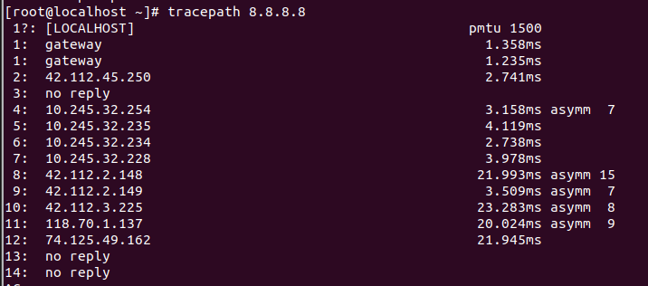
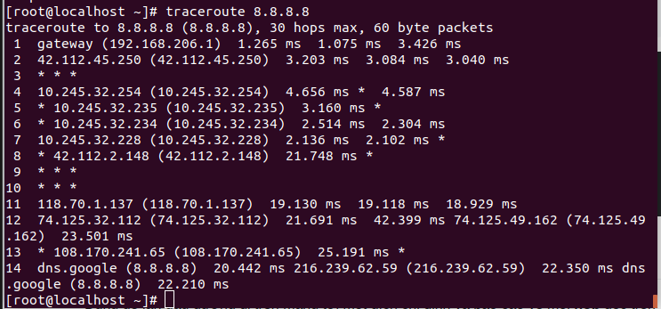 
Nếu không có traceroute có thể dùng lệnh:

     # yum -y install traceroute
<h2 style="color:orange">3. mtr</h2>

- Là sự kết hợp ping và tracepath trong một câu lệnh.
- mtr sẽ gửi liên tục các gói và hiển thị thời gian ping cho mỗi hop.
- Câu lệnh cũng giúp phát hiện một số vấn đề mạng qua tỉ lệ Loss%.
- Gõ q để thoát khỏi tiến trình.

      # mtr [IP/Domain_destination]
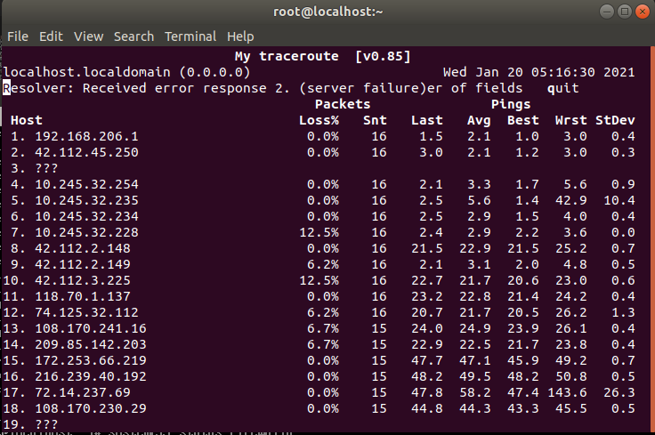 
<h2 style="color:orange">4. host</h2>
Lệnh host sẽ thực hiện tìm kiếm DNS.

Nhập vào tên miền khi muốn xem địa chỉ IP đi kèm và ngược lại, nhập vào địa chỉ IP khi muốn xem tên miền đi kèm.

      # host [IP/Domain]
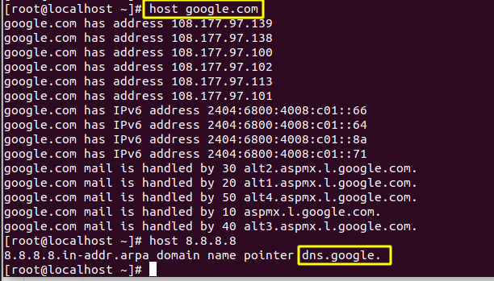 
<h2 style="color:orange">5. whois</h2>
whois không được cài đặt mặc định trên CentOS , phải cài thủ công :

     # yum install -y whois
Đưa ra các bản ghi trên server whois (whois record) của website, vì vậy bạn có thể xem thông tin về người hay tổ chức đã đăng ký và sở hữu website đó.

     # whois [Domain]
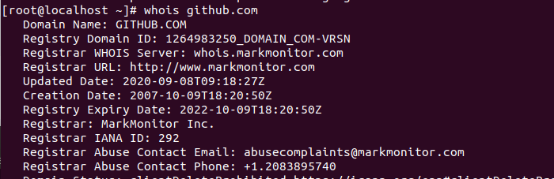 

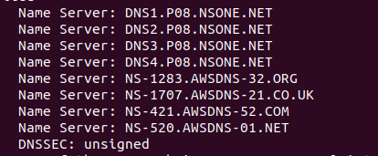 
<h2 style="color:orange">6. dhclient</h2>
Giúp làm mới địa chỉ IP trên máy bằng cách giải phóng địa chỉ IP cũ và nhận một địa chỉ mới từ DHCP server .

    # dhclient -r   ( release )
    # dhclient      ( renew )
<h2 style="color:orange">7. netstat</h2>
Là một lệnh nằm trong số các tập lệnh để giám sát hệ thống trên Linux .

Giám sát cả chiều in và chiều out kết nối vào server , hoặc các tuyến đường route , trạng thái của card mạng .

Rất hữu dụng trong việc giải quyết các vấn đề về sự cố liên quan đến network như là lượng connect kết nối , traffic , tốc độ , trạng thái của từng port , IP…

Cú pháp :

      # netstat [options]
Options :
- -a : kiểm tra tổng quát tất cả các port trên Server
- -c : kiểm tra tổng quát tất cả các port trên Server ở chế độ runtime
- -at : kiểm tra các port chạy TCP
- -au : kiểm tra các port chạy UDP
- -l : kiểm tra các port ở trạng thái LISTENING
- -lt : kiểm tra các port ở trạng thái LISTENING chạy TCP
- -plnt : kiểm tra các port ở trạng thái LISTENING đang chạy dịch vụ gì
- -lu : kiểm tra các port ở trạng thái LISTENING chạy UDP
- -rn : Hiển thị bảng định tuyến
- -s : thống kê theo các bộ giao thức TCP , UDP , ICMP , IP
- -st : thống kê theo bộ giao thức TCP
- -su : thống kê theo bộ giao thức UDP
- -i : hiển thị hoạt động của các network interface
- -g : hiển thị tình trạng IPv4 và IPv6

1 số ví dụ:
- Hiển thị hoạt động của các network interface :

       # netstat -i
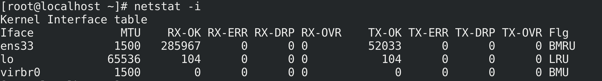 
- Hiển thị thông tin bảng định tuyến :

      # netstat -rn
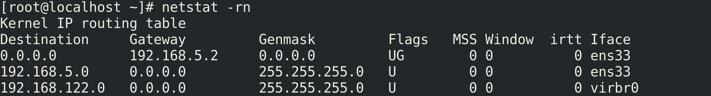 
- Hiển thị các kết nối sử dụng dịch vụ http :

      # netstat -ap | grep http
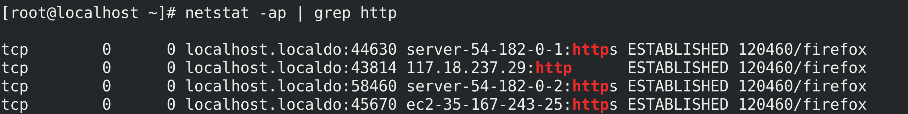 
<h2 style="color:orange">8. tcpdump</h2>
Tcpdump là phần mềm bắt gói tin trong mạng làm việc trên hầu hết các phiên bản hệ điều hành Unix/Linux. Tcpdump cho phép bắt và lưu lại những gói tin bắt được, từ đó chúng ta có thể sử dụng để phân tích.

Có thể lưu ra file và đọc bằng công cụ đồ họa `Wireshark.`

1. Cài đặt tcpdump :

       # yum install -y tcpdump
2. Cấu trúc lệnh :

       # tcpdump [options] [network_interface]

3. Options :
- -X : hiển thị nội dung của gói theo định dạng ASCII và HEX
- -XX : tương tự -X
- -D : liệt kê các network interface có sẵn
- -l : Đầu ra có thể đọc được dòng (để xem khi bạn lưu hoặc gửi đến các lệnh khác)
- -t : Cung cấp đầu ra dấu thời gian có thể đọc được của con người
- -q : Ít dài dòng hơn với đầu ra
- -tttt : Cung cấp đầu ra dấu thời gian tối đa có thể đọc được của con người
- -i : Bắt lưu lượng của một giao diện cụ thể
- -vv : Đầu ra cụ thể và chi tiết hơn (nhiều v hơn cho đầu ra nhiều hơn)
- -s : Xác định snaplength(kích thước) của gói tin theo byte. Sử dụng -s0 để có được mọi thứ. Nếu không set size packet dump thành unlimit, thì khi tcpdump ra nó bị phân mảnh
- -c : Chỉ nhận được x số gói và sau đó dừng lại
- -S : In số thứ tự tuyệt đối
- -e : Nhận tiêu đề ethernet
- -q : Hiển thị ít thông tin giao thức
- -E : Giải mã lưu lượng IPSEC bằng cách cung cấp khóa mã hóa.

1 số ví dụ:
- Bắt 1 gói tin có địa chỉ IP từ 1 interface cụ thể (n):

      # tcpdump -n -i ens33
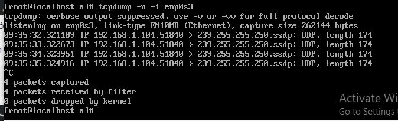 
Sử dụng tùy chọn -n để lọc gói tin có chứa địa chỉ IP . Nếu không sử dụng tùy chọn này , tcpdump sẽ bắt cả các gói tin DNS
- Hiển thị các network interface có sẵn (-D):

      # tcpdump -D
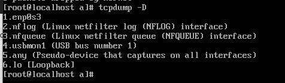 
- Bắt gói tin trên port cụ thể với IP nguồn và IP đích cụ thể:

      # tcpdump -i ens33 port 22 [src [IP]|dst [IP]]