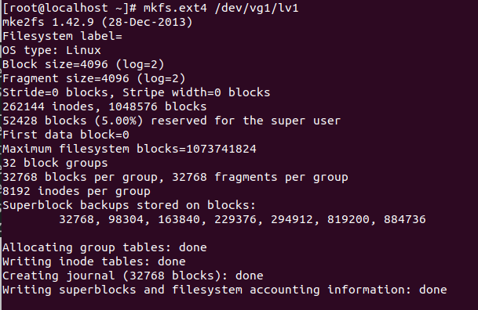
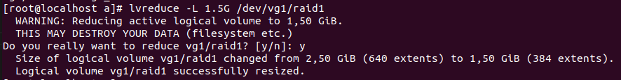

<h1 style="color:orange">LVM install</h1>
<h2 style="color:orange">1. Các lệnh trong LVM</h2>

1. Physical Volume :
- pvcreate : tạo physical volume
- pvdisplay , pvs : xem physical volume đã tạo
- pvremove : xóa physical volume
2. Volume Group :
- vgcreate : tạo volume group
- vgdisplay , vgs : xem volume group đã tạo
- vgremove : xóa volume group
- vgextend : tăng dung lượng của volume group
- vgreduce : giảm dung lượng của volume group
3. Logical Volume :
- lvcreate : tạo logical volume
- lvdisplay , lvs : xem logical volume đã tạo
- lvremove : xóa logical volume
- lvextend : tăng dung lượng logical volume
- lvreduce : giảm dung lượng logical volume
<h1 style="color:orange">2. Tạo logical volume</h1>
<h2 style="color:orange">2.1. Tùy chỉnh các partition thành dạng LVM</h2>

1. B1: Tạo các partition trên 1 hard disk(ổ cứng)
Sử dụng lệnh fdisk (làm như bài 20):
 
Trong ví dụ tạo ra 3 partition từ hard disk sdc.
2. B2: Ấn "t" để thay đổi định dạng partition
 
 
- 1 là phân vùng partition
- `8e` là thay đổi định dạng sang 'LVM'
<h2 style="color:orange">2.2. Tạo linear volume</h2>
Tương tự từ ví dụ trên ta đổi sdc2 và sdc3 sang định dạng LVM và tạo 3 partition cho ổ sdb và cũng set tất cả 3 partition sang LVM

 
1. B1: Tạo các physical volume 

       # pvcreate /dev/sdb1 /dev/sdc1
 
và sau đó kiểm tra bằng lệnh:
       
       # pvs
       hoặc # pvdisplay
2. B2: Tạo volume group 
Sử dụng lệnh:
        
        # vgcreate vg1 /dev/sdb1 /dev/sdc1
Trong đó `vg1` là tên của volume group
 
Sau đó có thể kiểm tra lại bằn lệnh:

       # vgs
       hoặc # vgdisplay
3. B3: tạo logical volume: 
Từ 1 volume group có thể tạo ra các logical volume bằng lệnh:

       # lvcreate -L 4G -n lv-demo1 vg1
Trong đó: 
-L : chỉ ra dung lượng của logical volume 
-n : chỉ ra tên của logical volume 
lv1 là tên logical volume 
vg1 là tên volume group 
 
Sau đó có thể kiểm tra bằng lệnh

      # lvs
      hoặc lvdisplay
4. B4: Format logical volume

       #  mkfs.ext4 /dev/vg1/lv1
 
5. B5: Mount ổ cứng
Sử dụng lệnh:

       # mount /dev/vg1/lv1 /root/a
để mount ổ cứng vào /root/a
 
Sau đó dùng lệnh 
       
       # df -h để kiểm tra
6. B6: Lưu cấu hình vào /etc/fstab
       
       # vim /etc/fstab
       # echo /dev/vg1/lv1 /root/a ext4 defaults 0 0
<h2 style="color:orange">2.3. Tạo RAID</h2>
Ngoài lệnh của LVM, ta còn có thể cài đặt gói `mdadm` để quản lý RAID

       # yum install -y mdadm
Tài liệu tạo RAID tham khảo bằng mdadm: [tai-lieu-mdadm](https://blogd.net/linux/software-raid-toan-tap-tren-linux/)

<h3 style="color:orange">2.3.1. Tạo RAID 0</h3>
Sau khi tạo được volume group 

1. Dùng lệnh:
     
       # lvcreate -L 4G -i2 -I64 -n raid0 vg1
Trong đó: 
-L: chỉ ra dung lượng của logical volume 
-i2: thông báo tạo stripped volume trên 2 ổ physical (có thể thay đổi) 
-I64: kích thước các luồng dữ liệu tuần tự (stripe) được ghi trên các physical volume (64kb) 
-n: chỉ ra tên của stripped logical volume 
raid0: tên raid (có thể đặt khác) 
vg1: tên volume group 
 
Sau đó kiểm tra bằng

       # lvs
Ngoài ra có thể tạo raid 0 có dung lượng bằng số PE

       # lvcreate -l 100 -i2 -I64 -n raid0 vg1
Trong đó: 
-l : chỉ ra dung lượng tính bằng PE của logical volume => Dung lượng của volume tạo ra là 100 * 4 = 400MB

2. Sau đó định dạng journal cho ổ :
       
       # mkfs.ext4 /dev/vg1/raid0
 
-----> mount và lưu vào file /etc/fstab để dùng.
<h3 style="color:orange">2.4.1. Tạo RAID 1</h3>
Sau khi tạo được volume group

1. Dùng lệnh:

       # lvcreate -L 2G -m1 -n raid1 vg1
Trong đó: 
-L: chỉ ra dung lượng của logical volume 
-m1: chỉ định tạo ra 1 logical volume với 1 mirror đi kèm (nếu là -m2 sẽ tạo ra 2 mirror) 
-n: chỉ ra tên của mirror logical volume 
raid1 tên ổ raid 
vg1: tên volume group 

<h4 style="color:orange">Lưu ý</h4>

- Tổng dung lượng các ổ physical phải > (số mirror - 1 khác 0) x với dung lượng logical volume

 
 
Ở đây mặc dù tổng dung lượng 2 ổ physical là 5,99G nhưng dung lượng ổ logical chỉ có thể là 2.5G (khái niệm raid 1) 
- Có bao nhiêu mirror thì cần bấy nhiêu ổ physical - 1
 
Mặc dù ở đây với dung lượng 1G thì có thể tạo 4 mirror nhưng hệ thống báo là thiếu physical volume để lưu (khái niệm raid 1)
2. Định dạng journal cho logical volume

        # mkfs.ext4 /dev/vg1/raid1
-----> mount -----> lưu vào /etc/fstab
<h2 style="color:orange">2.4. Xóa logical volume, volume group, physical volume</h2>
<h3 style="color:orange">2.4.1. Xóa logical volume</h3>

1. Unmount logical volume:
      
       # umount /dev/vg1/lv1 /root/a
       hoặc # umount /root/a
2. Dùng lệnh:
      
       # lvremove /dev/vg1/lv1
- vg1 tên volume group
- lv1 tên logical volume
<h3 style="color:orange">2.4.2. Xóa volume group</h3>
Trước khi xóa volume group, phải đảm bảo xóa hết logical volume:

Xóa volume group bằng lệnh:

       # vgremove /dev/vg1
<h3 style="color:orange">2.4.3. Xóa physical volume</h3>

       # pvremove /dev/sdb1
- sdb1 tên physical volume
<h2 style="color:orange">2.5. Thay đổi dung lượng logical volume</h2>

1. B1: kiểm tra dung lượng của volume group

       # vgdisplay
Để tăng kích thước, phải kiểm tra xem volume group còn dư dung lượng để kéo giãn logical volume không. Logical volume thuộc 1 volume group nhất định, nếu volume group đã cấp phát hết thì logical volume cũng không tăng dung lượng lên được .

Chú ý 2 trường: 
 
- VG status: resizable ---> có thể co dãn 
- free PE/Size: 

2.1. B2: Tăng dung lượng logical volume

        # lvextend -L +1.5G /dev/vg1/raid1
 
Sau khi tăng kích thước logical volume thì dung lượng đã được tăng nhưng file system trên volume này vẫn chưa thay đổi :

        # resize2fs /dev/vg-demo1/lv-demo1

2.2. Giảm dung lượng logical volume
- Trước tiên unmount logical volume muốn giảm
- Dùng lệnh:

         # lvreduce -L 1.5G /dev/vg1/lv1
 
         
         hoặc # lvreduce -L -1G /dev/vg1/lv1
 

- Format lại logical volume:

         # mkfs.ext4 /dev/vg1/raid1
-----> mount lại ----> lưu vào /etc/fstab
<h2 style="color:orange">2.6. Thay đổi dung lượng volume group</h2>
Chính là việc nhóm thêm physical volume hay bỏ nhóm physical volume ra khỏi volume group .

1. B1: Kiểm tra thông tin partition :
        
         # vgdisplay
         hoặc # lsblk
2.1. B2: Nhóm thêm 1 partition vào volume group:

        # vgextend /dev/vg1 /dev/sdb2
(hệ thống sẽ tự động chuyển /dev/sdb2 thành physical volume)

2.2. Cắt 1 partition ra khỏi volume group
        
        # vgreduce /dev/vg-demo1 /dev/sdb2