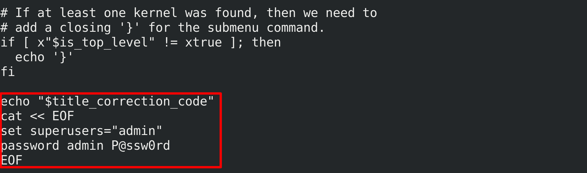
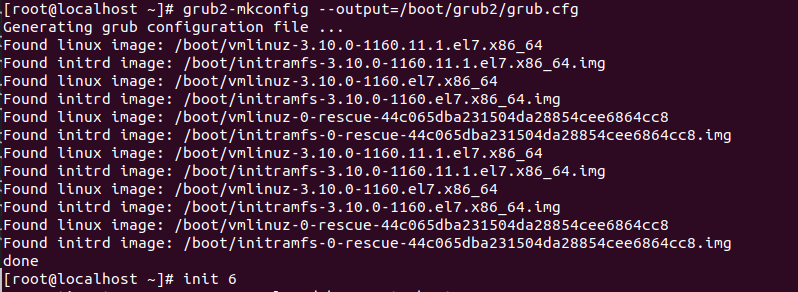

<h1 style="color:orange">Đặt mật khẩu bảo vệ GRUB</h1>
GRUB - Grand Unified Boot Loader là trình khởi động máy tính nằm trong Master Boot Record (MBR) có trách nhiệm nạp kernel và Initial RAM Disk (có chứa một số tệp quan trọng và trình điều khiển thiết bị cần thiết để khởi động hệ thống) vào bộ nhớ.

Với tính năng chứng thực mật khẩu GRUB sẽ chỉ cho phép quản trị viên dùng các hoạt động tương tác với GRUB , những người không có thẩm quyền sẽ không thể vào hệ thống qua chế độ Single User Mode để thay đổi mật khẩu root hay tinh chỉnh các giá trị của GRUB.
<h1 style="color:orange">1.GRUB plain password</h1>

1. B1: Login với user root :

2. B2: Tạo file backup grub.cfg và 10_linux

       # cp /boot/grub2/grub.cfg /boot/grub2/grub.cfg.orig
       # cp /etc/grub.d/10_linux /etc/grub.d/10_linux.orig
3. B3: Chỉnh sửa file 10_linux

       # vi /etc/grub.d/10_linux
Thêm vào cuối file nội dung sau :

cat << EOF 
set superusers="huy" 
password huy 123456 
EOF

4. B4: Tạo lại file grub.conf từ những cấu hình đã chỉnh sửa:

        # grub2-mkconfig --output=/boot/grub2/grub.cfg

5. B5: Khởi động lại
        
        # init 6
<h1 style="color:orange">2.GRUB encrypted password</h1>

1. B1 : Login với user root :

2. B2 : Tạo file backup grub.cfg và 10_linux

         # cp /boot/grub2/grub.cfg /boot/grub2/grub.cfg.orig
         # cp /etc/grub.d/10_linux /etc/grub.d/10_linux.orig
3. B3 : Tạo password mã hóa :

         # grub2-mkpasswd-pbkdf2
=> Copy phần password mã hóa "grub.pbkdf2.sha512..."

4. B4 : Chỉnh sửa file 10_linux :

         # vi /etc/grub.d/10_linux
Thêm vào cuối file nội dung sau :

cat << EOF 
set superusers="admin" 
passwd_pbkdf2 admin 
grub.pbkdf2.sha512.... 
5. B5: Tạo lại file grub.conf từ những cấu hình đã chỉnh sửa :

        # grub2-mkconfig --output=/boot/grub2/grub.cfg
6. B6: Khởi động lại hệ thống và kiểm tra:

        # reboot