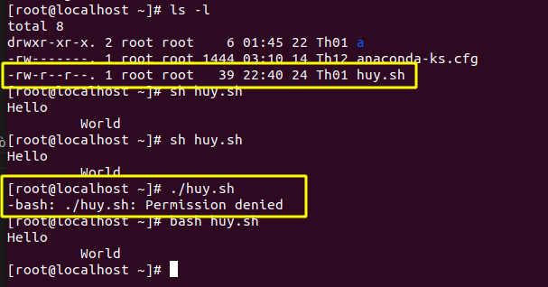
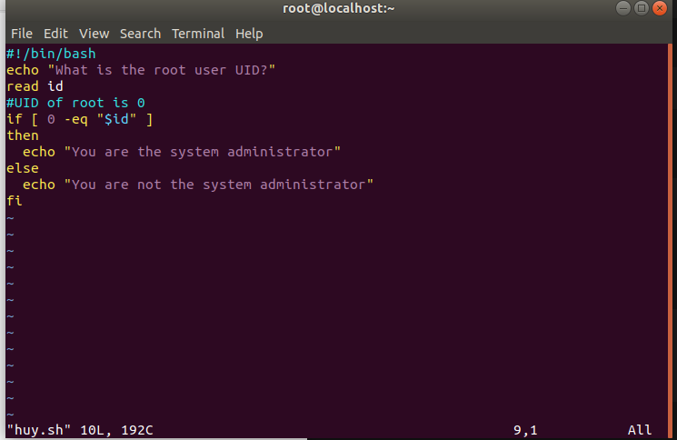
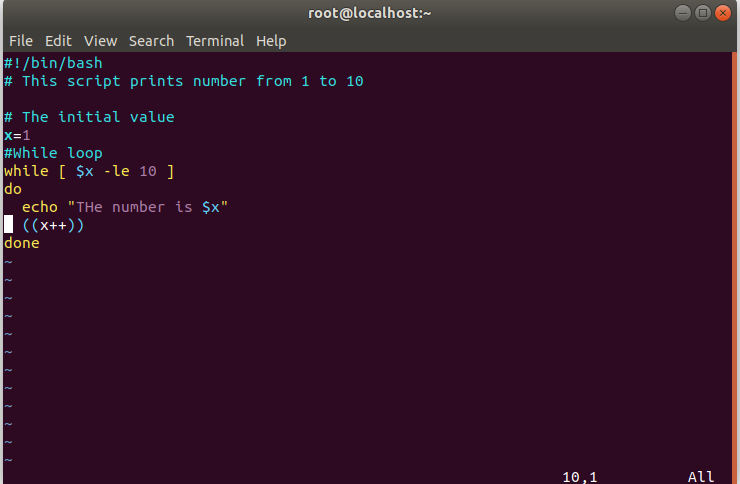
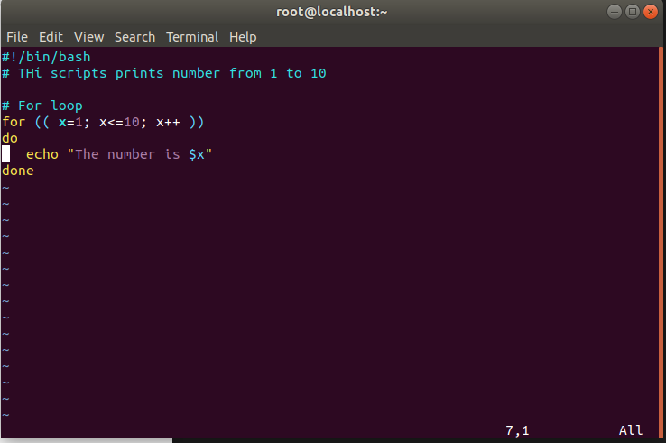

<h1 style="color:orange">Shell Scripting</h1>

1. Shell là chương trình giao tiếp với người dùng, chấp nhận các lệnh nhập từ keyboard và thực thi nó.
2. Nếu muốn sử dụng nhiều lệnh chỉ bằng 1 lệnh, có thể lưu chuỗi lệnh vào file text và bảo shell thực thi chuỗi lệnh thay vì tự nhập vào các lệnh.
3. Shell-script là 1 chuỗi các lệnh được viết trong plain-text file (giống batch trong MS-DOS nhưng mạnh mẽ hơn).
4. Ưu điểm:
- Shell-script có thể nhận input từ user, file hoặc output từ màn hình.
- Tiện lợi để tạo nhóm lệnh riêng
- Tiết kiệm thời gian
- Tự động làm các công việc đã được lên lịch
<h2 style="color:orange">1. Cách tạo 1 file shell script</h2>

1. B1: Tạo file huy.sh 
Sử dụng vi, emacs, gedit, ... để tạo nội dung cho file:
       
       # touch huy.sh (file shell-script luôn có đuôi .sh)
       # vi huy.sh

#!/bin/bash 
echo "hello world" 
- Dòng đầu tiên luôn là "#!/bin/bash". Đây là cú pháp bắt buộc.
- Sau "#" được hiểu là comment - chú thích của các đoạn code.
2. B2 : Cấp quyền execute cho file :

       # chmod 755 huy.sh
       hoặc # chmod 0777 shell.sh

3. B3 : Thực thi file shell :

       # ./shell.sh
hoặc
       
       # bash shell.sh
       hoặc # sh shell.sh
4. Sự khác nhau giữa `./shell.sh` và 2 lệnh còn lại 

Ở đây file huy.sh không có quyền execute nên lệnh:

       # ./huy.sh
sẽ không có quyền thực thi file

Tuy nhiên bash và sh lại là chương trình thực thi file nên vẫn chạy được lệnh.
<h2 style="color:orange">2. Biến trong shell</h2>
<h3 style="color:orange">2.1. Biến hệ thống</h3>

1. Tạo ra bởi hệ thống và quản lý bởi Linux .
2. Tên biến là chữ hoa
Để show các biến hệ thống, dùng lệnh echo, VD:
    
       # echo $HOME
       # echo $USER
3. Một số biến hệ thống quan trọng:
- BASH = /bin/bash - tên shell
- BASH_VERSION = 4.2.46(2) - phiên bản của shell
- COLUMN = 80 - số cột cho màn hình
- HOME = /home/cuongnq - thư mục home của user
- LINE = 25 - số dòng của màn hình
- LOGNAME = cuongnq - tên đăng nhập của user
- OSTYPE = Linux - loại hệ điều hành
- PATH = /usr/bin:/sbin:/bin:/usr/sbin - thiết lập đường dẫn của biến môi trường
- PWD = /root - thư mục hiện hành
- SHELL = /bin/bash - tên shell
- USER = root - user đang login
<h3 style="color:orange">2.2. Biến người dùng</h3>

     # tên_biến=value
- tên_biến phải bắt đầu bằng ký tự 
- Không có dấu cách 2 bên toán tử = khi gán giá trị cho biến
       
      # a=1 -> Đúng
      # a = 1 -> sai
      # a= 1 hay a =1 -> sai
- Tên biến có phân biệt chữ hoa, chữ thường
- Một biến không có giá trị khởi tạo thì bằng NULL
- Không được dùng dấu `?  *` để đặt tên các biến
- Dùng lệnh:

      # echo $tên_biến
để in ra giá trị biến
- Lệnh echo để in ra các giá trị của biến :
       
      # echo [options] [string,variable,...]
Options: 
.-n : không in kí tự xuống dòng 
.-e : cho phép hiểu những kí tự theo sau dấu "\" 
.\a : alert ( tiếng chuông ) 
.\b : backspace ( xóa kí tự trước ) 
.\c : không xuống dòng 
.\e : xóa ký tự tiếp theo 
.\f : form feed 
.\n : xuống dòng 
.\r : về đầu dòng 
.\t : tab ngang 
.\v : xuống cách 1 dòng 
.`\\` : dấu `\` 
VD:
     
    # echo -e "Hello\tHuy"
    Hello   Huy
    # echo -e "Hello\nHuy"
    Hello
    Huy
<h2 style="color:orange">3. Các phép toán số học</h2>
<h3 style="color:orange">3.1. Lệnh expr</h3>
Cú pháp:

     # expr toán_hạng_1 toán_tử toán_hạng_2
Toán tử:
- `+:` cộng 
- `-:` trừ 
- `\*:` nhân 
- `/:` chia lấy phần nguyên 
- `%:` chia lấy phần dư 
VD:

      # expr 10 \* 2
      20
- Chú ý : Phải có dấu cách trước và sau toán tử
<h3 style="color:orange">3.2. Các dấu ngoặc</h3>

- Tất cả các ký tự trong dấu ngoặc kép đều không có ý nghĩa tính toán, trừ những ký tự sau \ hoặc $.
- Dấu nháy ngược (``): yêu cầu thực thi lệnh. 
VD:

      # echo "ngay hom nay la : `date`"
      ngay hom nay la : Monday Jan 25 11:39:49 +07 2021
      # echo `expr 1 + 2`
      3
      # echo "expr 1 + 2"
      expr 1 + 2
<h3 style="color:orange">3.3. Kiểm tra trạng thái trả về của lệnh vừa thực hiện</h3>
Cú pháp:

      # echo $?
Trạng thái trả về :
      
      # 0 -> không có lỗi
      # 1 -> có lỗi
VD : File abc.txt không tồn tại
      
      # rm abc.txt
      # echo $?
      1 -> Lệnh trước có lỗi (xóa file không tồn tại)
<h2 style="color:orange">4. Các phép toán kiểm tra</h2>

1. So sánh biến số :
- -eq ( == ) : bằng (equal)
- -ne ( != ) : khác (not equal)
- -lt : nhỏ hơn ( less than )
- -le : nhỏ hơn hoặc bằng ( less or equal )
- -ge : lớn hơn hoặc bằng ( greater of equal )
- -gt : lớn hơn ( greater than )
2. So sánh chuỗi :
- string1 = string2 : true nếu 2 chuỗi bằng nhau ( chính xác từng ký tự )
- string1 != string2 : true nếu 2 chuỗi không giống nhau
- -n string1 : true nếu string1 không rỗng
- -z string1 : true nếu string1 rỗng
3. Kiểm tra điều kiện trên tập tin :
- d file : true nếu file là thư mục
- e file : true nếu file có tồn tại
- f file : true nếu file là tập tin thường
- s file : true nếu kích cỡ file khác 0
- u file : true nếu SUID được thiết lập trên file
- g file : true nếu SGID được thiết lập trên file
- r file : true nếu file cho phép read
- w file : true nếu file cho phép write
- x file : true nếu file cho phép execute
3. Toán tử logic :
- ! expression : NOT
- expression1 , -a , expression2 : AND
- expression1 && expression2 : AND
- expression1 , -0 , expression2 : OR
- expression1 || expression2 : OR
<h2 style="color:orange">5. Cấu trúc điều khiển trong shell-script</h2>
<h3 style="color:orange">5.1. Cấu trúc rẽ nhánh if</h3>
Cú pháp 
        
        if điều_kiện
        then
           command1
           ....
        fi
2. If...else 
Cú pháp:

        if điều_kiện then
          command1
          ....
        else
          command2
          ....
        fi

<h3 style="color:orange">5.2. Vòng lặp while</h3>
Cú pháp:
        
        while [điều_kiện]
        do 
          command1
          ....
        done

<h3 style="color:orange">5.3. Vòng lặp for</h3>
Cú pháp:

      for tên_biến in danh_sách
      do
        command1
        ....
      done
hoặc
      
      for (( expr1 ; expr2 ; expr3 ))
      do
        command1
        ....
      done

<h2 style="color:orange">6. 1 số cấu trúc hỗ trợ</h2>
<h3 style="color:orange">6.1. Lệnh test</h3>
Lệnh test dùng để kiểm tra 1 biểu thức đúng hay không và trả lại, sử dụng các câu lệnh điều khiển (if, while,...). Output là: 

- 0 nếu biểu thức đúng
- khác 0 nếu biểu thức sai
Cú pháp :
       
       test biểu_thức
       hoặc [biểu_thức]
<h3 style="color:orange">6.2. Lệnh read</h3>
Dùng để lấy dữ liệu nhập từ bàn phím và lưu vào biến. VD:

       read id (nhập số id=)
       echo "id la $id"