<h1 style="color:orange">LAB 01</h1>
Giả định:

- Gắn 2 ổ vdb vdc mỗi ổ 1GB vào 
- Tạo LVM extend 4GB
- Format ext4 mount vào /backups  
- Copy data vào full 2GB kia 
- Check md5sum của từng file lưu lại vào file text 
- Xong tắt cả con máy đi 
- Tạo máy mới 
- Gỡ 2 cái đisk 2GB kia gắn vào máy mới 
- Scan lại lvm và check lại toàn vẹn data xem OK ko
<h2 style="color:orange">1. Bước 1</h2>

Chuột phải vào giao diện máy centos hiện có: 
Vào Settings ----> Storage -----> vào biểu tưởng trên hình 
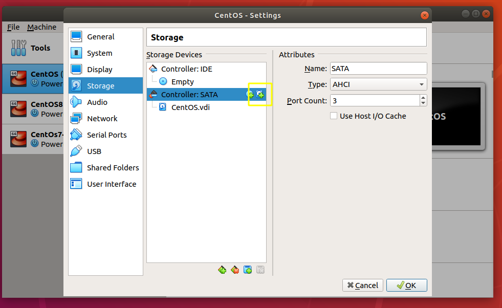

Tạo 2 ổ cứng có dung lượng 1GB và gắn vào máy:
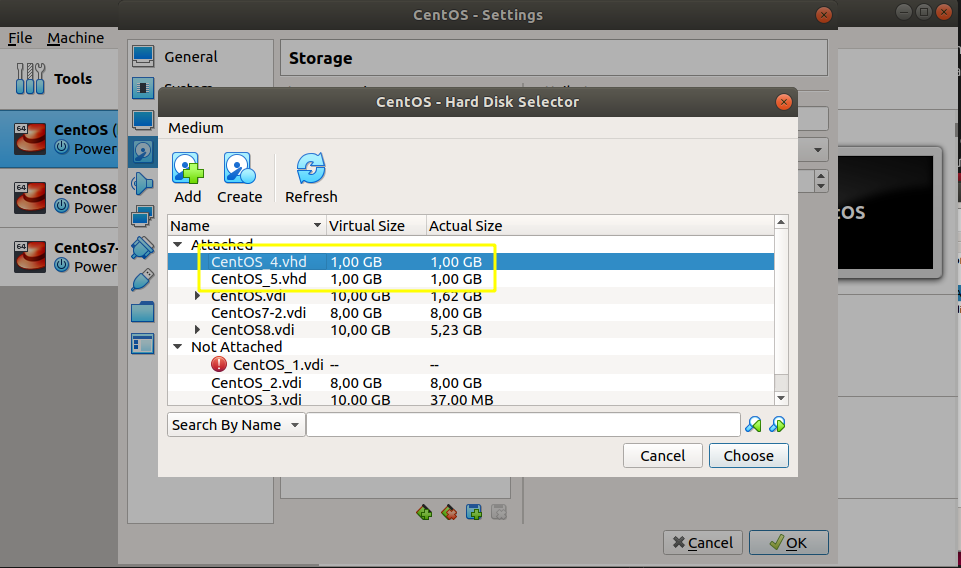 
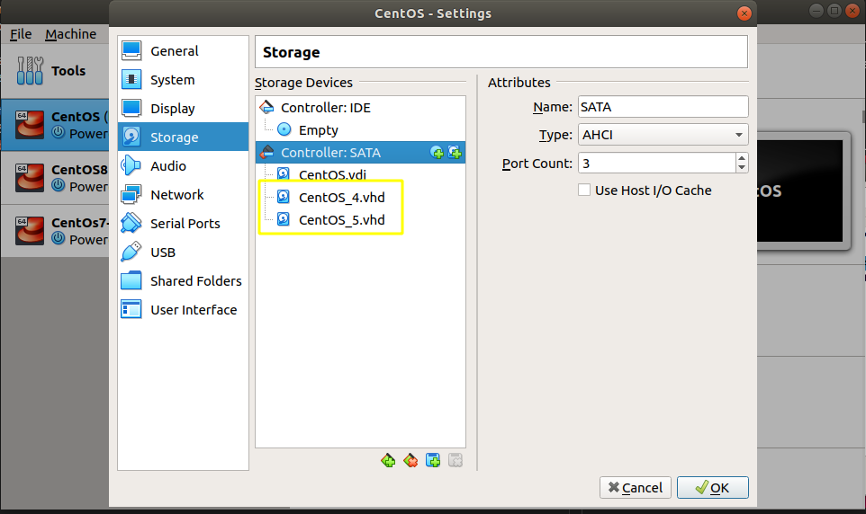 
-----> Khởi động máy
<h2 style="color:orange">2. Bước 2</h2>

1. Sử dụng lệnh
    
        # lsblk
để xem máy đã nhận ổ cứng chưa 

2. Tạo physical volume từ 2 ổ 1 gb vừa lắp vào 
------> chuyển định dạng các ổ physical sang LVM. VD: 
      
        # fdisk /dev/sdb  ---> t ----> 1 ----> 8e ----> w
Tạo volume group 
Tạo logical volume 

Dùng lệnh để kiểm tra:
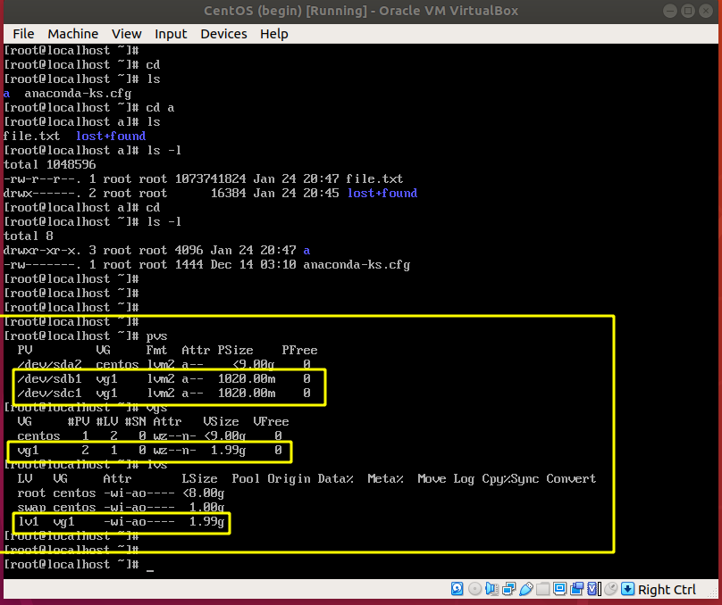 
Ở đây logical volume được tạo ra là `/dev/vg1/lv1` (vg1 là tên volume group)

3. Định dạng journal cho logical volume vừa tạo:
       
        # mkfs.ext4 /dev/vg1/lv1

4. Mount ổ vào 1 file bất kì

Ở đây tiến hành mount ổ /dev/vg1/lv1 vào /root/a

    # mount /dev/vg1/lv1 /root/a
5. Dùng lệnh:
    
       # lsblk
       hoặc df -h để kiểm tra
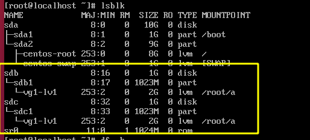 

6. Tạo 1 file có giá trị lớn hơn 1GB để file lưu vào cả hai ổ physical

       # dd if=/dev/zero of=/root/a/file.txt bs=1G count=1
Dùng lệnh:
       
       # df -h /dev/vg1/lv1
để kiểm tra 
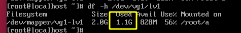 
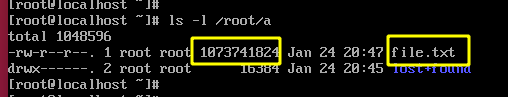 

Ở đây file.txt được tạo ra có dung lượng xấp xỉ 1,1gb >1gb

7. Sử dụng lệnh:
       
         # openssl dgst -md5 -hex /root/a/file.txt
để lấy md5 checksum của file.txt
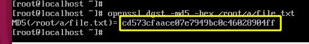 
<h2 style="color:orange">3. Bước 3</h2>

Tạo máy centOS 7 mới
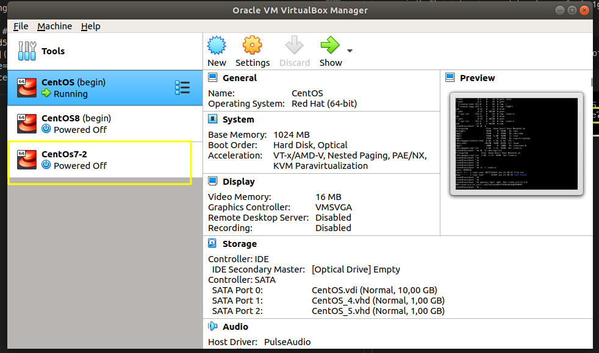 
<h2 style="color:orange">4. Bước 4</h2>
Remove 2 ổ 1Gb vừa tạo ở 2 máy CentOS 7 cũ chuyển sang lắp vào máy mới vừa tạo 
-----> Khởi động máy mới
<h2 style="color:orange">5. Bước 5</h2>

1. Dùng lệnh:

       # lsblk
để kiểm tra
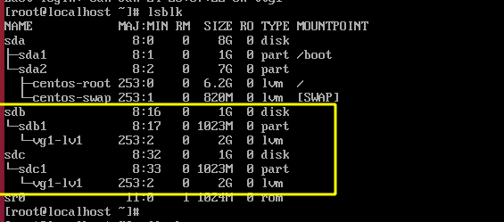 
---> đã có logical volume

2. Mount logical volume vào 1 directory bất kì. VD:

       # mount /dev/vg1/lv1 /root/b
Sử dụng lệnh:
       
       # ls -l /root/b để kiểm tra
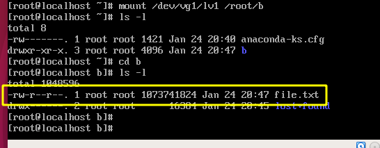 
------> đã xuất hiện file.txt
3. Sử dụng lệnh
       
       # openssl dgst -md5 -hex /root/b/file.txt
để kiểm tra tính toàn vẹn của file.txt 
 
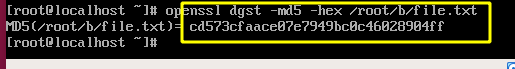 
Ở đây md5 của file.txt trong directory của cả a và b đều giống nhau 
---------> file.txt khi chuyển từ máy cũ sang máy mới vẫn giữ nguyên dữ liệu 
---------> dữ liệu khi chuyển ổ cứng toàn vẹn. 