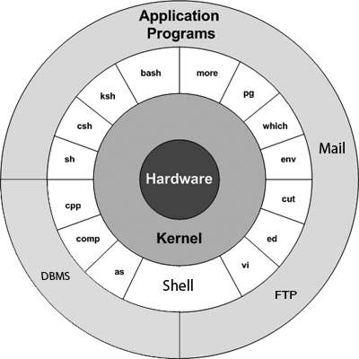
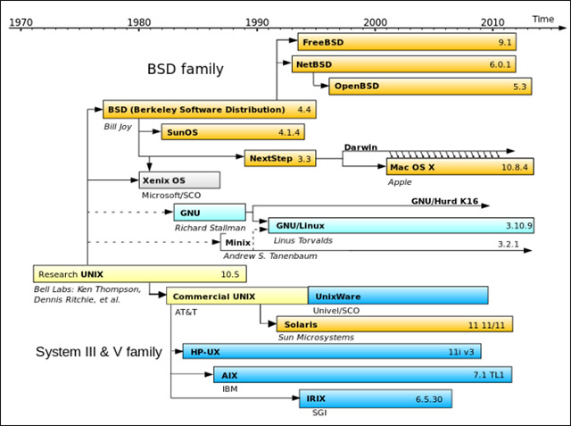

# UNIX
## `Lịch sử phát triển`
UNIX được phát triển những năm 1960s 
Nhiều người có thể sử dụng một máy tính Unix cùng một lúc; vì thế Unix được gọi là hệ thống đa người dùng. 
Một người sử dụng có thể chạy nhiều chương trình cùng một lúc; vì thế Unix được gọi là đa nhiệm.

Các hệ điều hành như Linux, Mac OS X, Android, iOS, Chrome OS hay Orbis OS được sử dụng trên PlayStation 4, hay thậm chí bất kỳ phần mềm nào đang chạy trên bộ định tuyến (router) của bạn - tất cả các hệ điều hành này thường được gọi là hệ điều hành “Unix-like” do chúng được phát triển dựa trên nền tảng là Unix.

`Tất cả hệ điều hành hiện tại đều kế thừa và phát huy UNIX 1 phần nào đó`
## `Thiết kế UNIX`
Triết lý UNIX tạo ra các tiện ích, các tiện ích theo kiểu module, cùng hoàn thành 1 tác vụ nào đó.

Unix cũng có một hệ thống tập tin duy nhất mà các chương trình sử dụng để giao tiếp với nhau. Đây là lý do tại sao có sự xuất hiện của thuật ngữ “everything is a file” trên Linux. Điều này bao gồm các thiết bị phần cứng và các tệp đặc biệt cung cấp thông tin hệ thống hoặc dữ liệu khác. Đó cũng là lý do tại sao chỉ có Windows có ký tự ổ đĩa, đây là một đặc điểm mà nó được thừa hưởng từ DOS. Còn trên các hệ điều hành khác, mọi tệp trên hệ thống là một phần của một hệ thống phân cấp thư mục duy nhất.
## `Cấu trúc UNIX`

Khái niệm UNIX bao gồm 4 cơ sở:
- `Kernel(nhân)`: Kernel là trái tim của hệ điều hành. Nó tương tác với phần cứng và hầu hết nhiệm vụ như quản lý bộ nhớ, quản lý file, lên chương trình nhiệm vụ.
- `Shell`: Shell là tiện ích biến đổi lệnh bạn gõ trên terminal thành 1 lệnh mà UNIX có thể hiểu.
- `Các lệnh và các tiện ích`: Có rất nhiều lệnh và tiện ích mà bạn có thể sử dụng trong công việc hàng ngày. cp, mv, cat và grep… là một số ví dụ của lệnh và tiện ích. Có trên 250 lệnh tiêu chuẩn cộng với một số lệnh khác được cung cấp bởi phần mềm thứ 3. Tất cả các lệnh này đi cùng với các tùy chọn (chức năng) của nó.
- `File và thư mục`: Tất cả dữ liệu trong Unix được tổ chức trong các file. Tất cả các file được tổ chức vào trong các thư mục. Những thư mục này được tổ chức trong một cấu trúc dạng cây được gọi như là hệ thống file.

## `Các hậu duệ của UNIX`

Có thể gộp hậu duệ UNIX làm 2 nhóm:
- Một nhóm hậu duệ Unix đã được phát triển trong môi trường các học viện. Đầu tiên là BSD (Berkeley Software Distribution), một hệ điều hành giống như Unix và có mã nguồn mở. BSD còn tồn tại cho đến ngày hôm nay thông qua FreeBSD, NetBSD và OpenBSD. NeXTStep cũng là một hệ điều hành dựa trên BSD gốc, Mac OS X của Apple lại dựa trên NeXTStep và iOS dựa trên Mac OS X. Nhiều hệ điều hành khác, bao gồm cả Hệ điều hành Orbis được sử dụng trên PlayStation 4, cũng được lấy cảm hứng từ các loại hệ điều hành BSD.
- Dự án GNU của Richard Stallman được bắt đầu như là một phản ứng đối với các điều khoản cấp phép phần mềm Unix ngày càng hạn chế của AT&T. MINIX là một hệ điều hành giống Unix được tạo ra cho các mục đích giáo dục, và điều thú vị là Linux lại được lấy cảm hứng từ MINIX. Linux mà chúng ta biết đến ngày nay thực sự là GNU/Linux, vì nó được tạo thành từ nhân (kernel) của Linux và rất nhiều tiện ích GNU. GNU/Linux không trực tiếp được phát triển từ BSD, nhưng nó xuất phát từ các thiết kế của Unix và có nguồn gốc từ giới học viện. Nhiều hệ điều hành ngày nay, bao gồm cả Android, Chrome OS, hệ điều hành SteamOS và một số lượng lớn các hệ điều hành phổ biến khác đều được xây dựng dựa trên Linux.

## `Sự ra đời của DOS`
DOS được phát triển một cách độc lập chứ không hề dựa vào Unix (đó là lý do tại sao Windows sử dụng dấu gạch chéo ngược ( \ ) cho các đường dẫn tệp trong khi các hệ điều hành khác khác sử dụng dấu gạch chéo chuyển tiếp (/)). Các phiên bản sau này của Windows đã thừa kế lại DOS, giống như BSD, Linux, Mac OS X và các hệ điều hành hậu duệ khác được thừa hưởng nhiều khía cạnh về mặt thiết kế của Unix.