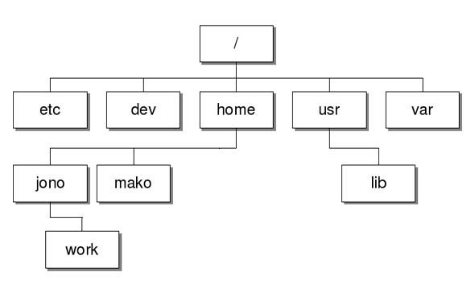
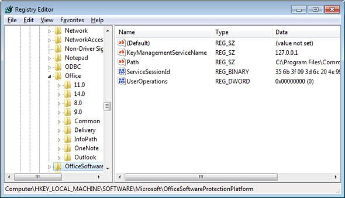
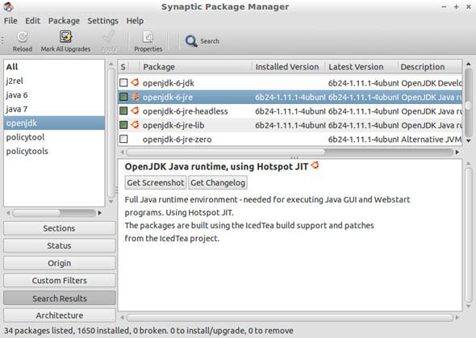
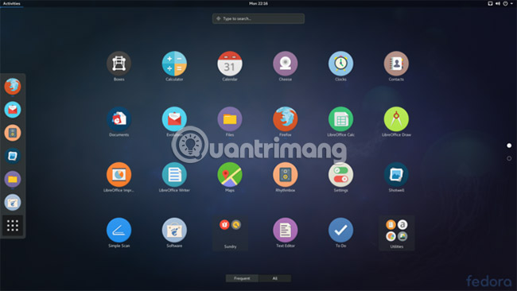
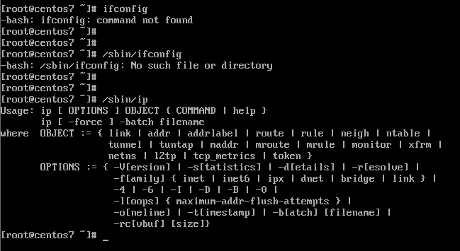
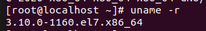

# `Linux`
Là hệ điều hành được phát triển dựa theo UNIX

Phiên bản Linux đầu tiên 1.0 do sinh viên Đại học Helsinki (Phần Lan) Linus Torvalds viết vào năm 1991, và ra mắt thị trường vào năm 1994 dưới bản quyền của GNU General Public License.

Thực chất Linux là tên nhân (kernel) của hệ điều hành. Những hđh được sử dụng vd ubuntu, redhat,... được gọi là các distro linux sử dụng nhân linux.

## `Ưu điểm Linux`
- HĐH mã nguồn mở -> không tốn chi phí mua/bán bản quyền
- Tính bảo mật cao: hầu hết virus, mã độc không hoạt động trên Linux
- Tính linh hoạt: Người dùng tự do sửa HĐH theo nhu cầu sử dụng -> lý tưởng cho việc lập trình.
- Nhẹ, hoạt động tốt trên máy cấu hình yếu
## `Nhược điểm`
- Số lượng phần mềm sử dụng trên Linux còn hạn chế
- Nhiều nhà phát hành không phát triển driver cho Linux
## `Công dụng Linux`
- Quản lý điều phối các tài nguyên hệ thống
- Người dùng nhìn thấy mọi dòng code trong Linux -> thoải mái chỉnh sửa
- Mọi tính năng đều miễn phí
- Bảo mật cao, thường xuyên được `cộng đồng` fix bug
- Nhẹ, hoạt động được trên máy yếu.
## `Khác biệt giữa Linux và Windows`
1. `Cấu trúc file` 
Với Linux, các thư mục như My Documents, ổ đĩa C, ổ đĩa D sẽ được thay bằng cây dữ liệu. Các ổ đĩa sẽ được đặt vào đó, kể cả thư mục Home và Desktop.

2. `Không sử dụng Registry` 

Registry trong Windows là một cơ sở dữ liệu chủ cho toàn bộ các thiết lập nằm trên máy tính. Nó nắm giữ thông tin ứng dụng, mật khẩu người dùng, thông tin thiết bị…

Linux không có registry. Các ứng dụng trên Linux lưu thiết lập của mình trên cơ sở chương trình dưới sự phân cấp người dùng. Với ý nghĩa này, những cấu hình của Linux ở dạng mô đun.

3. `Trình quản lý gói` 

Trong linux, các chương trình không ở dưới dạng .exe như windows mà tập hợp trong chương trình quản lý gói (package manager). Khi muốn cài chương trình về máy, người dùng có thể tải gói từ các repo trên mạng.
4. `Giao diện`  

Trong quá trình nâng cấp và phát triển, giao diện windows không có thay đổi nhiều, trong khi giao diện của linux tách biệt hoàn toàn với lõi nên có thể tùy biến.
5. `Lệnh đầu cuối`  

Tùy chỉnh trong windows thường sử dụng GUI nhưng với Linux các thao tác chủ yếu trên terminal (Linux cũng có UI nhưng không mạnh)
6. `Tài khoản và quyền users`  
Linux có 3 loại users: Regular, Administrator (root), service. Trong đó:
- Regular: Tất cả các file, thư mục được lưu trữ trong /home/ là thư mục chính của tài khoản này. User này không có quyền truy cập vào thưc mục của những user khác.
- Administrator (root): được sử dụng khi người dùng muốn cài đặt phần mềm, thay đổi file hệ thống hoặc thực hiện các tác vụ cần quyền quản trị khác trên Linux.
- Service: tăng cường tính bảo mật cho máy tính.
Trong khi Windows có 4 loại users là: Administrator, Standard, Child và Guest.
7. `Các thiết lập điều khiển`
Linux thích hợp lướt web hơn để chơi game
8. `Tính tự do`
Trong khi với windows, nhà phát hành sẽ đưa ra các bẩn cập nhật sử lỗi và nâng cấp; người dùng có thể chính tay sửa lỗi và thay đổi với Linux -> mỗi máy tính Linux là duy nhất. Ngoài ra, "cộng đồng" cũng luôn sửa, phát hiện lỗi với Linux.
## `VPS Linux`
VPS (Virtual Private Server) là dạng máy chủ ảo, server ảo được tạo ra bằng phương pháp phân chia một máy chủ vật lý thành nhiều máy chủ khác nhau có tính năng tương tự như máy chủ riêng (dedicated server), chạy dưới dạng chia sẻ tài nguyên từ máy chủ vật lý ban đầu đó.

Có rất nhiều loại VPS khác nhau:

VPS Windows và VPS Linux là hai hệ điều hành phổ biến nhất  hiện nay 
Open VZ VPS, Xen VPS, KVM, VMWare… là công nghệ ảo hóa được sử dụng để phân chia máy chủ vật lý thành các máy chủ ảo khác nhau 
VPS Linux là một máy chủ ảo được xây dựng trên nền tảng Linux, hiện nay Linux đang thống lĩnh thị trường máy chủ, có tới hơn 60% các máy chủ chạy hệ điều hành Linux.

Linux thường được dùng cho máy chủ server ảo bởi tính năng cực nổi trội:
1. `Tính ổn định`: khả năng xử lý cùng lúc các khối lượng lớn tác vụ mà ít xảy ra tình trạng xuống cấp, mất tính ổn định
2. `Bảo mật cao`: Linux được xây dựng dựa trên nền tảng hệ điều hành đa nhiệm Unix. Do đó, chỉ quản trị hoặc root user mới có thể cấp quyền truy cập sử dụng các tác vụ quan trọng. -> bảo mật cực cao
3. `Linh hoạt`: cho phép mở rộng, có thể hoạt động tốt trên bất kỳ máy tính nào. Linux sẽ không bị ảnh hưởng bởi bộ xử lý và kiến trúc của máy.
4. `Chi phí rẻ`: Linux là một phần mềm miễn phí -> ưu thế khiến nó độc tôn trong thị trường server.
5. `Chủ động`: tùy biến cao, doanh nghiệp không phải lo về bản quyền.

<h2 style="color:orange">Nhận Linux</h2>
Cách kiểm tra phiên bản kernel hiện tại :

     # uname -r

Trong đó :
- 3 là phiên bản kernel .
- 10 đề cập đến phiên bản sửa đổi chính hiện tại
- 0 đề cập đến phiên bản sửa đổi phụ hiện tại
- 1160 đề cập đến bản vá cuối cùng được cập nhật cho phiên bản này
- e17 có nghĩa kernel này dành cho tất cả các phiên bản RHEL/CentOS 7.x
- x86_64 là độ rộng thanh ghi 64_bit như của window.

Kiểm tra tất cả các phiên bản kernel đã cài đặt trên CentOS :

    # rpm -q kernel
Xóa các bản kernel cũ hơn không dùng đến, vd:

    # yum remove kernel-3.10.0-957.el7.x86_64