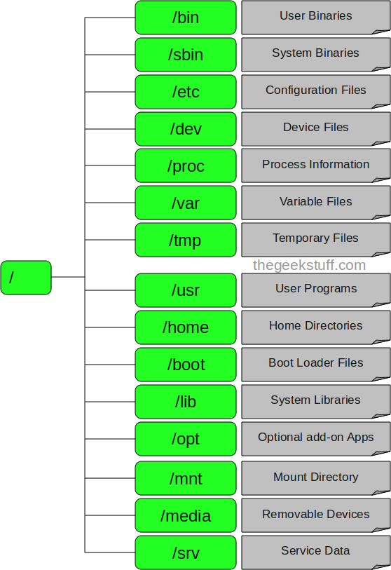

<h1>Cấu trúc file Linux</h1>

<h1>Cấu trúc cây thư mục trong Linux</h1>

1. `/ - Root`
Đúng với tên gọi của mình: nút gốc (root) đây là nơi bắt đầu của tất cả các file và thư mục. Chỉ có root user mới có quyền ghi trong thư mục này. Chú ý rằng /root là thư mục home của root user chứ không phải là /.

2. `/bin` - Chương trình của người dùng
Thư mục này chứa các chương trình thực thi. Các chương trình chung của Linux được sử dụng bởi tất cả người dùng được lưu ở đây. Ví dụ như: ps, ls, ping...

3. `/sbin` - Chương trình hệ thống
Cũng giống như /bin, /sbinn cũng chứa các chương trình thực thi, nhưng chúng là những chương trình của admin, dành cho việc bảo trì hệ thống. Ví dụ như: reboot, fdisk, iptables...

4. `/etc` - Các file cấu hình
Thư mục này chứa các file cấu hình của các chương trình, đồng thời nó còn chứa các shell script dùng để khởi động hoặc tắt các chương trình khác. Ví dụ: /etc/resolv.conf, /etc/logrolate.conf

5. `/dev` - Các file thiết bị
Các phân vùng ổ cứng, thiết bị ngoại vi như USB, ổ đĩa cắm ngoài, hay bất cứ thiết bị nào gắn kèm vào hệ thống đều được lưu ở đây. Ví dụ: /dev/sdb1 là tên của USB bạn vừa cắm vào máy, để mở được USB này bạn cần sử dụng lệnh mount với quyền root: # mount /dev/sdb1 /tmp

6. `/tmp` - Các file tạm
Thư mục này chứa các file tạm thời được tạo bởi hệ thống và các người dùng. Các file lưu trong thư mục này sẽ bị xóa khi hệ thống khởi động lại.

7. `/proc` - Thông tin về các tiến trình
Thông tin về các tiến trình đang chạy sẽ được lưu trong /proc dưới dạng một hệ thống file thư mục mô phỏng. Ví dụ thư mục con /proc/{pid} chứa các thông tin về tiến trình có ID là pid (pid ~ process ID). Ngoài ra đây cũng là nơi lưu thông tin về về các tài nguyên đang sử dụng của hệ thống như: /proc/version, /proc/uptime...

8. `/var` - File về biến của chương trình
Thông tin về các biến của hệ thống được lưu trong thư mục này. Như thông tin về log file: /var/log, các gói và cơ sở dữ liệu /var/lib...

9. `/usr` - Chương trình của người dùng
Chứa các thư viện, file thực thi, tài liệu hướng dẫn và mã nguồn cho chương trình chạy ở level 2 của hệ thống. Trong đó

- `/usr/bin` chứa các file thực thi của người dùng như: at, awk, cc, less... Nếu bạn không tìm thấy chúng trong /bin hãy tìm trong /usr/bin
- `/usr/sbin` chứa các file thực thi của hệ thống dưới quyền của admin như: atd, cron, sshd... Nếu bạn không tìm thấy chúng trong /sbin thì hãy tìm trong thư mục này.
- `/usr/lib` chứa các thư viện cho các chương trình trong /usr/bin và /usr/sbin
- `/usr/local` chứa các chương tình của người dùng được cài từ mã nguồn. Ví dụ như bạn cài apache từ mã nguồn, nó sẽ được lưu dưới /usr/local/apache2
10. `/home` - Thư mục người của dùng
Thư mục này chứa tất cả các file cá nhân của từng người dùng. Ví dụ: /home/john, /home/marie

11. `/boot` - Các file khởi động
Tất cả các file yêu cầu khi khởi động như initrd, vmlinux. grub được lưu tại đây. Ví dụ vmlixuz-2.6.32-24-generic

12. `/lib` - Thư viện hệ thống
Chứa cá thư viện hỗ trợ cho các file thực thi trong /bin và /sbin. Các thư viện này thường có tên bắt đầu bằng ld* hoặc lib*.so.*. Ví dụ như ld-2.11.1.so hay libncurses.so.5.7

13. `/opt` - Các ứng dụng phụ tùy chọn
Tên thư mục này nghĩa là optional (tùy chọn), nó chứa các ứng dụng thêm vào từ các nhà cung cấp độc lập khác. Các ứng dụng này có thể được cài ở /opt hoặc một thư mục con của /opt

14. `/mnt` - Thư mục để mount
Đây là thư mục tạm để mount các file hệ thống. Ví dụ như # mount /dev/sda2 /mnt

15. `/media` - Các thiết bị gắn có thể gỡ bỏ
Thư mục tạm này chứa các thiết bị như CdRom /media/cdrom. floppy /media/floopy hay các phân vùng đĩa cứng /media/Data (hiểu như là ổ D:/Data trong Windows)

16. `/srv` - Dữ liệu của các dịch vụ khác
Chứa dữ liệu liên quan đến các dịch vụ máy chủ như /srv/svs, chứa các dữ liệu liên quan đến CVS.