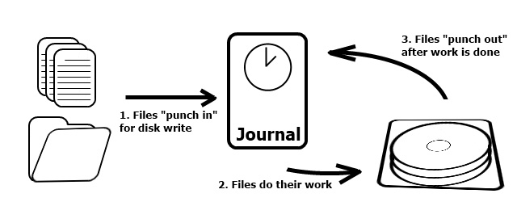
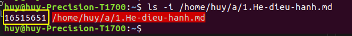
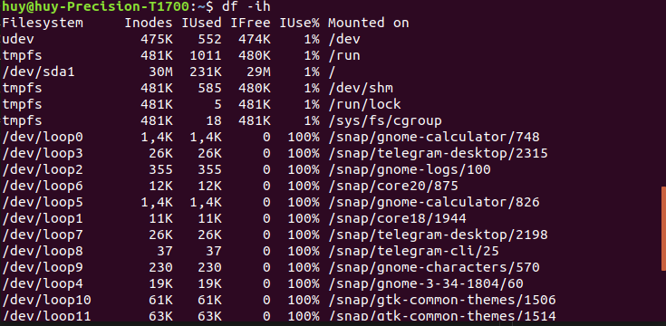

<h1 style="color:orange">1.Journaling trong linux</h1>
Journaling trong các hệ thống file máy tính hoạt động rất giống nhau. Mục đích của nó là theo dõi các thay đổi chưa được ghi lại (commit) đối với hệ thống file. Ngay cả sau khi có sự cố hoặc tắt máy đột xuất, bạn vẫn có thể truy cập phiên bản file mới nhất với khả năng bị lỗi thấp hơn.

Thuật ngữ “journal” xuất phát từ sự tương đồng với một cuốn nhật ký. Mọi thay đổi bạn ghi lại trong nhật ký sẽ được lưu trữ theo ngày và thời gian. Theo cách tương tự, journaling cho phép tất cả các bản cập nhật cho một file được lưu trữ trong phần liền kề của ổ đĩa.

Các cập nhật này không cần phải đặt gần nhau về mặt vật lý. Trên thực tế, các mục được ghi lại nằm rải rác trên ổ đĩa. Nhưng thay vì truy cập chúng một cách ngẫu nhiên, chúng có sẵn trong một chuỗi giống như nhật ký, với tốc độ nhanh hơn hàng ngàn lần.
<h2 style="color:orange">1.1.Journaling hoạt động thế nào?</h2>
Journaling chỉ được sử dụng khi ghi dữ liệu lên ổ cứng và đóng vai trò như những chiếc đục lỗ để ghi thông tin vào phân vùng. Đồng thời, nó cũng khắc phục vấn đề xảy ra khi ổ cứng gặp lỗi trong quá trình này, nếu không có journal thì hệ điều hành sẽ không thể biết được file dữ liệu có được ghi đầy đủ tới ổ cứng hay chưa.

Trước tiên file sẽ được ghi vào journal, đẩy vào bên trong lớp quản lý dữ liệu, sau đó journal sẽ ghi file đó vào phân vùng ổ cứng khi đã sẵn sàng. Và khi thành công, file sẽ được xóa bỏ khỏi journal và quá trình hoàn tất. Nếu xảy ra lỗi trong khi thực hiện thì file hệ thống có thể kiểm tra lại journal và tất cả các thao tác chưa được hoàn tất, đồng thời ghi nhớ lại đúng vị trí xảy ra lỗi đó.
<h2 style="color:orange">2.Các kiểu file system trong CentOS7</h2>
<h3 style="color:orange">2.1.Các định nghĩa</h3>

- Tebibyte (TiB): Tất cả chúng ta đều biết một gigabyte là bao nhiêu. 1 tebibyte (TiB) = 1024 gigabyte. TiB là một trong những đơn vị mặc định để thể hiện các giá trị lớn trong lưu trữ file. 
- Ngoài ra, 1 TiB = 1,09951 terabyte (TB).
- Pebibyte (PiB): 1 pebibyte (PiB) tương đương 1024 TiB hoặc khoảng 1 triệu gigabyte. Đây thực sự là một giá trị rất lớn.
- Cluster: Data cluster (cụm dữ liệu) là đơn vị nhỏ nhất của không gian ổ đĩa, có thể được sử dụng để lưu trữ một file. Nó có thể dao động từ 512 byte cho một sector đến 64KB cho 128 sector.
<h3 style="color:orange">2.2.EXT</h3>

Extended File System (Ext) là `hệ thống journaling` của Linux. Nó được lấy cảm hứng từ Unix File System (UFS) và đã trải qua 3 phiên bản kể từ khi xuất hiện vào đầu những năm 90.
- ext2 ban đầu được sử dụng trong Debian và Red Hat Linux. Ext2 vẫn được sử dụng trong phương tiện flash như thẻ SD và USB. Nó có thể chứa 2 đến 32TiB dữ liệu với dung lượng cluster tối đa là 8KB.
- ext3 được sử dụng với Linux, BSD và ReactOS. Các giới hạn về dung lượng tương tự như ext2.
- ext4 là phiên bản mới nhất của Ext, nó được sử dụng bởi BSD, PowerPC và hầu hết các bản phân phối Linux hiện tại. Giới hạn dung lượng là 1024PiB hoặc khoảng 1 triệu TiB. Kích thước cluster lớn nhất là 64KB.
<h3 style="color:orange">2.2.XFS</h3>
Đây là file system mặc định trên CentOS 7 
Được phát triển bởi Silicon Graphics từ nằm 1993 
Có các đặc điểm:

- Hạn chế được tình trạng phân mảnh dữ liệu
- Hỗ trợ volume size lên đến 8 exbibytes
- Hỗ trợ file size lên đến 8 exbibytes
- Có thể chứa tối đa 264 file trong 1 volume .
- Độ dài tên file tối đa là 255 kí tự .
- Cấu trúc thư mục theo dạng B+ tree

<h1 style="color:orange">3.Inodes</h1>
Inode (index node) là một khái niệm nền tảng trong các filesystem Linux và UNIX. Mỗi và mọi file trên Linux (và UNIX) đều có những thuộc tính sau:

- File type (executable, block special etc)
- Permissions (read, write etc)
- Owner
- Group
- File Size
- File access, change and modification time (nên nhớ UNIX không bao giờ lưu trữ thời gian tạo file)
- File deletion time
- Number of links (soft/hard)
- Các thuộc tính mở rộng như chỉ append hoặc không ai có thể xóa file bao gồm của user root.
- Access Control List (ACLs)

Tất cả các dữ liệu trên của 1 file hoặc 1 thư mục (được gọi là siêu dữ liệu) được lưu trong 1 inode, inode được đánh số

Tất cả những tập tin hình ảnh, video, tập tin HTML, thư mục hay bất kỳ tập tin mã nguồn nào đều liên quan đến inodes. Khi đã đạt đến giới hạn inodes, sẽ không còn có thể tạo thêm bất kỳ tập tin hay file nào nữa. Thậm chí, trang web của bạn còn có thể ngừng hoạt động. Một website bình thường cũng có thể có nhiều inodes.
- Hiểu đơn giản: 
Inode là cấu trúc dữ liệu trên Ext4 chứa tất cả siêu dữ liệu cho một file. 

Tất nhiên sẽ có nhiều file trên một hệ thống file. Như bạn có thể đoán, mỗi file sẽ có inode riêng và mỗi inode được đánh số
<h1 style="color:orange">3.1.Cách đánh số Inode</h1>
Số inode trên một hệ thống file bắt đầu từ 1 đến 10 inode đầu tiên được dành riêng cho việc sử dụng trong hệ thống. Các file người dùng có siêu dữ liệu được lưu trữ từ inode 11. Tất cả các inode được xếp chồng lên nhau gọn gàng trong một bảng inode.

Một mục trong bảng inode sẽ có dung lượng 256 byte. Đối với một file, Linux sắp xếp thông minh tất cả các siêu dữ liệu trong phạm vi 256 byte này! `Ngoài ra, mỗi inode cho một file cũng sẽ có thông tin về vị trí của dữ liệu trong hệ thống file.`

Mặc dù inode chứa thông tin về vị trí lưu dữ liệu của file nhưng nó không tham gia vào hoạt động giúp truy xuất dữ liệu nhanh hơn.
<h1 style="color:orange">3.2.Cách xem số Inode</h1>
SỬ dụng lệnh: 

    # ls -i ten_file
để xem inode của file đó được đánh số nào
 
16515651 là inode của file

Để xem số  inode còn lại có thể ghi trong ổ :

    # df -ih

