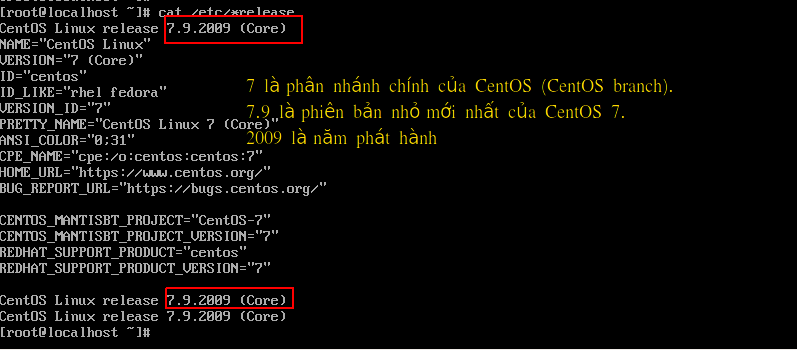
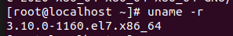
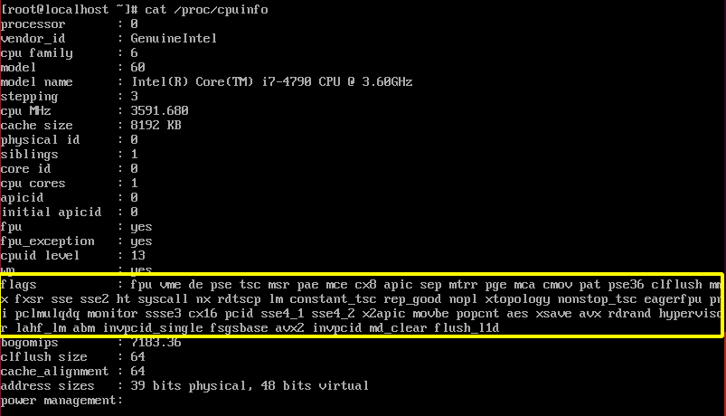
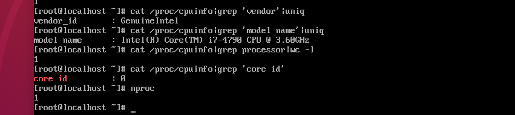
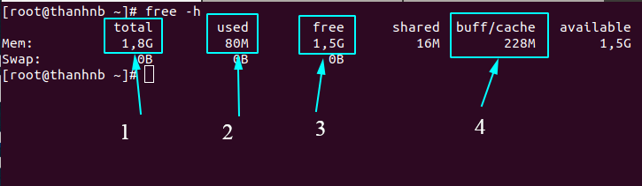
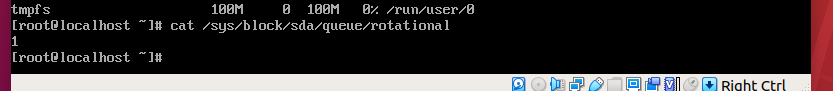
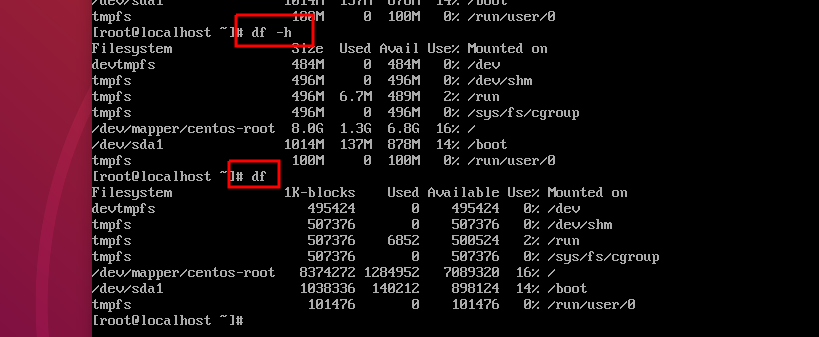
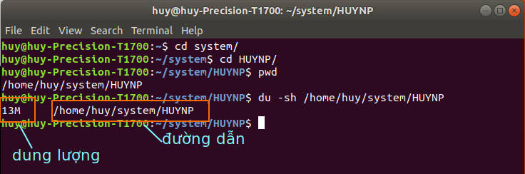
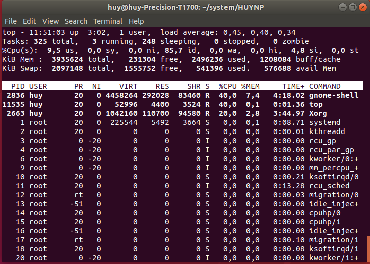
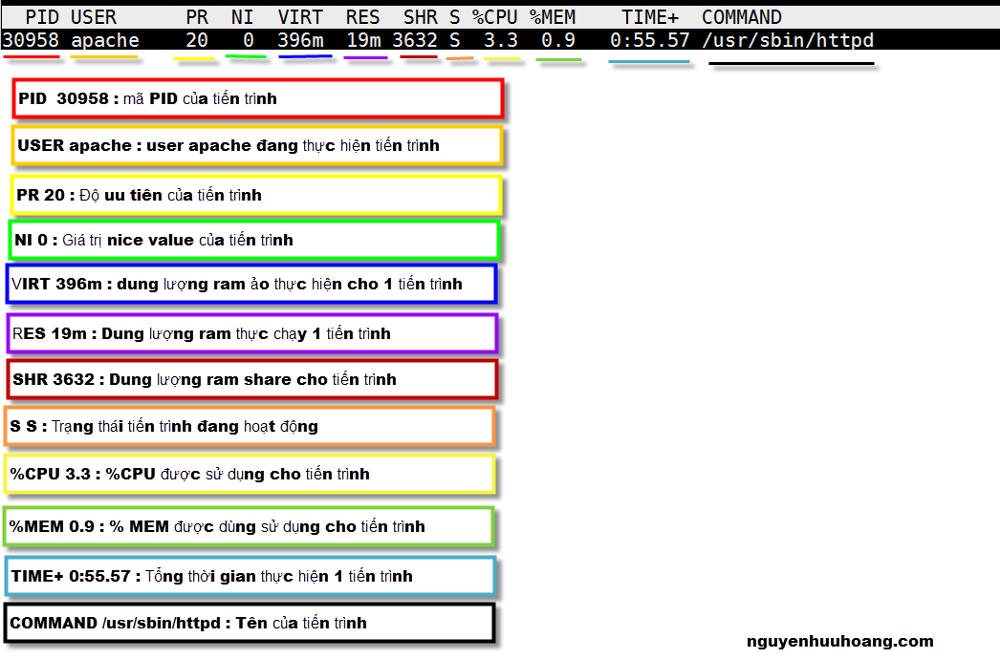

<h1>Xem phiên bản linux</h2> 

    lsb_release -a
hoặc
    
    cat /etc/*release

<h2 style="color:orange">Nhân Linux</h2>
Cách kiểm tra phiên bản kernel hiện tại :

     # uname -r

Trong đó :
- 3 là phiên bản kernel .
- 10 đề cập đến phiên bản sửa đổi chính hiện tại
- 0 đề cập đến phiên bản sửa đổi phụ hiện tại
- 1160 đề cập đến bản vá cuối cùng được cập nhật cho phiên bản này
- e17 có nghĩa kernel này dành cho tất cả các phiên bản RHEL/CentOS 7.x
- x86_64 là độ rộng thanh ghi 64_bit như của window.

Kiểm tra tất cả các phiên bản kernel đã cài đặt trên CentOS :

    # rpm -q kernel
Xóa các bản kernel cũ hơn không dùng đến, vd:

    # yum remove kernel-3.10.0-957.el7.x86_64
<h1>Xem cấu hình máy</h1>
<h2 style="color:orange">CPU:</h2>

      cat /proc/cpuinfo

`Flags` là đặc điểm của CPU. vd:

64-bit (x86_64/AMD64/Intel64)? `lm` 
Hardware virtualization (VMX/AMD-V)? `vmx` (Intel), `svm` (AMD) 
Accelerated AES (AES-NI)? `aes` 
TXT (TPM)? `smx` 
a hypervisor (announced as such)? `hypervisor` 
Những đặc điểm này được quan tâm bởi những nhà phát triển kernel

Tất cả các giá trị `flags`: [flags](http://publicclu2.blogspot.com/2013/05/flags-in-x86-linuxs-proccpuinfo.html)

Ngoài ra có thể xem rút gọn thông tin CPU bằng các lệnh:
            
    # cat /proc/cpuinfo|grep 'vendor'|uniq (nhà sản xuất)
    # cat /proc/cpuinfo|grep 'model name'|uniq (model CPU)
    # cat /proc/cpuinfo|grep 'core id' (số core)
    # cat /proc/cpuinfo|grep processor|wc -l  (số luồng)

    
    #nproc (xem số luồng)

<h2 style="color:orange"> RAM:</h2>
Sử dụng lệnh:
      
      # free -m
      hoặc # cat /proc/meminfo
để kiểm tra thông số RAM:

(1) Tổng dung lượng bộ nhớ bằng 1,8 GB `(total)` 
(2) Đã sử dụng 80 MB `(used)` 
(3) Dung lượng rảnh rỗi bằng 1,5 GB `(free xấp xỉ = available)` 
(4) Dung lượng bộ nhớ sử dụng cho việc lưu đệm bằng 228 MB `(buff/cache`

Lưu ý:
- Số RAM trống tuy chỉ bằng 1.5 GB (free) nhưng thực tế bạn có thể sử dụng nhiều hơn thế. Tổng số bộ nhớ có thể sử dụng sẽ bằng free + buff/cache. Vậy ở đây, số RAM thực sự có thể sử dụng được sẽ bằng 1.728 GB.
- Lượng bộ nhớ RAM được buff/cache thường được sử dụng để cải thiện hiệu năng đọc ghi ổ đĩa. Vì bộ RAM sẽ có tốc độ truy vấn, đọc ghi cao hơn rất nhiều so với tốc độ truy vấn, đọc ghi ổ đĩa nên hệ điều hành sử dụng lượng RAM còn trống để cài thiện hiệu năng.
- `SWAP` là ram ảo được tạo ra nhờ lấy bộ nhớ từ ổ cứng(có trên Debian và CentOS), có tốc độ chậm hơn nhiều so với RAM vật lý, không nên dùng.

<h2 style="color:orange"> Disk</h2>
Lệnh:
       
       # cat /sys/block/sda/queue/rotational

để xem dùng loại ổ cứng gì

- `1` là HDD
- `0` là SSD

Xem ổ cứng sử dụng lệnh:

    # df hoặc df -h (lệnh hiển thị theo gb)

- filesystem: tên filesystem có thể trùng với phân vùng đĩa.
- 1K-blocks: Số lượng khối (block) có trong filesystem có kích thước 1Kb.
- Used: Số lượng 1K-block được sử dụng trong filesystem.
- Available: Số lượng 1K-block đang có sẵn.
- Use%: Phần trăm đĩa đã sử dụng trong filesystem.
- Mounted on: Nơi mount (file sử dụng phân vùng bộ nhớ đó)

<h3 style="color:orange">Lệnh du (disk usage)</h3>

Sử dụng lệnh `du` để xem bộ nhớ 1 file hay 1 thư mục sử dụng:

    # du hoặc # du -h 

- Để kiểm tra dung lượng file mình đang đứng dùng
    
    # pwd
để lấy đường dẫn tới file con trỏ trỏ tới
- dùng `-sh` để tóm tắt hiển thị dung lượng.

<h3 style="color:orange">Lệnh top</h3>
Tương tự task manager trong windows

- `Dòng 1` 
Thời gian 
Máy tính đã chạy được bao lâu rồi 
Số lượng người dùng 
Trung bình tải 
Trung bình tải hiển thị thời gian load hệ thống trong 1, 5 và 15 phút cuối. 
- `Dòng 2` 
Tổng số nhiệm vụ 
Số lượng tác vụ đang chạy 
Số lượng tác vụ trong trạng thái “ngủ” 
Số lượng tác vụ đã dừng 
Số lượng tác vụ zombie (tiến trình không tồn tại) 
- `Dòng 3` 
Mức sử dụng CPU bởi người dùng theo tỷ lệ phần trăm 
Mức sử dụng CPU bởi hệ thống theo tỷ lệ phần trăm 
Mức sử dụng CPU bởi các tiến trình có mức ưu tiên thấp theo tỷ lệ phần trăm 
Mức sử dụng CPU bởi idle process (tiến trình cho biết bộ xử lý đang rảnh rỗi) theo tỷ lệ phần trăm 
Mức sử dụng CPU bởi io wait (thời gian CPU không hoạt động để chờ I/O disk hoàn thành) theo tỷ lệ phần trăm 
Mức sử dụng CPU bởi việc ngắt phần cứng theo tỷ lệ phần trăm 
Mức sử dụng CPU bởi việc ngắt phần mềm theo tỷ lệ phần trăm 
Mức sử dụng CPU bởi steal time (thời gian CPU ảo “chờ” CPU thực, trong khi bộ ảo hóa đang phục vụ bộ xử lý ảo khác) theo tỷ lệ phần trăm 
- `Dòng 3` 
Tổng bộ nhớ hệ thống 
Bộ nhớ trống 
Bộ nhớ đã sử dụng 
Bộ nhớ đệm buffer cache 
- `Dòng 4` 
Tổng swap có sẵn 
Tổng swap còn trống 
Tổng swap đã sử dụng 
Bộ nhớ khả dụng 
- `Bảng chính` 
ID tiến trình 
Người dùng 
Mức độ ưu tiên 
Mức độ nice (gọi một tập lệnh shell với mức độ ưu tiên cụ thể) 
Bộ nhớ ảo được sử dụng bởi tiến trình 
Bộ nhớ chương trình sử dụng trong CPU 
Bộ nhớ trong RAM 
CPU được sử dụng bởi tiến trình theo tỷ lệ phần trăm 
Bộ nhớ được sử dụng bởi tiến trình theo tỷ lệ phần trăm 
Thời gian tiến trình đã được chạy 
Lệnh bắt đầu process 

<h3 style="color:orange">Kill</h3>
Dùng lệnh:

    # kill -9 [pid]
    (pid là process ID)
để kill tiến trình
<h2 style="color:orange"> Một số lệnh hệ thống</h2>

- Reboot
Khởi động lại Server :

        # reboot
- Init

        # init [number]
Number: 
. 3 : restart 
. 0 : shutdown 
- date
Xem ngày giờ hệ thống :

      # date
- Xem tên máy chủ:

        # hostname