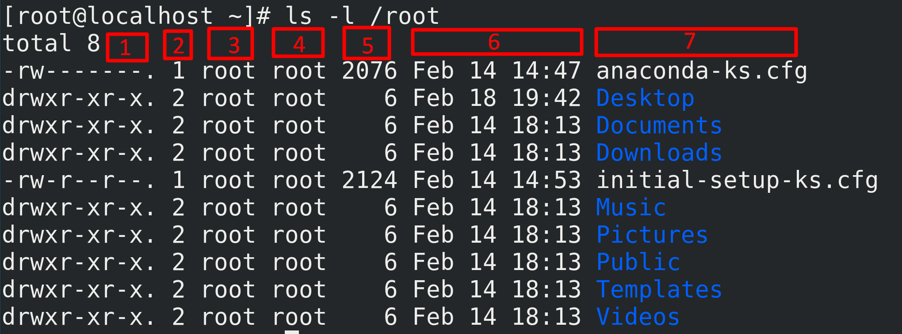
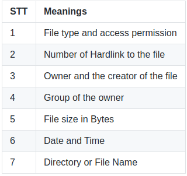

<h1 style="color:orange"> Điều khiển file trong Linux</h1>
<h2 style="color:orange">1. pwd(print working directory)</h2>

`pwd` để xem con trỏ của mình đang ở đâu
<h2 style="color:orange">2. cd(change directory)</h2>

`cd` để chuyển con trỏ tới file mong muốn (chuyển vị trí)
vd: đang ở /home/username/ 
gõ lệnh: 

    # cd /home/username/Downloads 
sẽ chuyển đến file Downloads
<h2 style="color:orange">3. ls</h2>
Mặc định là command `ls`` sẽ hiển thị danh sách file trong thư mục hiện tại.

Nếu bạn muốn xem nội dung thư mục khác, hãy nhập ls và sau đó là đường dẫn thư mục. Ví dụ: nhập 
     
     # ls /home/username/Document
để xem nội dung của Documents.

Có nhiều phiên bản để dùng với lệnh ls như sau:
- ls -R liệt kê các file bao gồm cả các thư mục phụ bên trong
- ls -a liệt kê những file ẩn
- ls -al liệt kê tất cả file và thư mục với thông tin chi tiết như phân quyền, kích thước, chủ sở hữu, vân vân.

VD: lệnh # ls -l sẽ show ra:

Tìm file chỉnh sửa gầ n nhất dùng lệnh:

    # ls -t|head -1
<h2 style="color:orange">4. cat (concatenate)</h2>

`cat` sử dụng để tìm file và hiện thị nó. Cấu trúc:

    # cat [OPTION] [FILE]
 - Cat giúp bạn nhanh chóng tạo file và ghi nội dung vào trong đó. Để làm vậy, sử dụng dấu > để chuyển vào nội dung của file.

       # cat > filename.txt
File đã được tạo, giờ bạn chỉ cần nhập nội dung và gõ Enter cho từng dòng. Sau khi hoàn tất, nhấn CTRL+D để thoát file.
- Xem nội dung của file bằng Cat Command

      # cat filename.txt hoặc
      # cat *.txt
để hiển thị toàn bộ nội dung của file text.
- Thay vì hiển thị nội dung trong một file, bạn còn có thể chuyển hướng kết quả vào một file khác với option >.

      # cat source.txt > destination.txt
Nếu file đích không có sẵn, lệnh này sẽ tự tạo file đó ra. Hoặc ghi đè lên file có cùng tên. 
Để ghi nội dung vào trong cuối file, hãy sử dụng dấu >>:

     # cat source.txt >> destination.txt
<h2 style="color:orange">5. cp(copy)</h2>
Sử dụng command cp để sao chép files từ thư mục hiện tại. VD:

    # cp scenery.jpg /home/username/Pictures 
sẽ tạo bản copy của scenery.jpg vào danh mục Pictures.
<h2 style="color:orange">6. mv(move)</h2>
Hoạt động tương tự lệnh cp với format:

    # mv file.txt /home/username/Documents.
- Để di chuyển thư mục directory sử dụng lệnh:
    
        # mv /[directory]/ /[destination directory]/
        # mv /home/vivek/data/ /nas/home/vivek/archived/
        hoặc 
        # cd /home/vivek
        # mv data/ /nas/home/vivek/archived/
- Để đổi tên file: 
        
        # mv oldname.ext newname.ext
<h2 style="color:orange">7. mkdir (make directory)</h2>
Tạo thư mục (directory). VD:
     
    # mkdir music/
tạo thư mục mới tên music tại file đang ở.
<h2 style="color:orange">8. Command rmdir</h2>

     # rmdir music/
Xóa file music. Tuy nhiên, rmdir chỉ cho phép bạn xóa các thư mục trống. 
Ngoài ra, có thể dùng lệnh:
     
     # rm -r music/
để xóa directory nhưng nên cẩn thận vì lệnh này xóa cả file bên trong, không thể khôi phục.
<h2 style="color:orange">9. touch</h2>
Command touch cho phép bạn tạo files mới trống thông qua dòng lệnh.Ví dụ: 
     
     # touch /home/username/Documents/Web.html 
để tạo file HTML tiêu đề Web trong thư mục Documents.
<h2 style="color:orange">10. locate</h2>
`locate` (định vị) file, giống như lệnh tìm kiếm trong Windows. Hơn nữa, việc sử dụng argument -i với lệnh này làm cho nó không còn phân biệt chữ hoa chữ thường, nên bạn có thể tìm file ngay cả khi không nhớ tên chính xác.

Để tìm file chứa hai hoặc nhiều từ, hãy sử dụng dấu hoa thị (*). Ví dụ: command locate -i school*note sẽ tìm tất cả file nào chứa từ “school” và “note”, không phân biệt chữ hoa hay chữ thường.
<h2 style="color:orange">11. find</h2>
Hoạt động gần giống với locate. Sự khác biệt là bạn sử dụng command find để xác định vị trí files trong thư mục nhất định.  
Ví dụ, command 
      
      # find /home/ -name notes.txt 
sẽ tìm file tên notes.txt trong thư mục chính và thư mục con của nó.

- Để tìm file trong thư mục hiện tại, dùng lệnh 
      
        # find . -name notes.txt
<h2 style="color:orange">12. echo</h2>
Lệnh này được dùng để chuyển dữ liệu vào một file. Ví dụ, nếu bạn muốn thêm text “Hello, my name is John” vào trong file  name.txt, bạn nhập lệnh 
      
     # echo "Hello, my name is John" >> name.txt
Dòng `Hello, my name is John` sẽ được thêm vào cuối file
Nếu sử dụng lệnh
     
     # echo "Hello, my name is John" > name.txt
Nó sẽ ghi đè lên nội dung của file name.txt (xóa nội dung name.txt và ghi dòng trên vào)
<h2 style="color:orange">13. head</h2>
Command head được sử dụng để xem dòng đầu tiên của bất kỳ file văn bản nào. Theo mặc định, nó sẽ hiển thị 10 dòng đầu tiên, nhưng có thể thay đổi số này theo ý mình. VD:

    # head -n [number] filename.txt
với n là số dòng, có thể là: 10,12. VD:
    
    # head -n 7 /home/Downloads/name.txt
hiển thị 7 dòng đầu file "name.txt"
<h2 style="color:orange">14. tail</h2>
Hoạt động tương tụ lệnh `head` nhưng là hiển thị từ cuối file.VD:

    # tail -n 7 /home/Downloads/name.txt
Hiển thị 7 dòng cuối file "name.txt"
<h2 style="color:orange">15. diff</h2>
Command diff sẽ so sánh nội dung của 2 files từng dòng một. Sau khi phân tích files này, nó sẽ xuất ra các dòng không khớp nhau. Lập trình viên thường dùng lệnh này khi cần thực hiện một số thay đổi chương trình thay vì viết lại toàn bộ mã nguồn.
   
     # diff filename1.txt filename2.txt
vd:
     
     # diff /home/Documents/name1.txt /home/Documents/name2.txt
<h2 style="color:orange">16. grep(Global regular expression print)</h2>
Đây là một trong số các lệnh cơ bản trong Linux hữu ích được dùng hằng ngày. Command grep cho phép bạn tìm kiếm tất cả text thông qua tập tin nhất định.

VD: 
      
      # grep blue notepad.txt 
sẽ tìm từ blue trong file notepad. Các dòng có chứa từ được tìm sẽ hiển thị đầy đủ.
<h2 style="color:orange">17. wc(word count)</h2>
Sử dụng lệnh:

    # wc [options] [file]
    # wc /home/huy/Documents/file1.txt
