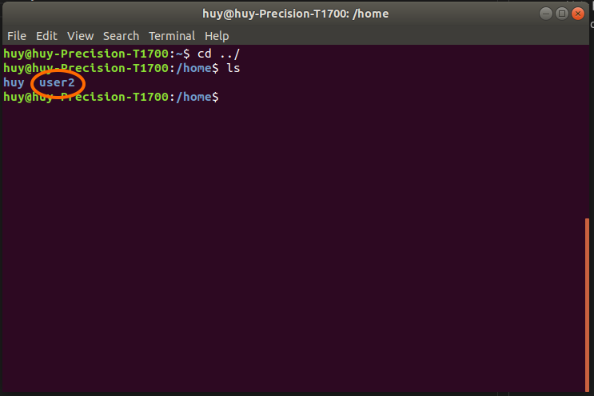
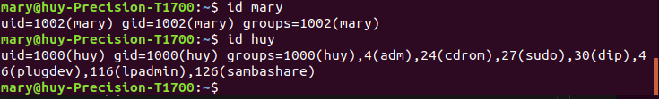
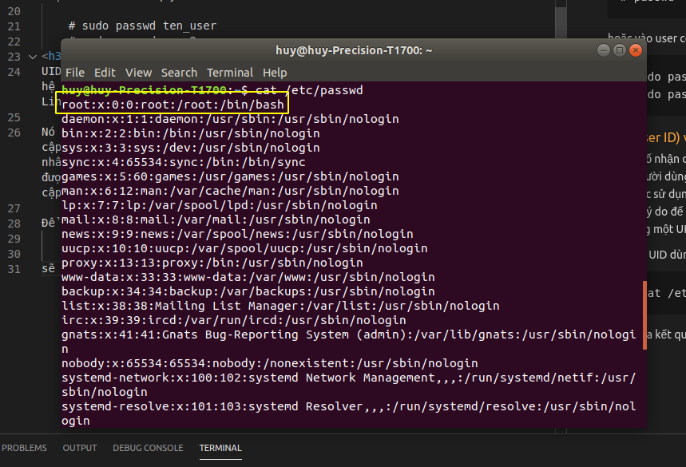
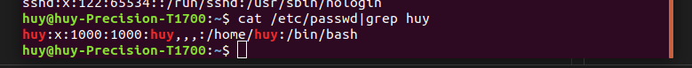
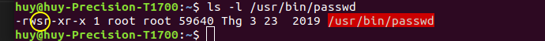
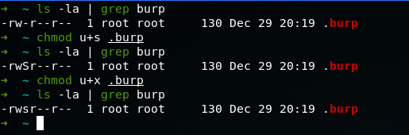
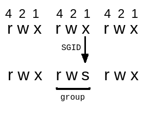
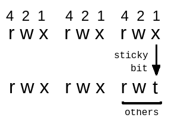
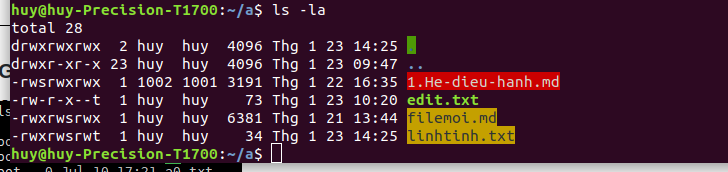

<h1 style="color:orange">User</h1>
Tạo user mới bằng lệnh:
     
     # sudo adduser tên_user
     # sudo adduser user2
User mặc định tạo ra sẽ có tên là user2 và trong group user2 
Sự khác biệt giữa `adduser` và `useradd` là adduser thân thiện với người dùng hơn do tạo 1 file thư mục trong /home/ còn useradd thì phải tùy chỉnh. VD:

<h2 style="color:orange">Tùy chỉnh</h2>
Để từ user này chuyển sang user khác ta dùng lệnh:
   
    # su tên_user
    # su user2
<h2 style="color:orange">ID user</h2>
Để xem thông tin 1 user ta dùng:

    # id user
    # id huy
 
Ở đây hiển thị những group và GID mà user đó thuộc
<h3 style="color:orange">Đổi mật khẩu</h3>
Chuyển sang user cần đổi mật khẩu và dùng lệnh:
    
    # passwd
hoặc vào user có quyền sudo:
    
    # sudo passwd ten_user
    # sudo passwd user2
<h2 style="color:orange">Group</h2>
Tạo group bằng lệnh:
   
      # sudo groupadd ten_group
      # sudo groupadd group1
Xóa group:
     
      # sudo groupdel ten_group
      # sudo groupdel group1
<h3 style="color:orange">UID(User ID) và GID(Group ID)</h3>
UID là số nhận dạng duy nhất được gán cho mọi người dùng có trong hệ thống Linux. Vai trò chính của UID là xác định người dùng với Linux kernel.

Nó được sử dụng để quản lý tài nguyên mà người dùng có quyền truy cập trong hệ thống. Đó là một trong những lý do để sử dụng UID duy nhất cho mọi người dùng có sẵn. Mặt khác, nếu có hai người dùng được liệt kê với cùng một UID, thì cả hai đều có thể có quyền truy cập vào tài nguyên dành cho người kia.

Để xem UID dùng lệnh: 
    
     # cat /etc/passwd
sẽ cho ra kết quả:

Dữ liệu được hiển thị trong 7 cột, như được liệt kê dưới đây. Các trường này được phân tách bằng dấu hai chấm (:)
- Cột 1 - Tên
- Cột 2 - Mật khẩu - Nếu người dùng đã đặt mật khẩu trên trường này, thì nó được chỉ định bằng chữ cái (x).
- Cột 3 - UID (User ID)
- Cột 4 - GID (Group ID)
- Cột 5 - Chứa thông tin chung về người dùng và có thể để trống.
- Cột 6 - Thư mục Home
- Cột 7 - Shell - Đường dẫn đến shell mặc định cho người dùng.

Nếu muốn hiện UID và GID của 1 user thì có thể dùng lệnh:
   
     # cat /etc/passwd|grep huy

Nếu muốn hiển thị GID thì có thể dùng lênh:
   
     # cat /etc/group
Nếu có tên của group muốn tìm GID dùng:
     
     # cat /etc/group|grep ten_group
     # cat /etc/group|grep sudo
Và ngược lại có GID muốn tìm tên:
     
     # cat /etc/group|grep GID
     # cat /etc/group|grep 27
<h3 style="color:orange">USERMOD (user modify)</h3>
Để thay đổi thông tin user chúng ta sử dụng lệnh usermod.

Cú pháp lệnh:
     
     # usermod [options] username
Xem tùy chỉnh usermod bằng # usermod -h

vd: 

     huy@huy-Precision-T1700:~$ sudo usermod -c cacthucacthu -g 2000 -G 2001 -s /bin/bash user2
- -c : thay đổi thông tin về username.
- -g: thay đổi group chính chứa username.
- -G: thay đổi các group phụ chứa username. Nếu thêm option -a sau GID hoặc groupname thì danh sách group phụ chứa username sẽ add thêm group này chứ không bị thay đổi hoàn toàn thành group này.
- -s: thay đổi default shell cho username.
- user2: username 

<h1 style="color:orange">SUID, SGID, Sticky</h1>
<h2 style="color:orange">SUID (set user ID)</h2>
SUID (Set user ID), thường được sử dụng trên các file thực thi(executable files). Quyền này cho phép file được thực thi với các đặc quyền (privileges) của chủ sở hữu file đó. 
Ví dụ: nếu một file được sở hữu bởi user root và đuợc set SUID bit, thì bất kể ai thực thi file, nó sẽ luôn chạy với các đặc quyền của user root. Và khi xem permissions của file, ở phần User, nhãn x sẽ được chuyển sang nhãn s.

Cách cài đặt SUID:
 
     # chmod u+s ten_file/thu_muc hoặc
     # chmod 4644 ten_file/thu_muc
4 ở đầu đại diện cho tham số u:user; 644 lần lượt là read, write, execute. Nếu muốn phần quyền cho thư mục kiểu đệ quy thì thêm option -R

Lưu ý: Nếu file chưa có quyền thực thi (executing file as program), SUID sẽ là chữ S. Để nhãn S trở thành s bạn phải cấp quyền thực thi cho file:
VD:

<h2 style="color:orange">SGID (set group ID)</h2>
SGID ( hay Set group ID ) , cũng tương tự như SUID. Quyền này cho phép file được thực thi với các đặc quyền (privileges) của group sở hữu file đó. Ví dụ: nếu một file thuộc sở hữu của Staff group, bất kể ai thực thi file đó, nó sẽ luôn chạy với đặc quyền của Staff group. Chữ x trong phần group sẽ được chuyển thành s tương tự SUID.

Cách cài đặt:
    
     # chmod g+s ten_file
     # chmod 2644 ten_file
Tương tự đại diện tham số g: group; 644: read-write-execute và nếu muốn phân quyền đệ quy thêm option -R
<h2 style="color:orange">Sticky Bit</h2>
Hạn chế người dùng chỉ có thể xóa những file do chính họ tạo ra. Có tác dụng lớn với những file phân quyền 777 (ai cũng có thể thêm/sửa) nhưng người dùng chỉ có thể xóa file của họ.

Cách cài đặt:
     
     # chmod +t ten_file
     # chmod o+t ten_file
     # chmod 1644 ten_file

Phân biệt theo màu:

- Những file/thư mục có cài SUID sẽ có màu hồng. - Những file/thư mục chỉ cài SGID hoặc cài SGID và Sticky có màu vàng
- Những file/thư mục chỉ cài Sticky sẽ không đổi màu.
<h3 style="color:orange">Khi nào dùng SUID, SGID, sticky bit</h3>

- Trường hợp các lệnh/chương trình/tập lệnh chỉ tài khoản root mới có quyền thực thi. Dùng SUID và SGID để cấp quyền thực thi cho các user thường.
- Trường hợp không muốn cung cấp thông tin đăng nhập của người dùng cụ thể nhưng muốn chạy một chương trình dưới quyền là chủ sở hữu(nhận các giá trị từ 2 đến 7).
- Trường hợp không muốn dùng lệnh sudo nhưng muốn cấp quyền thực thi cho lệnh/tập lệnh(nhận các giá trị từ 2 đến 7)
<h3 style="color:orange">So sánh SUID và Chmod</h3>

- SUID thường được dùng trong những câu lệnh của 1 hđh (1 tính năng mới). VD: usr/bin/passwd ---->ít dùng
- chmod thường được dùng để phân quyền chỉnh sửa giữa các user với nhau (end user- system đổ xuống)