<h1 style="color:orange">Network configuring</h1>
Để xem cấu hình các interface network trên CentOS7 dùng lệnh:

    # ip a
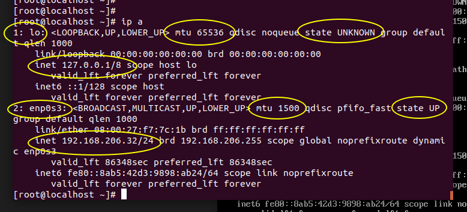

- Các interface là l0 và enp0s3
- mtu 65536 hay mtu 1500 là maximum transmission unit
- state là trạng thái. State của một ethernet interface là UP hoặc DOWN.
- 192.168.206.32/24 là địa chỉ IP của interface
- Kiểm tra network bằng lệnh ping. VD:
    
        # ping google.com
 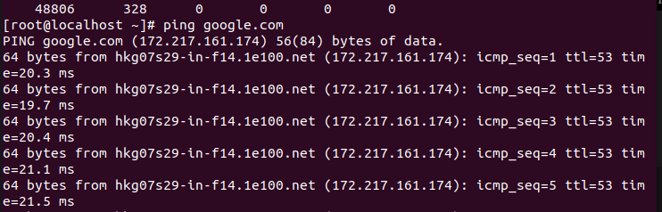
 Kết quả trả về như hình là có mạng.

 <h2 style="color:orange">Xem thông tin interface network</h2>
 
- Để xem có những interface network nào dùng lệnh:

        # ls /etc/sysconfig/network-scripts

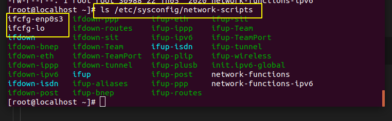
Ở đây hiện 2 interface là: enp0s3 và lo 
Network interface của centos tên là `enp0s3`
- Để xem thông tin card mạng:

        # cat /etc/sysconfig/network-scripts/ifcfg-enp0s3

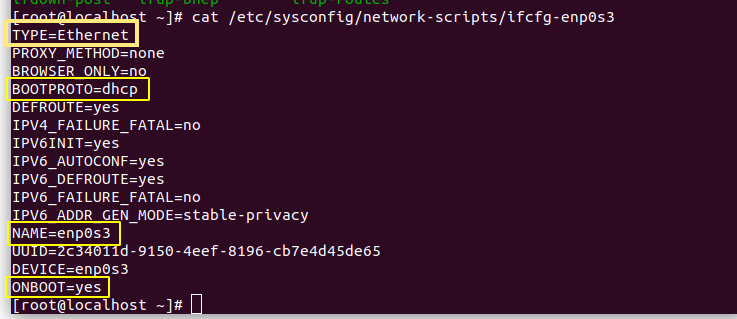

TYPE: ethernet, có thể là bonding.
BOOTPROTO có các option: 
. dhcp: card mạng nhận địa chỉ ip động dhcp 
. static: cấu hình địa chỉ ip tĩnh 
. none: không có địa chỉ 
NAME: tên card mạng 
ONBOOT: 
. yes: card mạng được bật 
. no: card mạng tắt 

Ngoài ra, còn có lệnh:
     
    # nmcli c s
    # nmcli dev status
để xem các interface nào đang hoạt động
<h2 style="color:orange">Cấu hình ip tĩnh</h2>
Sử dụng lệnh:
  
    # vim /etc/sysconfig/network-scripts/ifcfg-enp0s3
để chỉnh sửa và thêm cấu hình ip tĩnh:
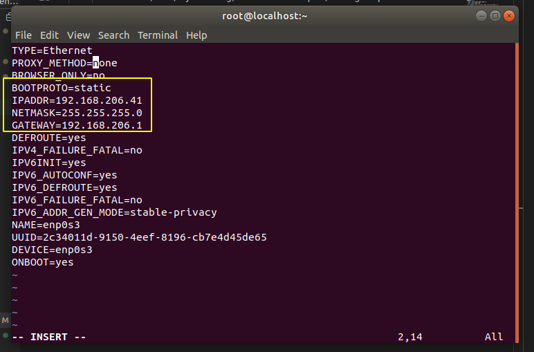

Sử dụng lệnh:

    # ifdown enp0s3 và
    # ifup enp0s3
để reset card mạng (thực thi file cấu hình)
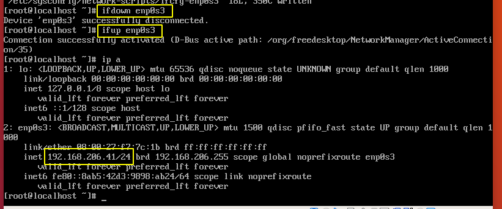
- Tương tự để chỉnh lại cấu hình DHCP, chỉnh lại dòng BOOTPROTO=dhcp rồi lại down và up card mạng để thực thi cấu hình.

<h2 style="color:orange">Xem default-gateway</h2>
SỬ dụng lệnh:
    
    # ip route show
để xem dafault-gateway
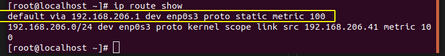

Default via thể hiện default-gateway.

<h2 style="color:orange">/etc/hosts</h2>

- Dùng để phân giải hostname không phân giải được
- Dùng thay DNS trong hệ thống mạng LAN
    + 127.0.0.1 <=> localhost.localdomain
    + ::1 <=> localhost.localdomain

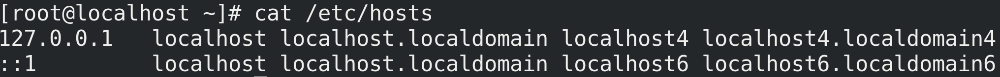
<h2 style="color:orange">/etc/resolv.conf</h2>
File để cấu hình DNS

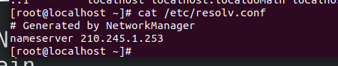
<h2 style="color:orange">Cấu hình IP bằng giao diện GUI</h2>
Gõ lệnh:
    
    # nmtui
- Cửa sổ NetworkManager TUI hiện ra , chọn Edit a connection => OK
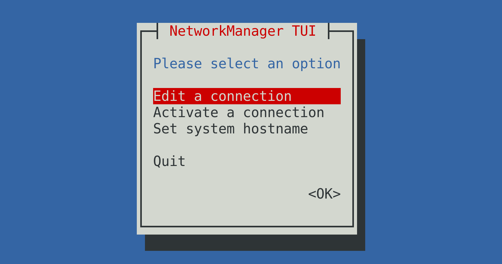
Chọn Card mạng cần đặt IP ( enp0s3 ):
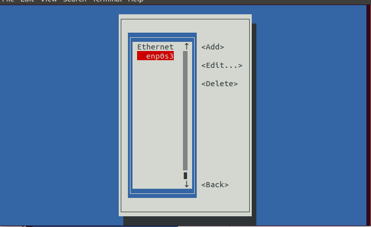
Chọn IPV4 CONFIGURATION => Manual
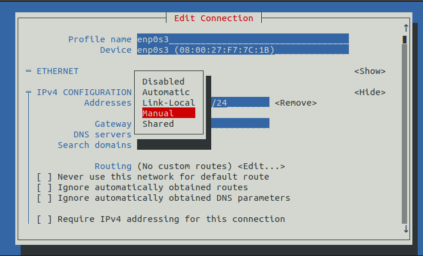
Đặt các thông số IP => OK
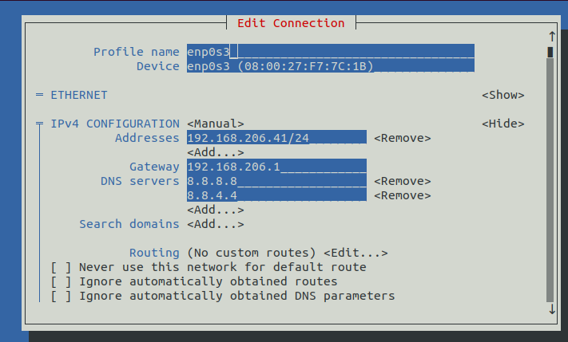

<h2 style="color:orange">nmcli</h2>

Đây là công cụ giúp điều khiển trình quản lý mạng trong Linux bằng dòng lệnh .

Xem các trạng thái kết nối cơ bản :
   
        # nmcli [options] [command] [arguments]
Options : 
-a : hiển thị đầy đủ thông tin về phần cứng card mạng gồm MAC , MTU , IP ,... 
-v : hiển thị version của nmcli 
Commands + Arguments :
- general : 
    - status : 
    - hostname : hiển thị hostname 
- network : 
    - on : enable card mạng
    - off : disable card mạng
    - connectivity : xem trạng thái kết nối : 
           - full : đã kết nối mạng và được truy cập Internet 
           - limited : đã kết nối mạng nhưng không được phép truy cập Internet 
           - none : chưa được kết nối mạng
- radio :
     + all : hiển thị trạng thái tất cả các kết nối không dây
     + wifi : hiển thị trạng thái wifi 
           - off : disable card wifi 
           - on : enable card wifi 
- monitor : quản lý status mạng theo runtime
- connection ( con ):
show --active : hiển thị các kết nối đang active
- device ( dev ) :
     - status : hiển thị trạng thái các interface
     - show if_name : hiển thị thông tin chi tiết của interface
     - wifi list : liệt kê các sóng wifi bắt được 
            .--auto : 
            .--rescan : 
     - wifi connect : kết nối tới mạng wifi đã biết 
            - SSID password "password"