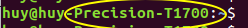
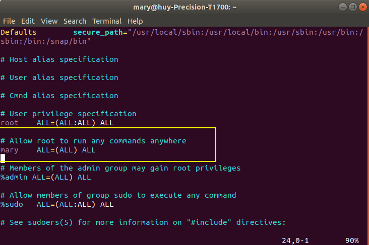
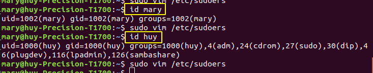
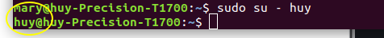

<h1 style="color:orange">1. File /etc/sudoers</h1>
Cấu trúc:

    # %GROUP HOSTNAME=(TARGET_USERS) COMMAND
    # USER HOSTNAME=(TARGET_USERS) COMMAND
- %GROUP: tên group hoặc user được cấp quyền
-   HOSTNAME: tên máy luật áp dụng lên. Tham số này cần thiết vì sudo được thiết kế để bạn có thể dùng một file sudoers cho các máy khác . Lúc này sudo sẽ xem máy đang chạy được dùng các luật nào . Nói cách khác , bạn có thể thiết kế các luật cho từng máy trong hệ thống . Tham số này thường đặt là ALL.

VD: 
- TARGET-USERS: Tên người dùng đích “mượn” quyền root thực thi.
- COMMAND : Tên “lệnh” ( thực ra là các tập tin thực thi binary - chỉ user root được sử dụng ) mà người dùng được quyền thực thi với bất kỳ tham số nào mà họ muốn . Tuy nhiên bạn cũng có thể đặc tả các tham số của lệnh ( bao gồm các dấu thay thế wildcards ). Ngược lại , có thể dùng kí hiệu “” để ám chỉ là lệnh chỉ được thực thi mà không có tham số nào cả.
<h2 style="color:orange">2. Thực hiện cấp quyền user</h2>
<h3 style="color:orange">Bước 1:</h3>
Đăng nhập vào user root:

    # su
    hoặc #sudo -i
<h3 style="color:orange">Bước 2:</h3>
Chỉnh sửa file /etc/sudoers:

    # vi /etc/sudoers/
    hoặc # visudo
<h3 style="color:orange">Bước 3:</h3>

 Thêm dòng:
     
    mary ALL=(ALL) ALL
Cho phép user mary quyền chạy superuser do ở mọi nơi
<h3 style="color:orange">Bước 4:</h3>
Lưu bằng lệnh:
    
    # wq!
<h3 style="color:orange">Bước 5:</h3>
Kiểm tra:

`user mary` không có ở trong nhóm sudo như `user huy` nhưng vẫn có thể sử dụng lệnh sudo
<h2 style="color:orange">3. 1 số ví dụ khác</h2>
Thêm lệnh:
     
    tom ALL=(ALL) NOPASSWD: /sbin/fdisk
Cho user tom quyền truy cập lệnh fdisk mà không cần password

    jerry ALL=(ALL) NOPASSWD: /bin/su -
Cho user jerry quyền đổi user mà không cần password

User mary ngay lập tức thay đổi thành user huy mà không cần password của user huy
<h2 style="color:orange">4. So sánh vim /etc/sudoers với usermod</h2>

Ở đây, khác biệt lớn nhất ở ví dụ này là user mary không cần phải vào group sudo vẫn có thể sử dụng lệnh superuser do.

Người ta thường dùng file `/etc/sudoers` để tùy chỉnh những lựa chọn cụ thể ví dụ như: nopasswd chứ không hoàn toàn cấp quyền sudo cho 1 user.