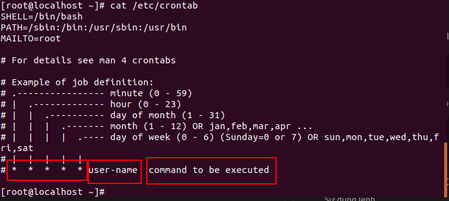
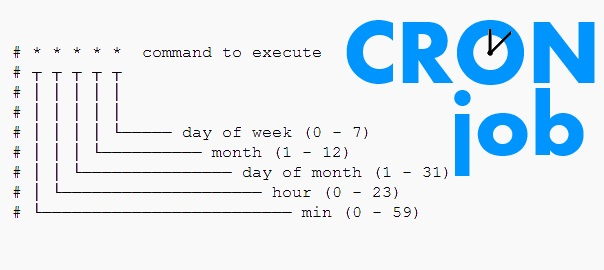
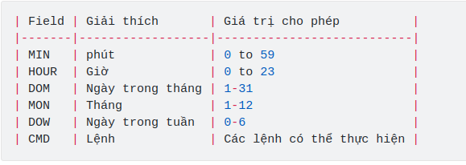
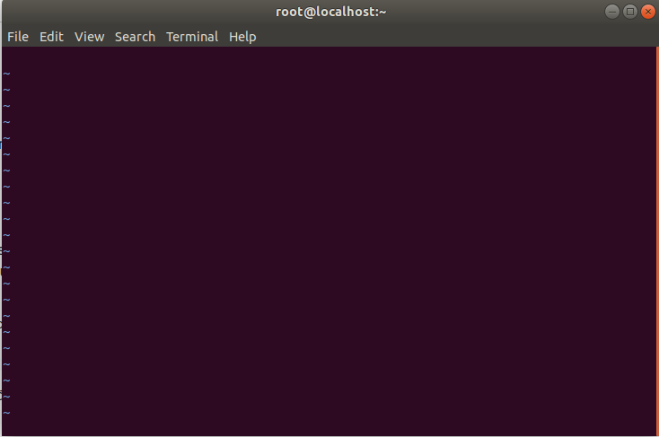

<h1 style="color:orange">1. Crontab</h1>
Cron là một chương trình deamon, tức là nó được chạy ngầm mãi mãi một khi nó được khởi động lên. Như các deamon khác thì bạn cần khởi động lại nó nếu như có thay đổi thiết lập gì đó. Chương trình này nhìn vào file thiết lập có tên là crontab để thực thi những task được mô tả ở bên trong (bản chất crontab là một file text, chương trình sẽ thực thi những lệnh có trong file text đó).

Cronjob là các lệnh thực thi hành động đặt trước vào thời điểm nhất định. Crontab là nơi lưu trữ các cronjob.

Một cron schedule đơn giản là một text file. Mỗi người dùng có một cron schedule riêng, file này thường nằm ở `/var/spool/cron`. Crontab files không cho phép bạn tạo hoặc chỉnh sửa trực tiếp với bất kỳ trình text editor nào, trừ phi bạn dùng lệnh crontab.

Một số lệnh thường dùng:

    # crontab -e: tạo, chỉnh sửa các crontab
    # crontab -l: Xem các Crontab đã tạo
    # crontab -r: xóa file crontab
<h2 style="color:orange">2. Cài đặt crontab</h2>
Crontab thường được dùng để quản trị server, có sẵn trong centos7 nhưng nếu không có có thể dùng lệnh:
    
    # yum install cronie
Start crontab và tự động chạy mỗi khi reboot:

    # service crond start
    # chkconfig crond on
<h2 style="color:orange">3. Cấu trúc lệnh crontab</h2>
Sử dụng lệnh
    
    # cat /etc/crontab
để xem cấu trúc lệnh

 
Trường hợp dùng các thiết lập đặc biệt: 
@reboot : chạy lệnh khi server reboot lại 
@hourly : chạy hàng giờ vào phút thứ 0 
@daily : chạy hàng ngày vào 00:00 
@monthly : chạy hàng tháng vào 00:00 của ngày đầu tiên mỗi tháng 
@yearly : chạy hàng năm vào 00:00 của ngày đầu tiên mỗi năm 
VD : @reboot [command]  . Để sửa crontab của user khác dùng lệnh :

        # crontab -u <user_name> -e
2. Hiển thị toàn bộ job crontab 
Của user hiện tại:
        
        # crontab -l
Của user khác:
        
        # crontab -u <username> -l
3. Sao lưu kết quả trên file txt :

        # crontab -l > cron-backup.txt
        # cat cron-backup.txt
<h2 style="color:orange">4. Ví dụ đặt lệnh crontab</h2>
Sử dụng lệnh 
      
     # crontab -e
để vào file crontab:
 
Crontab chưa có lệnh nào, chỉnh sửa crontab như sử dụng với vi,vim.

Ví dụ:

- Thực thi cron vào 2h sáng hằng ngày: 
`0 2 * * *` /bin/sh backup.sh 
- Thực thi cron 2 lần trong ngày: 
`0 5,17 * * *` /scripts/script.sh 
- Thực thi cron theo từng phút: 
`* * * * *` /scripts/script.sh 
- Thực thi cron vào 17h chủ nhật hàng tuần: 
`0 17 * * sun` /scripts/script.sh 
- Thực thi cron 10p 1 lần: 
`*/10 * * * *` /scripts/monitor.sh 
- Thực thi cron theo ngày, tháng được chỉ định: 
`* * * jan,may,aug *` /scripts/script.sh 
`0 17 * * sun,fri` /scripts/script.sh 
- Thực thi cron theo chu kì 4h : 
`0 */4 * * *` /scripts/script.sh 
- Thực thi cron cứ 30s 1 lần : 
`* * * * *` /scripts/script.sh 
hoặc
`* * * * *` sleep 30 ; /scripts/script.sh 
- Thực thi nhiều scripts trong 1 cron : 
`* * * * *` /scripts/script1.sh; /scripts/script2.sh 
- Thực thi script hằng ngày : 

        # @daily /scripts/script.sh
- Thực thi 2 cron vào chủ nhật đầu tiên hàng tháng : 
`0 2 * * sun` [$(date+%d) -le 07] && /scripts/script.sh 
- Chuyển kết quả cron sang mail: 

      # MAIL = phuonghuynguyen125@gmail.com
- Kiểm tra lại file crontab:
      
      # crontab -u <username> -l
- Save vào 1 file text để back up:
      
      # crontab -l > cron-backup.txt
- Để đẩy nội dung backup vào lại file crontab:
      
      # cat /root/cron-backup.txt > /var/spool/cron/root (root là tên user, nếu là user huy thì sẽ là /var/spool/cron/huy)