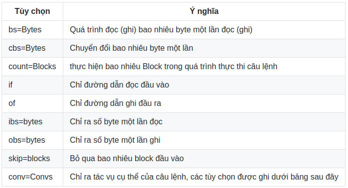

<h1 style="color:orange">dd command</h1>
Câu lệnh dd trong linux là một trong những câu lệnh thường xuyên được sử dụng. Câu lệnh dd dùng để sử dụng trong các trường hợp sau:

- Sao lưu và phục hồi toàn bộ dữ liệu ổ cứng hoặc một partition
- Chuyển đổi định dạng dữ liệu từ ASCII sang EBCDIC hoặc ngược lại
- Sao lưu lại MBR trong máy (MBR là một file dữ liệu rất quan trong nó chứa các lệnh để LILO hoặc GRUB nạp hệ điều hanh)
- Chuyển đổi chữ thường sang chữ hoa và ngược lại
- Tạo một file với kích cơ cô định
- Tạo một file ISO.
<h2 style="color:orange">1. Cú pháp lệnh</h2>

    # dd if=<địa chỉ đầu vào> of=<địa chỉ đầu ra> option
Trong đó:
- if= địa chỉ nguồn của dữ liệu nó sẽ bắt đầu đọc
- of= viết đầu ra của file
- option : các tùy chọn cho câu lệnh
<h3 style="color:orange">1.1 Các tùy chọn lệnh</h3>

 
====> Các option cua conv:
 

Lưu ý: Giá trị số byte cho 1 khối (bs): 
- c = 1 byte
- w = 2 byte
- b = 512 byte
- kB = 1000 byte
- K = 1024 byte
- MB = 1000000 byte
- M = (1024 * 1024) byte
- GB = (1000 * 1000 * 1000) byte
- G = (1024 * 1024 * 1024) byte
<h2 style="color:orange">2. Các ví dụ sử dụng thực tế</h2>
<h3 style="color:orange">2.1 Tạo swap</h3>
Sử dụng câu lệnh:
      
    # dd if=/dev/zero of=/root/swap bs=1024B count=1
để tạo swap ram
<h3 style="color:orange">2.2. Tạo 1 file có dung lượng nhất định</h3>

    # dd if=/dev/zero of=newfile.txt bs=1G count=1
 

Lệnh dd tạo ra tập tin có kích thước bằng count*bs.
<h3 style="color:orange">2.3. Kết hợp crontab</h3>
Kết hợp với câu lênh crontab để có thể lâp lịch sao chép dữ liêu ổ cứng của bạn theo định kì Đầu tiên vào một file sh để chạy

     # vi dd_command.sh
với nội dung là: 
dd if=/dev/sda1 of=/dev/sdb1 conv=noerror,sync

Tạo một crotab cho file chạy

    # crontab -e
    0 10 * * * sh dd_command.sh
Lúc này đến 10h hàng ngày quá trình sao chép dữ liệu giữa ổ sda1 sang ổ sdb1 được thực hiện
<h3 style="color:orange">2.4. Sao lưu ổ cứng</h3>
Sao lưu toàn bộ dữ liệu ổ cứng sao ổ cứng khác:

    # dd if=/dev/sda of=/dev/sdb conv=noerror,sync
Câu lệnh này dùng dể sao lưu toàn bộ dữ liệu của ổ sda sang ổ sdb với tùy chọn trong trường conv=noerrom.sync với ý nghĩa vẫn tiếp tục sao lưu nếu dữ liệu đầu vào bị lỗi và tự động đồng bộ với dữ liệu sdb.

Phục hồi dữ liệu
     
     # dd if=/root/sda1.img of=/dev/sda1
<h3 style="color:orange">2.5. Sao lưu phục hồi MBR</h3>
Sao chép MBR

    # dd if=/dev/sda1 of=/root/mbr.txt bs=512 count=1
Phục hồi lại MBR

    # dd if=/root/mbr.txt of=/dev/sda1