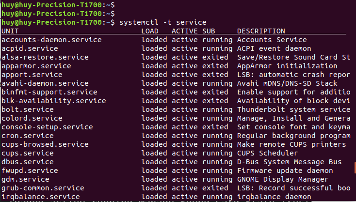

<h1 style="color:orange">Systemd (system daemon)</h1>
Systemd là 1 công cụ (System Tool) của Linux được phát triển bởi nhóm Red Hat. Nó bao gồm nhiều tính năng, bao gồm một hệ thống bootstrapping được sử dụng để khởi động và quản lý các tiến trình (processes) trong hệ thống. Nó hiện là hệ thống khởi tạo mặc định trên hầu hết các bản phân phối Linux. (PID = 1)

Các system daemon là các tiến trình cần phải hoạt động liên tục nhưng cũng không thể để người dùng ngồi nhìn nó chạy mãi được. Chính vì vậy, nó được chạy một cách "âm thầm", thuật ngữ gọi là chạy ngầm. Người dùng nếu không để ý hoặc tìm hiểu về nó thì không thể biết được tiến trình đó đang hoạt động. Nhưng systemd cũng không phải là để chỉ các tiến trình chạy ngầm đó, mà nó là một nhóm các chương trình đặc biệt sẽ quản lý, vận hành và theo dõi các tiến trình khác hoạt động.
<h2 style="color:orange">1. Vai trò systemd trong hệ thống</h2>
Bất cứ một chương trình nào trong Linux đều cần được thực thi dưới dạng một tiến trình và systemd cũng không ngoại lệ. Một trong các thành phần quan trọng này là khởi tạo hệ thống. Systemd cung cấp một chương trình đặc biệt là /sbin/init và nó sẽ là chương trình đầu tiên được khởi động trong hệ thống (PID = 1). Và khi hoạt động, /sbin/init sẽ giữ vai trò kích hoạt các file cấu hình cần thiết cho hệ thống, và các chương trình này sẽ tiếp nối để hoàn tất công đoạn khởi tạo.
<h2 style="color:orange">2. Các thành phần systemd</h2>
Về cơ bản thì systemd tương đương với một chương trình quản lý hệ thống và các dịch vụ trong Linux. Nó cung cấp một số các tiện ích như sau

- `systemctl` dùng để quản lý trạng thái của các dịch vụ hệ thống (bắt đầu, kết thúc, khởi động lại hoặc kiểm tra trạng thái hiện tại)
- `journald` dùng để quản lý nhật ký hoạt động của hệ thống (hay còn gọi là ghi log)
- `logind` dùng để quản lý và theo dõi việc đăng nhập/đăng xuất của người dùng
- `networkd` dùng để quản lý các kết nối mạng thông qua các cấu hình mạng
- `timedated` dùng để quản lý thời gian hệ thống hoặc thời gian mạng
- `udev` dùng để quản lý các thiết bị và firmware
<h2 style="color:orange">3. Unit file</h2>
Tất cả các chương trình được quản lý bởi systemd đều được thực thi dưới dạng daemon hay background bên dưới nền và được cấu hình thành 1 file configuration gọi là unit file .

Các unit file này sẽ gồm 12 loại :
- service : các file quản lý hoạt động của 1 số chương trình .
- socket : quản lý các kết nối
- device : quản lý thiết bị
- mount : gắn thiết bị
- automount : tự động gắn thiết bị
- swap : vùng không gian bộ nhớ trên đĩa cứng
- target : quản lý tạo liên kết
- path : quản lý các đường dẫn
- timer : dùng cho cronjob để lập lịch
- snapshot : sao lưu
- slice : dùng cho quản lý tiến trình
- scope : quy định không gian hoạt động
<h2 style="color:orange">4. Service</h2>
Mặc dù có 12 loại unit file trong systemd , tuy nhiên có lẽ service là loại được quan tâm nhất .

Loại này sẽ được khởi động khi bật máy và luôn chạy ở chế độ nền ( daemon hoặc background ) .

Các service thường được cấu hình trong các file riêng biệt và được quản lý thông qua systemctl .

Có thể dùng các câu lệnh sau để xem các service :

     # systemctl list-units | grep -e '.service'
     hoặc # systemctl -t service
 
Các tùy chọn bật/tắt service trong systemctl :
- start : bật service
- stop : tắt service
- restart : khởi động lại service
- reload : load lại file cấu hình ( chỉ có 1 số service hỗ trợ như Apache / NginX ,... )
- enable : service được khởi động cùng hệ thống
- disable : service không được khởi động cùng hệ thống
<h2 style="color:orange">5. Các hệ thống tương tự</h2>
Systemd mới chỉ xuất hiện từ 30-3-2010 , trước đó có 2 hệ thống khác đã từng được sử dụng :

1. Upstart : hệ thống init được phát triển bởi Canonical và được sử dụng trong Ubuntu Linux giai đọan đầu.
2. SysV : hệ thống init cổ điển của Unix BSD SystemV , được viết bằng shell script và đã quá lâu đời.