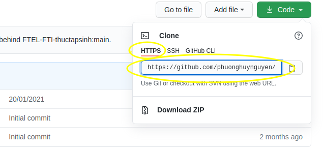
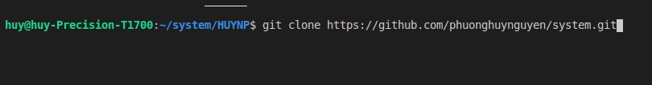
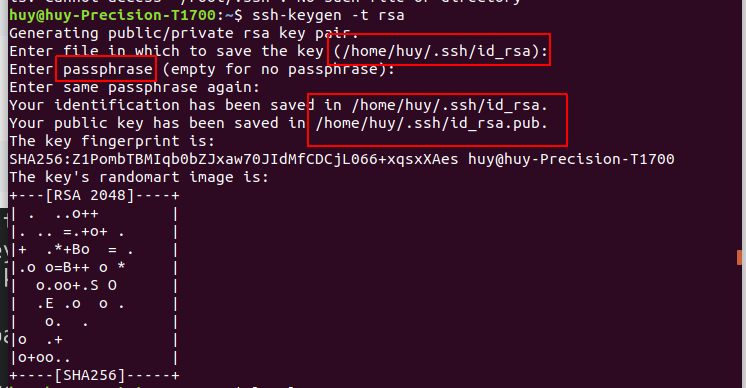
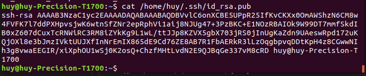
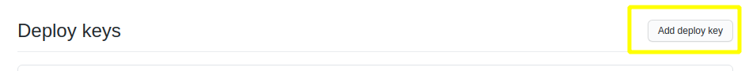
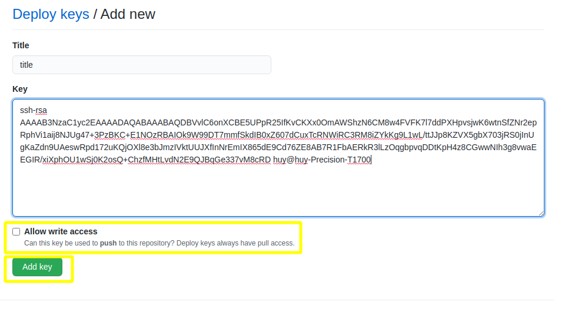
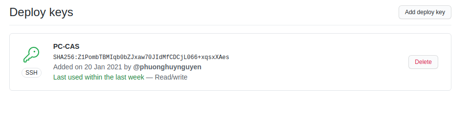
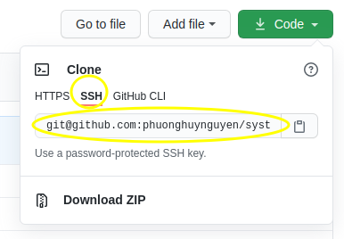

<h1 style="color:orange">Sử dụng Git trên linux thông qua VisualCode</h1>
<h2 style="color:orange">Clone https</h2>

1. B1 : Cài đặt Git
   
       # sudo apt-get install git   ( Ubuntu )
       # yum install -y git         ( CentOS )
2. B2 : Cài đặt thông tin user Git :

       $ git config --global user.name "QuocCuong97"
       $ git config --global user.email "cuongnq24101997@gmail.com"
3. B3 : Kiểm tra lại thông tin :
   
       # git config --list

 
 
Tùy vào việc clone từ https hay SSH mà sử dụng lệnh
       
       $ git clone với mã ren tương ứng
Ở đây dùng HTTPS nên là
       
       $ git clone https://github.com/phuonghuynguyen/system.git
<h2 style="color:orange">Clone SSH</h2>

1. Trên terminal tạo private key:

       # ssh keygen -t rsa
 
Ghi nhớ passphrase 

File ẩn tên `.ssh` đã được tạo ra để chứa id_rsa và id_rsa.pub

Dùng lệnh
     
     # ls -la
để kiểm tra

2. Kết quả kiểm tra 
 

3. Thêm private key vào tiến trình SSH :

       # ssh-agent -s
       # ssh-add /root/.ssh/id_rsa
4. Copy public key

       # cat /root/.ssh/id_rsa.pub
 

5. Truy cập https://github.com/settings/keys để  add key
 

6. Đặt title cho key và cop đoạn key id_rsa.pub vừa cop vào
 

7. Kết quả in ra màn hình
 

8. Khi clone từ ssh cũng tương tự dùng lệnh
       
       # git clone mã lấy được từ ssh
 