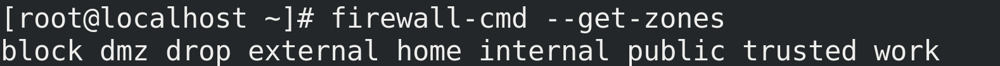
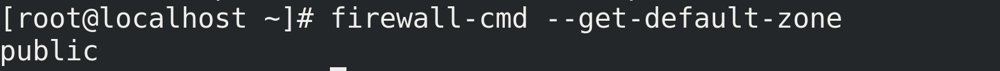
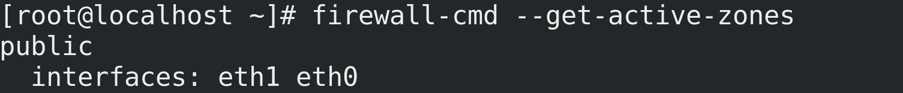
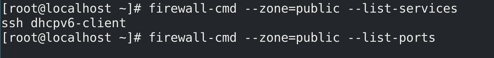
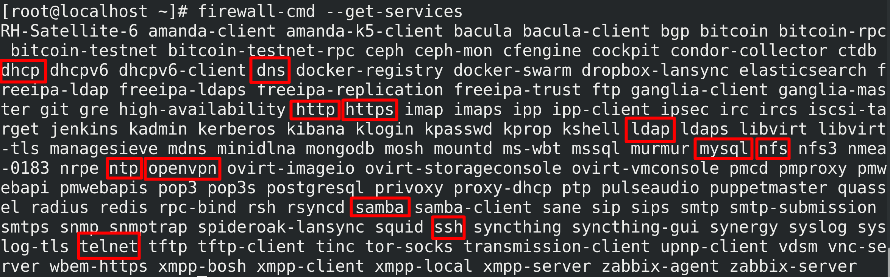

<h1 style="color:orange">Firewalld</h1>
<h2 style="color:orange">1. Khái niệm</h2>
FirewallD là giải pháp tường lửa mạnh mẽ, toàn diện được cài đặt mặc định trên CentOS/RHEL 7 , nhằm thay thế Iptables với những khác biệt cơ bản :

- FirewallD sử dụng “zones” và “services” thay vì “chain” và “rules” trong Iptables .
- FirewallD quản lý các quy tắc được thiết lập tự động , có tác dụng ngay lập tức mà không làm mất đi các kết nối và session hiện có.
<h2 style="color:orange">2. Các khái niệm trong firewalld</h2>
Firewalld là thiết lập tường lửa cho mỗi port của card mạng. Với mỗi zone tương ứng mà máy có thể nhận được thông tin tương ứng với zone.
<h3 style="color:orange">2.1. Zone</h3>
Trong FirewallD, zone là một nhóm các quy tắc nhằm chỉ ra những luồng dữ liệu được cho phép, dựa trên mức độ tin tưởng của điểm xuất phát luồng dữ liệu đó trong hệ thống mạng.

Các zone được xác định trước theo mức độ tin cậy, theo thứ tự từ “ít-tin-cậy-nhất” đến “đáng-tin-cậy-nhất”:

- `drop`: ít tin cậy nhất – toàn bộ các kết nối đến sẽ bị từ chối mà không phản hồi, chỉ cho phép duy nhất kết nối đi ra.
- `block`: tương tự như drop nhưng các kết nối đến bị từ chối và phản hồi bằng tin nhắn từ icmp-host-prohibited (hoặc icmp6-adm-prohibited).
- `public`: đại diện cho mạng công cộng, không đáng tin cậy. Các máy tính/services khác không được tin tưởng trong hệ thống nhưng vẫn cho phép các kết nối đến trên cơ sở chọn từng trường hợp cụ thể.
- `external`: hệ thống mạng bên ngoài trong trường hợp bạn sử dụng tường lửa làm gateway, được cấu hình giả lập NAT để giữ bảo mật mạng nội bộ mà vẫn có thể truy cập.
- `internal`: đối lập với external zone, sử dụng cho phần nội bộ của gateway. Các máy tính/services thuộc zone này thì khá đáng tin cậy.
- `dmz:` sử dụng cho các máy tính/service trong khu vực DMZ(Demilitarized) – cách ly không cho phép truy cập vào phần còn lại của hệ thống mạng, chỉ cho phép một số kết nối đến nhất định.
- `work:` sử dụng trong công việc, tin tưởng hầu hết các máy tính và một vài services được cho phép hoạt động.
- `home:` môi trường gia đình – tin tưởng hầu hết các máy tính khác và thêm một vài services được cho phép hoạt động.
- `trusted:` đáng tin cậy nhất – tin tưởng toàn bộ thiết bị trong hệ thống.

VD: nếu zone của port là trusted thì máy sẽ nhận toàn bộ dữ liệu từ port đó.
<h3 style="color:orange">2.2. Quy tắc runtime/permanent</h3>
Trong FirewallD, các quy tắc được cấu hình thời gian hiệu lực Runtime hoặc Permanent.

- Runtime(mặc định): có tác dụng ngay lập tức, mất hiệu lực khi reboot hệ thống.
- Permanent: không áp dụng cho hệ thống đang chạy, cần reload mới có hiệu lực, tác dụng vĩnh viễn cả khi reboot hệ thống.

Ví dụ:
    
    # firewall-cmd --zone=public --add-service=http
    # firewall-cmd --zone=public --add-service=http --permanent
    # firewall-cmd --reload
Việc Restart/Reload sẽ hủy bộ các thiết lập Runtime đồng thời áp dụng thiết lập Permanent mà không hề phá vỡ các kết nối và session hiện tại. Điều này giúp kiểm tra hoạt động của các quy tắc trên tường lửa và dễ dàng khởi động lại nếu có vấn đề xảy ra.

Lưu ý: Các ví dụ thiết lập trong bài sử dụng cả Runtime và Permanent.
<h2 style="color:orange">3. Cài đặt firewalld</h2>

– FirewallD được cài đặt mặc định trên CentOS 7. Cài đặt nếu chưa có:

     # yum install firewalld

– Khởi động FirewallD:

     # systemctl start firewalld
– Kiểm tra tình trạng hoạt động

     # systemctl status firewalld
– Thiết lập FirewallD khởi động cùng hệ thống

     # systemctl enable firewalld

Kiểm tra lại :

     # systemctl is-enabled firewalld
Ban đầu, bạn không nên cho phép FirewallD khởi động cùng hệ thống cũng như thiết lập Permanent, tránh bị khóa khỏi hệ thống nếu thiết lập sai. Chỉ thiết lập như vậy khi bạn đã hoàn thành các quy tắc tường lửa cũng như test cẩn thận.
– Khởi động lại

    # systemctl restart firewalld
    # firewall-cmd --reload
– Dừng và vô hiệu hóa FirewallD

    # systemctl stop firewalld
    # systemctl disable firewalld
<h2 style="color:orange">4. Cấu hình firewalld</h2>
<h3 style="color:orange">4.1. Thiết lập các zones</h2>

- Liệt kê tất cả các zone trong hệ thống

      # firewall-cmd --get-zones

- Kiểm tra zone mặc định

      # firewall-cmd --get-default-zone

- Kiểm tra zone active (được sử dụng bởi giao diện mạng) 
Vì FirewallD chưa được thiết lập bất kỳ quy tắc nào nên zone mặc định cũng đồng thời là zone duy nhất được kích hoạt, điều khiển mọi luồng dữ liệu.

      # firewall-cmd --get-active-zones

- Thay đổi zone mặc định, ví dụ thành home:

      # firewall-cmd --set-default-zone=home
=====> `active zone` của các port cũng được đổi theo thành `home zone`

- Tuy vậy, vẫn có thể giữ nguyên active zone=home zone mà zone của 1 port bất kì đổi thành public zone hay 1 zone khác bằng lệnh:
      
      # firewall-cmd --zone=public --change-interface=eth0 (eth0 là port mạng)
<h3 style="color:orange">4.2. rule trong zone</h2>

- Liệt kê toàn bộ các rule của các zones :

      # firewall-cmd --list-all-zones
- Liệt kê toàn bộ các rule trong default zone và active zone :

      # firewall-cmd --list-all
- Liệt kê toàn bộ các quy tắc trong một zone cụ thể , ví dụ home :

      # firewall-cmd --zone=home --list-all
- Liệt kê danh sách services/port được cho phép trong zone cụ thể :

      # firewall-cmd --zone=puclic --list-services
      # firewall-cmd --zone=public --list-ports

<h3 style="color:orange">4.3. Thiết lập service</h2>
Xác định các services trên hệ thống :

    # firewall-cmd --get-services
 
Thông tin về services được lưu trữ tại `/usr/lib/firewalld/services`

- Thiết lập cho phép services trên firewalld , sử dụng --add-service:

      # firewall-cmd --zone=public --add-service=http
      # firewall-cmd --zone=public --add-service=http --permanent
- Thực hiện kiểm tra xem service đã được cho phép chưa :

      # firewall-cmd --zone=public --list-services
- Vô hiệu hóa services trên firewalld , sử dụng --remove-service :

      # firewall-cmd --zone=public --remove-service=http
      # firewall-cmd --zone=public --remove-service=http --permanent
<h3 style="color:orange">4.4. Thiết lập cho port</h3>
Port tương ứng với service. VD: 80=http; 22=ssh,...

- Mở port với tham số --add-port :
      
      # firewall-cmd --zone=public --add-port=9999/tcp
      # firewall-cmd --zone=public --add-port=9999/tcp --permanent
- Mở 1 dải port :
      
      # firewall-cmd --zone=public --add-port=4990-5000/tcp
      # firewall-cmd --zone=public --add-port=4990-5000/tcp --permanent
- Kiểm tra lại các port đã mở :
      
      # firewall-cmd --zone=public --list-ports
- Đóng port với tham số --remove-port :
      
      # firewall-cmd --zone=public --remove-port=9999/tcp
      # firewall-cmd --zone=public --remove-port=9999/tcp --permanent
<h2 style="color:orange">5. Rich rule</h2>
Cú pháp Rich rules là rộng lớn nhưng đầy đủ trong

[tài liệu](https://jpopelka.fedorapeople.org/firewalld/doc/firewalld.richlanguage.html) (hoặc dùng lệnh man firewalld.richlanguage ). Sử dụng --add-rich-rule, --list-rich-rules và --remove-rich-rule với lệnh firewall-cmd để quản lý chúng.

Dưới đây là một số ví dụ:

- Cho phép tất cả lưu lượng IPv4 từ host 192.168.0.14.

      firewall-cmd --zone=public --add-rich-rule 'rule family="ipv4" source address=192.168.0.14 accept'
- Từ chối lưu lượng IPv4 qua TCP từ host 192.168.1.10 đến cổng 22.
      
      firewall-cmd --zone=public --add-rich-rule 'rule family="ipv4" source address="192.168.1.10" port port=22 protocol=tcp reject'
- Cho phép lưu lượng IPv4 qua TCP từ host 10.1.0.3 đến cổng 80, và chuyển tiếp nó đến cổng 6532.

      firewall-cmd --zone=public --add-rich-rule 'rule family=ipv4 source address=10.1.0.3 forward-port port=80 protocol=tcp to-port=6532'
- Chuyển tiếp tất cả lưu lượng IPv4 trên cổng 80 đến cổng 8080 trên host 172.31.4.2

      firewall-cmd --zone=public --add-rich-rule 'rule family=ipv4 forward-port port=80 protocol=tcp to-port=8080 to-addr=172.31.4.2'
- Để liệt kê Rich Rules hiện tại của bạn:

      firewall-cmd –list-rich-rules