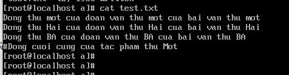

<h1 style="color:orange">sed command</h1>
sed là một trong những công cụ mạnh mẽ trong Linux giúp chúng ta có thể thực hiện các thao tác với văn bản như tìm kiếm, chỉnh sửa, xóa..

sed chấp nhận văn bản đầu vào có thể là nội dung từ một file có trên hệ thống hoặc từ standard input hay stdin .
<h2 style="color:orange">1. Cấu trúc lệnh</h2>
Cấu trúc lệnh :

     # sed [options] [scripts] [input_file]

Options :
- -i (in-place substitution): chỉnh sửa trực tiếp vào file

Scripts:
- s (substitution-thay thế):
- g (global replacement):
- p (print):
- d (delete):
<h2 style="color:orange">2. Các ví dụ cụ thể</h2>
Ví dụ có file test.txt

1. Tìm kiếm và thay thế ( phân biệt chữ hoa và chữ thường ) : tìm kiếm từ mot và thay thế bằng từ MOT :
     
       # sed `s/mot/MOT/` text.txt

2. Tìm kiếm và thay thế ( tất cả các từ ) : sử dụng tùy chọn /g (global) để thay thế tất cả các từ đúng yêu cầu trong cả file :

       # sed -i 's/mot/MOT/g' test.txt
3. Tìm kiếm và thay thế ( thay đổi luôn nội dung file ) : tìm kiếm từ mot và thay thế bằng từ mOt :

       # sed -i 's/mot/MOT/' test.txt
4. Tìm kiếm và thay thế ( lưu nội dung thay đổi ra file mới ) :
       
       # sed -i '.modified' 's/mot/MOT' test.txt
Câu lệnh trên sẽ tạo ra file text.txt.modified. 

5. Tìm kiếm và thay thế (nhiều hơn 1 từ / 1 dòng): mặc định các lệnh trên chỉ thay thế từ đầu tiên của dòng. Tùy chọn /1 , /2 , /3 sẽ giúp chỉ rõ vị trí từ cần thay thế. VD:

       # sed -i 's/mot/MOT/2' test.txt
6. ìm kiếm và thay thế ( tất cả các từ của dòng sau vị trí n ) : sử dụng tùy chọn /'n'g để thay thế tất cả các từ thỏa mãn từ thứ n trở đi trong dòng :

        # sed -i 's/mot/MOT/2g' test.txt
7. Tìm kiếm và thay thế ( chỉ định trong dòng n ) :

        # sed -i '3 s/BA/ba' test.txt (chỉ thay thế trong dòng số 3)
8. Tìm kiếm và thay thế (từ dòng thứ x đến dòng thứ y):
    
        # sed -i 'x,y s/mot/MOT' test.txt
        # sed -i '1,3 s/mot/MOT' test.txt
9. Tìm kiếm và thay thế ( nhân đôi những dòng bị thay thế ) :
       
        # sed 's/Hai/HAI/p` test.txt
10. Tìm kiếm và thay thế ( in ra những dòng bị thay thế ) :

        # sed -n 's/Hai/HAI/p' test.txt
11. Xóa dòng ( xóa dòng thứ n ) :
       
        # sed '2d' test.txt
12. Xóa dòng ( xóa dòng cuối cùng ) :

        # sed '$d' test.txt
13. Xóa dòng ( xóa từ dòng thứ x đến dòng thứ y ) :

        # sed 'x,yd' test.txt
        # sed '2,4d' test.txt
hoặc xóa từ dòng thứ n đến cuối file :
 
        # sed '2,$d' test.txt
14. Xóa dòng ( xóa dòng có chứa đoạn abc )

        # sed '/#/d' test.txt
