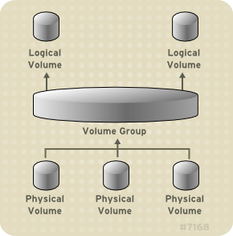
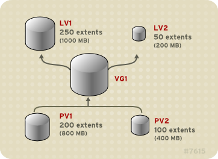
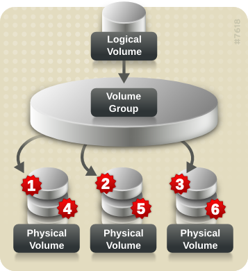
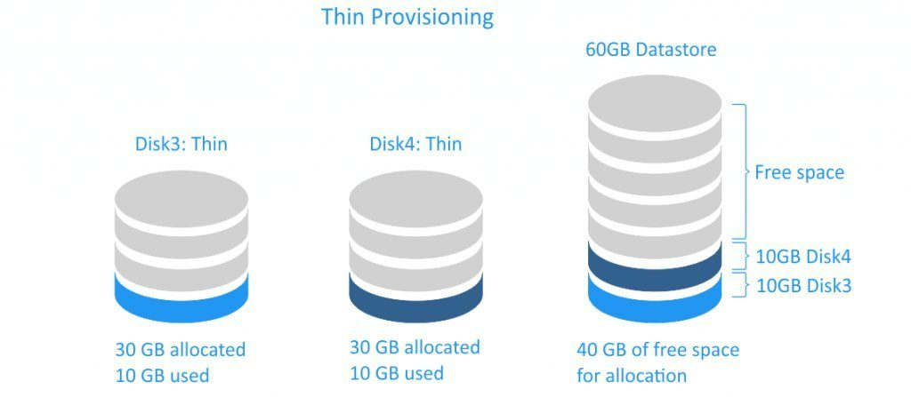
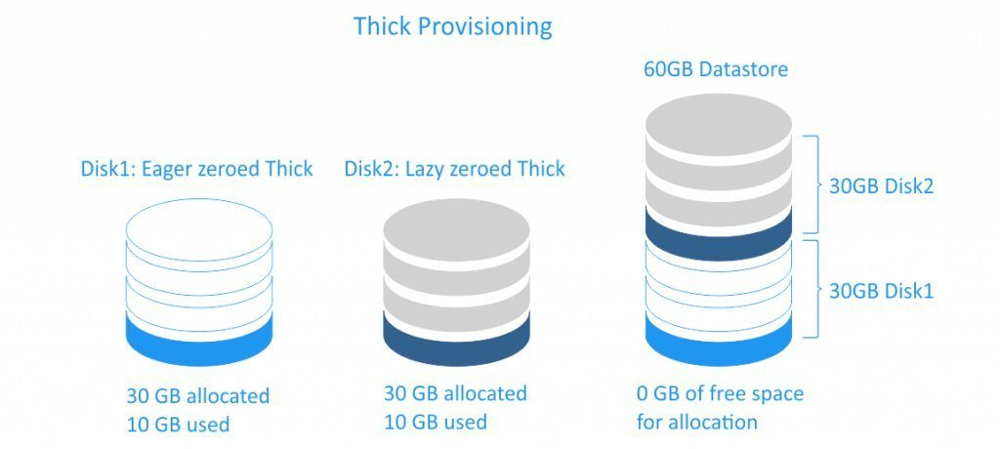
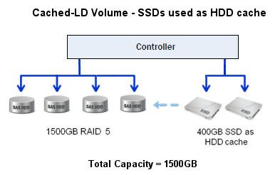

<h1 style="color:orange">LVM</h1>

- `Logical Volume Manager (LVM)` là phương pháp cho phép ấn định không gian đĩa cứng thành những Logical Volume khiến cho việc thay đổi kích thước trở nên dễ dàng hơn so với partition .

- Với kỹ thuật LVM , có thể thay đổi kích thước phân vùng mà không cần phải sửa lại table của OS . Điều này rất hữu ích với trường hợp đã sử dụng hết phần bộ nhớ còn trống của partition và muốn mở rộng dung lượng của nó .

- Vai trò của LVM: LVM là kỹ thuật quản lý việc thay đổi kích thước lưu trữ của ổ cứng: 

.Không để hệ thống bị gián đoạn hoạt động 
.Không làm hỏng dịch vụ 
.Có thể kết hợp với cơ chế hot swapping ( phương pháp thay thế nóng các thành phần bên trong máy tính )

<h2 style="color:orange">1. Mô hình các thành phần trong LVM</h2>

<h3 style="color:orange">1.1. Hard drives - Drives</h3>
Là các thiết bị lưu trữ dữ liệu , có dạng /dev/xxxx
<h3 style="color:orange">1.2. Partition</h3>
Là các phân vùng của hard drives, mỗi hard drive có 4 partition trong đó partition bao gồm 2 loại là `primary partition` và `extended partition:`

- Primary Partition:
Là phân vùng chính, có thể boot (là những partition có thể chứa OS, còn extended partition thì không)
Mỗi đĩa cứng có thể có tối đa 4 phân vùng này
- Extended Partition:
Là phân vùng mở rộng chứa dữ liệu, trong nó có thể tạo các logical partition
<h3 style="color:orange">1.3. Physical volume</h3>

- Là 1 tên gọi khác của partition trong kỹ thuật LVM, nó là những thành phần cơ bản được sử dụng bởi LVM
- Một Physical Volume không thể mở rộng ra ngoài phạm vi 1 ổ đĩa.
- Có thể kết hợp nhiều Physical Volume thành một Volume Group.
<h3 style="color:orange">1.4. Volume group</h3>
Nhiều Physical Volume trên những ổ đĩa khác nhau kết hợp lại thành 1 Volume Group.

Volume Group được dùng để tạo ra các Logical Volume, trong đó người dùng có thể tạo, thay đổi kích thước, gỡ bỏ và sử dụng.
<h3 style="color:orange">1.5. Physical Extend (PE)</h3>
Là 1 đại lượng thể hiện 1 khối dữ liệu dùng làm đơn vị tính dung lượng của Logical Volume.

Mặc định 1PE = 4MB
<h3 style="color:orange">1.6. Logical volume</h3>
Volume Group được chia nhỏ thành các Logical Volume, mỗi Logical Volume có ý nghĩa tương tự 1 partition. Nó được dùng cho các mount point và được format với những định dạng khác nhau như ext2, ext3, ext4, xfs,...

Khi dung lượng của Physical volume được sử dụng hết ta có thể đưa thêm ổ đĩa mới bổ sung cho Volume Group và do đó tăng được dung lượng của Logical Volume.

VD: Có thể tạo ra 4 ổ đĩa mỗi ổ 5GB, kết hợp thành 1 Volume Group 20G, có thể tạo ra 2 Logical Volume mỗi cái 10G.
<h4 style="color:orange">1.6.1. Linear volume (span volume)</h4>

- Là một Logical Volume bình thường được tạo ra từ Volume Group
- Các Physical Volume thành phần tạo nên Volume Group không nhất thiết phải giống nhau về dung lượng .
- Có thể tạo ra nhiều Linear Volume với dung lượng tùy ý trên Volume Group được tạo ra .
- Linear không có khả năng đáp ứng vấn đề an toàn dữ liệu (Fault Tolerancing), và tốc độ xử lý dữ liệu (Load Balancing)
<h4 style="color:orange">1.6.2. Stripped Logical Volume (RAID 0)</h4>

Trong hình trên: 
Luồng dữ liệu thứ nhất được ghi vào PV1 
Luồng dữ liệu thứ hai được ghi vào PV2 
Luồng dữ liệu thứ ba được ghi vào PV3 
Luồng dữ liệu thứ 4 được lưu vào PV1 
Kích thước của 1 luồng dữ liệu không vượt quá kích thước của 1 PE.
<h4 style="color:orange">1.6.3. RAID</h4>
LVM hỗ trợ RAID 0/1/5/6/10.

LVM RAID Volume hỗ trợ snapshot.
<h4 style="color:orange">1.6.4. Thinly-Provisioned Logical Volumes( Thin Volumes)</h4>
Thin Volume được tạo ra có 1 dung lượng chia sẵn (allocated size) nhưng chỉ chiếm dung lượng của ổ đĩa đúng bằng dung lượng của dữ liệu thực tế có trên Volume (used size).

VD : chia ổ ảo 30G nhưng hiện tại chỉ sử dụng 10G thì trên ổ đĩa vật lý chỉ chiếm 10G không gian thực.

<h4 style="color:orange">1.6.5. Thickly-Provisioned Logical Volumes (Thick Volumes)</h4>
Thick Volume được tạo ra có 1 dung lượng chia sẵn (allocated size) và chiếm đúng bằng đó dung lượng của ổ đĩa mặc dù dữ liệu bên trong ít hơn.

VD: chia ổ ảo 30G, thực tế đang sử dụng hết 10G nhưng trên ổ đĩa vật lý vẫn chiếm 30G không gian đĩa.

<h4 style="color:orange">1.6.6. Snapshot volume</h4>

- Tính năng LVM Snapshot cung cấp tạo ra 1 bản sao ổ đĩa tại thời điểm hiện tại mà không làm gián đoạn các dịch vụ.
- Khi thực hiện snapshot trên ổ đĩa gốc, tính năng này sẽ thực hiện tạo ra 1 bản sao của vùng dữ liệu đang có trên máy tính và có thể dùng nó để khôi phục lại trạng thái cũ.
- Vì snapshot chỉ lưu lại các vùng dữ liệu thay đổi sau khi thực hiện, nên snapshot volume cần một dung lượng tối thiểu của đĩa cứng  VD: Nếu ít thực hiện thay đổi trên ổ đĩa, snapshot volume chỉ chiếm khoảng 3-5% dung lượng của đĩa cứng.
- Snapshot chỉ thực hiện tạo ra 1 bản sao ảo, không thể thay thế hoàn toàn quá trình sao lưu dữ liệu.
<h4 style="color:orange">1.6.7. Cache volumes</h4>
LVM hỗ trợ việc sử dụng các ổ SSD để làm cache cho các ổ HDD.

 
Có thể tạo ra cache logical volume để cải thiện hiệu suất của các logical volume có sẵn hoặc tạo cache volume gồm các SSD tốc độ cao với dung lượng lưu trữ thấp và các HDD tốc độ chậm với dung lượng lưu trữ cao.
<h2 style="color:orange">2. Ưu và nhược điểm của LVM</h2>
<h3 style="color:orange">2.1. Ưu điểm</h3>

- Có thể gom nhiều đĩa cứng vật lý lại thành 1 đĩa ảo dung lượng lớn
- Có thể tạo ra các vùng dung lượng lớn nhỏ tùy ý
- Có thể thay đổi các vùng dung lượng đó dễ dàng, linh hoạt
<h3 style="color:orange">2.2. Nhược điểm</h3>

- Các bước thiết lập phức tạp , khó khăn hơn
- Càng gắn nhiều đĩa cứng và thiết lập càng nhiều LVM thì hệ thống khởi động càng lâu
- Khả năng mất dữ liệu khi 1 trong các đĩa cứng vật lý bị hỏng
- Windows không thể nhận ra vùng dữ liệu của LVM. Nếu dual-boot (chạy 2 OS song song), Windows sẽ không thể truy cập dữ liệu chứa trong LVM.