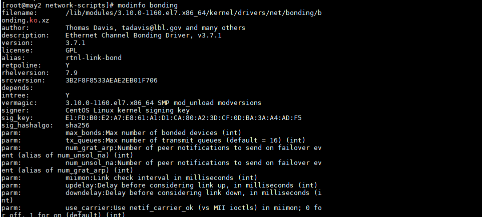

<h1 style="color:orange">Bonding</h1>
Mặc định centos7 chưa có module bonding, để load module này dùng lệnh:

    # modprobe --first-time bonding
Kiểm tra bonding module:

    # modinfo bonding
 
<h2 style="color:orange">1. Tạo file bond</h2>

    # vim /etc/sysconfig/network-scripts/ifcfg-bond0
Thêm vào những dòng sau:

    DEVICE=bond0
    NAME=bond0
    TYPE=Bond
    BONDING_MASTER=yes
    IPADDR=192.168.1.150
    PREFIX=24
    GATEWAY=192.168.1.1
    DNS=8.8.8.8
    ONBOOT=yes
    BOOTPROTO=none
    BONDING_OPTS="mode=5 miimon=100"
    NM_CONTROLLED=no
    USERCTL=no
Lưu ý: TYPE=Bond phải viết hoa chữ cái đầu của Bond.

Trong đó có tất cả 7 mode:
1. `mode=0 (balance-rr)`
Round-robin policy: It the default mode. It transmits packets in sequential order from the first available slave through the last. This mode provides load balancing and fault tolerance.

2. `mode=1 (active-backup)`
Active-backup policy: In this mode, only one slave in the bond is active. The other one will become active, only when the active slave fails. The bond’s MAC address is externally visible on only one port (network adapter) to avoid confusing the switch. This mode provides fault tolerance.

3. `mode=2 (balance-xor)`
XOR policy: Transmit based on [(source MAC address XOR’d with destination MAC address) modulo slave count]. This selects the same slave for each destination MAC address. This mode provides load balancing and fault tolerance.

4. `mode=3 (broadcast)`
Broadcast policy: transmits everything on all slave interfaces. This mode provides fault tolerance.

5. `mode=4 (802.3ad)`
IEEE 802.3ad Dynamic link aggregation. Creates aggregation groups that share the same speed and duplex settings. Utilizes all slaves in the active aggregator according to the 802.3ad specification.

Prerequisites:

– Ethtool support in the base drivers for retrieving the speed and duplex of each slave.
– A switch that supports IEEE 802.3ad Dynamic link aggregation. Most switches will require some type of configuration to enable 802.3ad mode.

6. `mode=5 (balance-tlb)`
Adaptive transmit load balancing: channel bonding that does not require any special switch support. The outgoing traffic is distributed according to the current load (computed relative to the speed) on each slave. Incoming traffic is received by the current slave. If the receiving slave fails, another slave takes over the MAC address of the failed receiving slave.

Prerequisite:

– Ethtool support in the base drivers for retrieving the speed of each slave.

7. `mode=6 (balance-alb)`
Adaptive load balancing: includes balance-tlb plus receive load balancing (rlb) for IPV4 traffic, and does not require any special switch support. The receive load balancing is achieved by ARP negotiation. The bonding driver intercepts the ARP Replies sent by the local system on their way out and overwrites the source hardware address with the unique hardware address of one of the slaves in the bond such that different peers use different hardware addresses for the server.

- `miimon:` là giá trị tính bằng milisecond (ms) chỉ thời gian giám sát MII của NIC.

Dùng mode nào thì thay số ở: `BONDING_OPTS="mode=5 miimon=100"`
<h2 style="color:orange">2. Cấu hình các SLAVE</h2>

    # vim /etc/sysconfig/network-scripts/ifcfg-ens33
thêm vào các dòng

    DEVICE=ens33
    TYPE=Ethernet
    ONBOOT=yes
    BOOTPROTO=none
    NM_CONTROLLED=no
    MASTER=bond0
    SLAVE=yes
    USERCTL=no
card NIC 2:

    # vim /etc/sysconfig/network-scripts/ifcfg-ens38
paste vào 

    DEVICE=ens38
    TYPE=Ethernet
    ONBOOT=yes
    BOOTPROTO=none
    NM_CONTROLLED=no
    MASTER=bond0
    SLAVE=yes
    USERCTL=no
Ở đây bond 2 card ens33 và ens38.

    # systemctl restart network
<h2 style="color:orange">3. Kiểm tra</h2>
Để theo dõi hoạt động trạng thái của card interface ‘bond0‘ thì bạn có thể đọc nội dung file hệ thống sau.

    # cat /proc/net/bonding/bond0
Để kiểm xác cơ chế hoạt động bonding, thì hãy xem nội dung file sau :

    # cat /sys/class/net/bond0/bonding/mode
    balance-tlb 5
Để kiểm tra có bao nhiêu card interface ‘bonding‘ đang hoạt động trên hệ thống.

    # cat /sys/class/net/bonding_masters
    bond0
