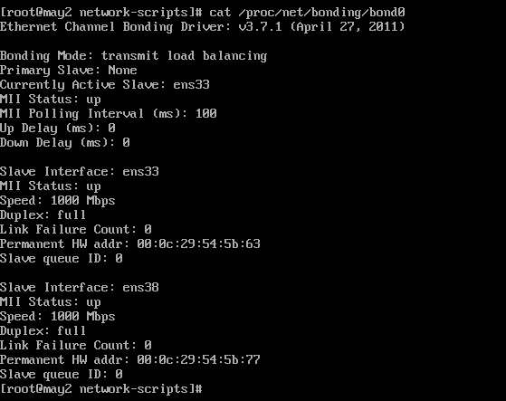

<h1 style="color:orange">Gán VLan vào bonding centos7</h1>
Chuẩn bị: 
- Máy 1: 2 card mạng bridge 
- Máy 2: card mạng bridge

Mô hình: bond 2 card mạng máy 1, gán vlan vào bond. Gán vlan vào card bridge máy 2 và test kết nối 2 máy.
<h2 style="color:orange">1. Trến máy 1</h2>
Mặc định centos7 chưa có module bonding, để load module này dùng lệnh:

    # modprobe --first-time bonding
Kiểm tra bonding module:

    # modinfo bonding
 
<h3 style="color:orange">1.1. Tạo file bond</h3>

    # vim /etc/sysconfig/network-scripts/ifcfg-bond0
Thêm vào những dòng sau:

    DEVICE=bond0
    NAME=bond0
    TYPE=Bond
    BONDING_MASTER=yes
    ONBOOT=yes
    BOOTPROTO=none
    BONDING_OPTS="mode=5 miimon=100"
    NM_CONTROLLED=no
    USERCTL=no
Lưu ý: TYPE=Bond phải viết hoa chữ cái đầu của Bond.
<h3 style="color:orange">1.2. Cấu hình các SLAVE</h3>

    # vim /etc/sysconfig/network-scripts/ifcfg-ens33
thêm vào các dòng

    DEVICE=ens33
    TYPE=Ethernet
    ONBOOT=yes
    BOOTPROTO=none
    NM_CONTROLLED=no
    MASTER=bond0
    SLAVE=yes
    USERCTL=no
card NIC 2:

    # vim /etc/sysconfig/network-scripts/ifcfg-ens38
paste vào 

    DEVICE=ens38
    TYPE=Ethernet
    ONBOOT=yes
    BOOTPROTO=none
    NM_CONTROLLED=no
    MASTER=bond0
    SLAVE=yes
    USERCTL=no
Ở đây bond 2 card ens33 và ens38.

    # systemctl restart network
<h3 style="color:orange">1.3. Kiểm tra</h3>
Để theo dõi hoạt động trạng thái của card interface ‘bond0‘ thì bạn có thể đọc nội dung file hệ thống sau.

    # cat /proc/net/bonding/bond0
 
Để kiểm xác cơ chế hoạt động bonding, thì hãy xem nội dung file sau:

    # cat /sys/class/net/bond0/bonding/mode
    balance-tlb 5
Để kiểm tra có bao nhiêu card interface ‘bonding‘ đang hoạt động trên hệ thống.

    # cat /sys/class/net/bonding_masters
    bond0
<h2 style="color:orange">1.4. Gán VLAN vào bond</h2>
Kiểm tra xem kernel đã load module 802.1q chưa.

    # sudo lsmod|grep 8021q
 
Nếu server chưa load chuẩn 802.1q ----> dùng lệnh sau để load:

    # sudo modprobe 8021q
Tuy vậy khi server reboot thì sẽ phải load lại. Để cấu hình chuẩn 802.1q load cùng server:

    # vim /etc/modules-load.d/modules.conf
paste vào

    8021q
phân quyền cho file vừa tạo
    
    # chmod +x /etc/modules-load.d/modules.conf
<h3 style="color:orange">1.4.1. Cấu hình bond0</h3>

    # vim /etc/sysconfig/network-scripts/ifcfg-bond0
Tạo interface bond0.10 đánh tag vlan10

    # vim /etc/sysconfig/network-scripts/ifcfg-bond0.10
paste vào

    DEVICE=bond0.10
    BOOTPROTO=none
    ONBOOT=yes
    IPADDR=192.168.1.151
    NETMASK=255.255.255.0
    NETWORK=192.168.1.0
    VLAN=yes
    NM_CONTROLLED=no
Đến đây đã cấu hình vlan thành công, tuy vậy không ping ra được inrternet. Để cấu hình internet ta làm các bước sau:

Tạo file configuration rule cho vlan10

    # vim /etc/sysconfig/network-scripts/rule-bond0.10
    thêm vào
    from 192.168.1.0/24 tab 1 priority 500
Tạo file route configuration cho vlan10

    # vim /etc/sysconfig/network-scripts/route-bond0.10
    thêm vào 
    default via 192.168.1.1 dev bond.10 table 1
192.168.1.1 là default-gateway

Cấu hình sysctl cho phép packet forwarding trên server:

    # vim /etc/sysctl.d/99-sysctl.conf
    thêm vào
    net.ipv4.ip_forward=1
    net.ipv4.conf.all.arp_filter=0
    net.ipv4.conf.all.rp_filter=2
Áp dụng những thay đổi vừa xong

    # sudo sysctl -p /etc/sysctl.d/99-sysctl.conf
    # init 6
Kiểm tra interface vlan

    # cat /proc/net/vlan/config
 
<h2 style="color:orange">2. Trến máy 2</h2>
Kiểm tra xem kernel đã load module 802.1q chưa.

    # sudo lsmod|grep 8021q
 
Nếu server chưa load chuẩn 802.1q ----> dùng lệnh sau để load:

    # sudo modprobe 8021q
Tuy vậy khi server reboot thì sẽ phải load lại. Để cấu hình chuẩn 802.1q load cùng server:

    # vim /etc/modules-load.d/modules.conf
paste vào

    8021q
phân quyền cho file vừa tạo
    
    # chmod +x /etc/modules-load.d/modules.conf
<h3 style="color:orange">2.1.1. Cấu hình ens37</h3>

    # vim /etc/sysconfig/network-scripts/ifcfg-ens37
kiểm tra các dòng

    BOOTPROTO="none"
    DEVICE="ens37"
    ONBOOT="yes"
    TYPE="Ethernet"
Tạo interface ens37.10 đánh tag vlan10

    # vim /etc/sysconfig/network-scripts/ifcfg-ens37.10
paste vào

    DEVICE=ens37.10
    BOOTPROTO=none
    ONBOOT=yes
    IPADDR=192.168.1.153
    NETMASK=255.255.255.0
    NETWORK=192.168.1.0
    VLAN=yes
    NM_CONTROLLED=no
Tạo file configuration rule cho vlan10

    # vim /etc/sysconfig/network-scripts/rule-ens37.10
    thêm vào
    from 192.168.1.0/24 tab 1 priority 500
Tạo file route configuration cho vlan10

    # vim /etc/sysconfig/network-scripts/route-ens37.10
    thêm vào 
    default via 192.168.1.1 dev ens37.10 table 1
Cấu hình sysctl cho phép packet forwarding trên server:

    # vim /etc/sysctl.d/99-sysctl.conf
    thêm vào
    net.ipv4.ip_forward=1
    net.ipv4.conf.all.arp_filter=0
    net.ipv4.conf.all.rp_filter=2
Áp dụng những thay đổi vừa xong

    # sudo sysctl -p /etc/sysctl.d/99-sysctl.conf
    # init 6
Kiểm tra interface vlan

    # cat /proc/net/vlan/config
 
<h2 style="color:orange">3. Kiểm tra</h2>
2 máy trong cùng vlan 10 ping được cho nhau 

 
 
Máy bên ngoài không ping được: 
 