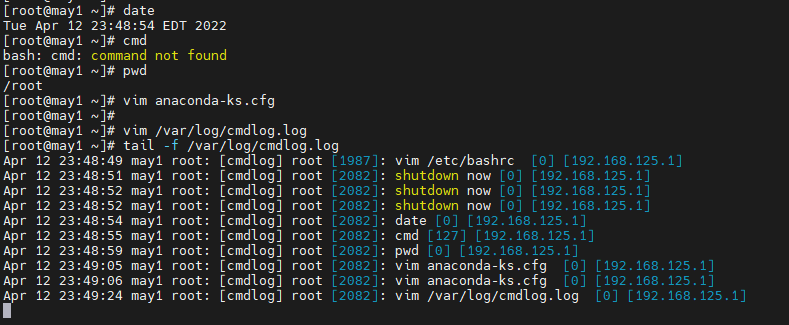

<h1 style="color:orange">Cách để lưu log shell command trong linux</h1>
Bình thường khi gõ lệnh shell trên linux thì xem lại lệnh bằng

    # history
Tuy vậy, history bị giới hạn, khi gõ nhiều lệnh hoặc muốn xem lại lệnh từ lâu, như vài ngày, vài tuần trước sẽ không thể xem được

-----> Vì vậy, đưa ra giải pháp lưu lại command shell vào 1 file log
<h2 style="color:orange">Cách làm</h2>
Vào /etc/rsyslog.conf thêm vào các dòng:

    # vim /etc/rsyslog.conf

    thêm vào
    #Log cmdlog
    local6.*  /var/log/cmdlog.log
Trong đó /var/log/cmd.log là nơi lưu log cmd

2. Vào /etc/bashrc thêm vào dòng

       export PROMPT_COMMAND='RETRN_VAL=$?;logger -p local6.debug "[cmdlog] $(whoami) [$$]: $(history 1 | sed "s/^[ ]*[0-9]\+[ ]*//" ) [$RETRN_VAL] [$(echo $SSH_CLIENT | cut -d" " -f1)]"'
 
Thoát và lưu

    # systemctl restart rsyslog
Gõ 1 vài lệnh bash shell và vào /var/log/cmdlog.log để kiểm tra

 