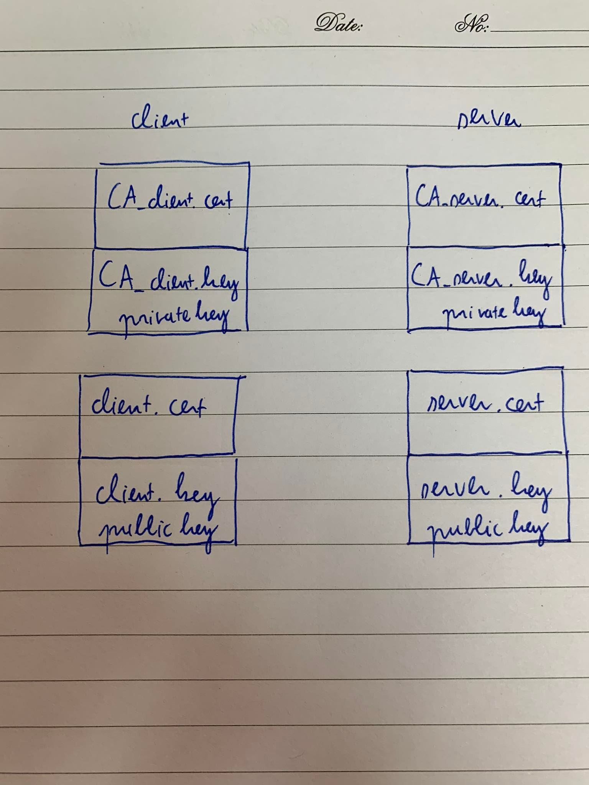
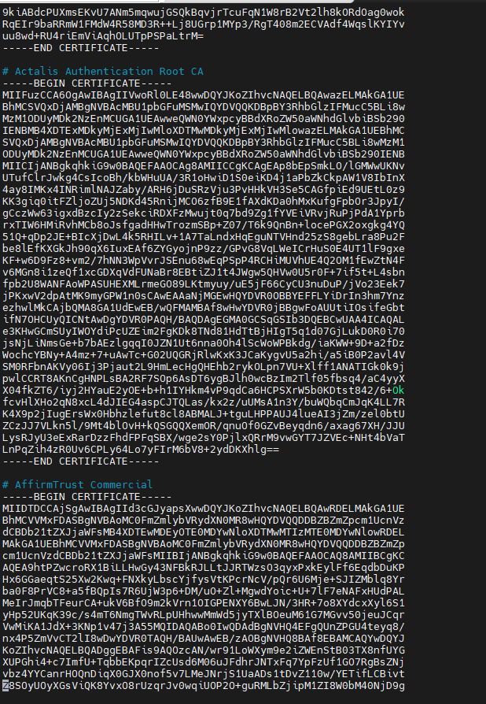

<h1 style="color:orange">Cách hoạt động của TLS/SSL</h1>

 
Mỗi server sẽ có 4 file: 
- CA.cert: là danh sách những cert mà chính server đó trust: thường khi cài đặt OS sẽ có 1 list CA root đã được cài sẵn trong image OS. Ở đây CA_cert của client là CA_client.crt, của server là CA_server.cert. 
File Ca.crt của Centos7 nằm ở đường dẫn: `/etc/ssl/certs/ca-bundle.crt
`: 
 
- CA.key: là private key của server.
- Server.cert: là cert của chính server đó. Khi server2 khác kết nối đến server này thì nó sẽ chìa cái cert này và public key của nó ra cho server2 kia kiểm chứng. Nếu server2 kiểm tra trong CA2.cert của mình có CA.cert kí cho server.cert ko. Nếu có thì nó trust.  