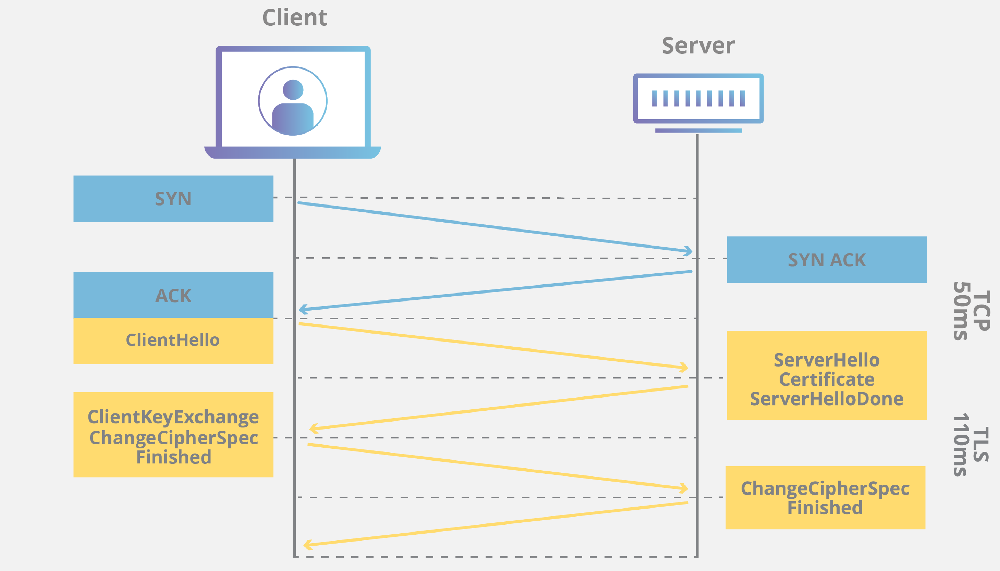

<h1 style="color:orange">Cách hoạt động của TLS/SSL</h1>

 
Mỗi server sẽ có 4 file: 
- CA.cert: là danh sách những cert mà chính server đó trust: thường khi cài đặt OS sẽ có 1 list CA root đã được cài sẵn trong image OS. Ở đây CA_cert của client là CA_client.crt, của server là CA_server.cert. 
File Ca.crt của Centos7 nằm ở đường dẫn: `/etc/ssl/certs/ca-bundle.crt
`: 
 
- CA.key: là private key của server.
- Server.cert: là cert của chính server đó. Khi server2 khác kết nối đến server này thì nó sẽ chìa cái cert này và public key của nó ra cho server2 kia kiểm chứng. Server2 sẽ kiểm tra trong CA2.cert của mình có CA.cert kí cho server.cert hoặc chính server.cert hay không. Nếu có thì nó trust.
- Server.key: public key của server.
 <h2 style="color:orange">1. Xác thực 1 chiều (TLS)</h2>
 
  
 1. Client gửi bản tin "hello" đến server (trước đó đã bắt tay 3 bước).
 2. Server gửi bản tin "hello" lại đến client, đính kèm cert và public key của mình (server.cert và server.key)
 3. Client kiểm tra xem server.cert có được kí bởi thằng CA nào có trong CA_client.cert ko, nếu có thì trust. Thiết lập kết nối. 
 Client tự gen ra 1 share key được mã hóa bằng public key của server (server.key) rồi gửi cho server.
 4. Server khi nhận được 1 share key đã được mã hóa thì giải mã bằng private key (CA_server.key) -> kết nối được thiết lập
 5. Từ sau bước 4, bất cứ gói tin nào gửi từ 2 bên đều được mã hóa và giải mã bằng share key.

 Chi tiết tham khảo: https://www.cloudflare.com/learning/ssl/what-happens-in-a-tls-handshake/
<h2 style="color:orange">2. Xác thực 2 chiều (mutual TLS)</h2>
Về cơ bản, xác thực 2 chiều giống xác thực 1 chiều, chỉ thêm bước server sẽ xác thực cert của client.

1. Client gửi bản tin "hello"
2. Server chào lại và gửi server.cert + server.key (public key)
3. Client verify xem server.cert có trust được không
4. Client gửi client.cert + client.key (public key)
5. Server verify xem client.cert có trust được không. Nếu có, thiết lập kết nối và gửi bản tin oke lại cho client.
6. Client lại gen ra shared key và mã hóa nó bằng public key của server và gửi cho server. Kết nối mã hóa được thiết lập.