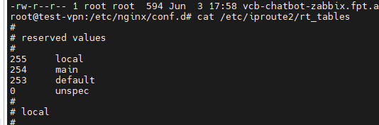
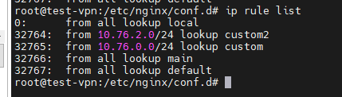

<h1 style="color:orange">Linux routing policy</h1>
Policy routing cho phép chung ta khả năng linh hoạt direct traffic ra ngoài 1 Linux server. Mục đích sử dụng là traffic từ IP hoặc dải IP nào sẽ đi ra ngoài bằng interface nào (nếu server có nhiều interface)

Tham khảo: https://medium.com/@marthin.pasaribu_72336/linux-policy-routing-introduction-37933f8cb62e

`Policy routing tables`: Linux có 3 loại table default:
- Local
- Main
- Default

Mỗi khi dùng routing cần thực hiện 3 bước:
- Tạo custom policy routing table
- Tạo 1 hoặc nhiều custom policy routing rules
- Đặt custom policy routing table với routes
<h2 style="color:orange">B1. Tạo custom policy routing table</h2>

check custom policy routing table

    # cat /etc/iproute2/rt_tables
 

Tạo custom table:

    # echo 200 custom >> /etc/iproute2/rt_tables
<h2 style="color:orange">B2. Tạo policy routing rule</h2>
Tạo policy routing rule:

    # ip rule add from 10.76.0.0/24 lookup custom
    hoặc
    # ip rule add from 10.76.0.200 lookup custom    #routing cho IP cố định
Để check routing rule:

    # ip rule list
 
Tuy nhiên, routing này sẽ mất khi restart server, để khiến nó consitent:

    # vim /etc/network/interfaces
    thêm dòng 
    post-up ip rule add from 10.76.0.0/24 lookup custom
<h2 style="color:orange">B3. Đặt routing table vào route</h2>

    # ip route add default via 10.76.0.0/24 dev eth1 table custom
để khiến việc routing consistent:

    # vim /etc/network/interfaces
    thêm dòng
    post-up ip route add 10.76.0.0/24 dev eth1 table custom

Kết quả mong muốn là traffic đi vào từ 10.76.0.0/24 sẽ đi ra ngoài bằng interface eth1