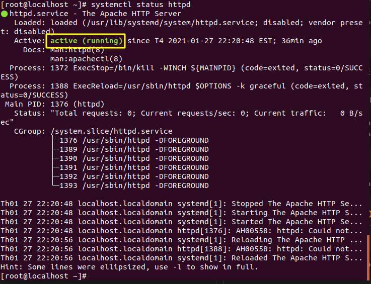
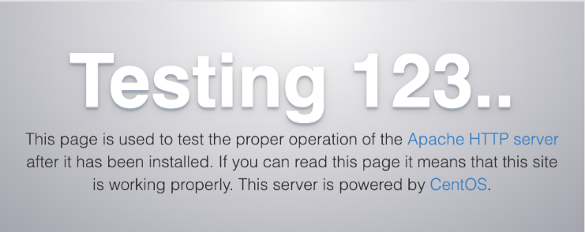
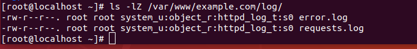
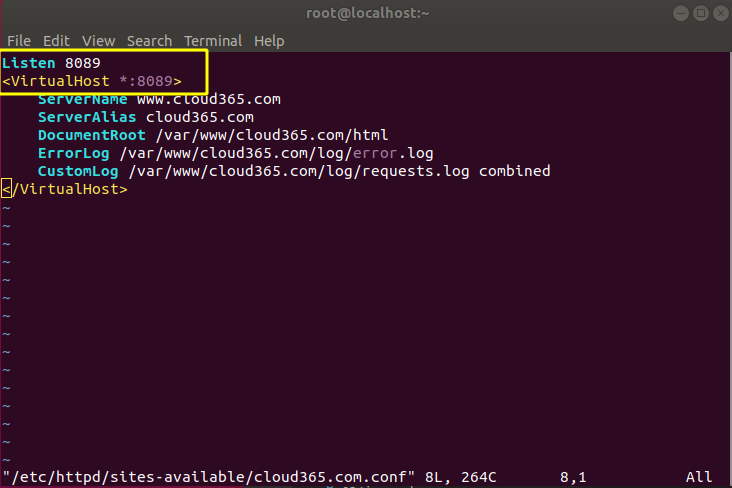
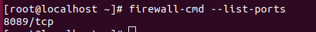

<h1 style="color:orange">1. Cài đặt Apache</h1>

1. Update và Upgrade phiên bản CentOS:

       # sudo yum install update
       # sudo yum install epel-release
2. Install:
      
       # sudo yum install httpd
3. Apache sẽ cần port 80 (http) và port 443 (https) để sử dụng:
 
       # firewall-cmd --permanent --add-service=http
       # firewall-cmd --permanent --add-service=https
4. Reload firewall
       
       # firewall-cmd --reload
<h1 style="color:orange">2. Lệnh cấu hình Apache</h1>

1. Bật apache

       # systemctl start httpd
2. Check apache
       
       # systemctl status httpd

Tuy nhiên cách kiểm tra tốt nhất là vào firefox, nếu có cấu hình GUI để kiểm tra. Sử dụng lệnh:

        # curl -4 icanhazip.com
để lấy địa chỉ ipv4 public mà máy khác thấy mình trên mạng 
-----> sau đó nhập vào firefox. Kết quả sẽ như hình:

3. Dừng web server:
       
        # systemctl stop httpd
        # systemctl restart httpd (khởi động lại apache)
        # systemctl reload httpd (reload apache)
4. Apache được mặc định bật mỗi khi server boot, để thoát hành động này:
        
        # systemctl disable httpd
        # systemctl enable httpd để bật mỗi khi boot
<h1 style="color:orange">3. Cài đặt VHost</h1>
Khi sử dụng Apache Web server, có thể dùng virtual host (tương tự server block của Nginx) để tóm gọn chi tiết cấu hình và host nhiều hơn 1 domain trong 1 server vật lý. TRong ví dụ này sẽ dùng domain: `example.com`.

Apache trong CentOS7 có 1 server block mặc định được cấu hình cho document trong file /var/www/html. Trong khi nó hoạt động ổn định với 1 site duy nhât, nhưng có thể quá tải nếu host multi sites. Thay vì động đến file /var/www/html, chúng ta sẽ tạo file trong /var/www cho site example.com.

1. DÙng lệnh:
        
        # mkdir -p /var/www/example.com/html
Dùng -p để tạo ra file parent nếu chưa tồn tại.

2. Tạo thêm 1 thư mục chứa logfile:

        # mkdir -p /var/www/example.com/log
3. Phân quyền sử dụng file html cho apache:

        # chown -R apache:apache /var/www/example.com/html
4. Đảm bảo đường dẫn web có quyền thích hợp:
        
        # chmod -R 755 /var/www
5. Tạo file index.html trong file html

        # vim /var/www/example.com/html/index.html
Gán vào nội dung ví dụ:

    <html>
      <head>
        <title>Welcome to Example.com!</title>
      </head>
      <body>
        <h1>Success! The example.com virtual host is working!</h1>
      </body>
    </html>

6. Với thư mục cho site và index file, bạn gần như đã sẵn sàng tạo virtual host file. Những Virtual host files chỉ rõ cấu hình các sites riêng biệt và cho Apache biết cách trả lời những domain requests.

Trước khi tạo những virtual hosts cần phải tạo thư mục `sites-available` để chứa chúng. Tạo thêm thư mục `sites-enabled` để cho Apache biết virtual host sẵn sàng phục vụ. Thư mục `sites-enabled` sẽ chứa symbolic links đến virtual hosts:

         # mkdir /etc/httpd/sites-available /etc/httpd/sites-enabled
7. Tiếp theo cấu hình Apache để tìm virtual hosts trong thư mục `sites-enabled`:
         
         vim /etc/httpd/conf/httpd.conf
và thêm dòng
         
         IncludeOptional sites-enabled/*.conf
8. Tạo virtual host file:
         
         vim /etc/httpd/sites-available/example.com.conf
và gõ vào:

    <VirtualHost *:80>
        ServerName www.example.com
        ServerAlias example.com
        DocumentRoot /var/www/example.com/html
        ErrorLog /var/www/example.com/log/error.log
        CustomLog /var/www/example.com/log/requests.log combined
    </VirtualHost>

Thao tác này sẽ cho Apache biết nơi tìm trực tiếp gốc chứa các tài liệu web có thể truy cập công khai. Nó cũng cho Apache biết nơi lưu trữ lỗi và yêu cầu nhật ký cho trang web cụ thể này.

------> Tạo xong virtual host file

9. Tạo symbolink link cho mỗi virtual host để Apache trả kết quả cho người dùng:
      
       ln -s /etc/httpd/sites-available/example.com.conf /etc/httpd/sites-enabled/example.com.conf
<h1 style="color:orange">4. Cấu hình SELinux</h1>
SELinux được cấu hình để làm việc với cấu hình Apache mặc định -----> KHi bạn tạo thư mục log tùy chỉnh -----> SELinux sẽ chặn Apache.

Tùy tình huống có thể tắt SElinux nhưng việc này là không nên đối với server.

Để cấu hình policies SELinux, cần phải cài đặt SEMANAGE bằng lệnh:

      # yum install -y policycoreutils-python
Để troubleshooting các vấn đề SELinux, tải package troubleshooting:

      # yum install -y setroubleshoot
<h2 style="color:orange">4.1. Cấu hình SELinux globally</h2>
Sử dụng httpd_unified boolean để SElinux cho phép tất cả các file Apache đều hoạt động:

        # sudo setsebool -P httpd_unified 1
Option -P để giữ cấu hình sau khi reboot. Để bật thì cài giá trị =1 (bật; 0=tắt)
<h2 style="color:orange">4.2. Cấu hình SELinux cho từng thư mục</h2>
Ưu điểm là cho nhiều quyền điều khiển hơn với Apache, nhưng cần nhiều thao tác hơn.

1. Kiểm tra thư mục /var/www/example.com/log:

        ls -dZ /var/www/example.com/log
Kết quả trả ra:

    drwxr-xr-x. root root unconfined_u:object_r:httpd_sys_content_t:s0 /var/www/example.com/log/
Lúc này, nội dung đang là `httpd_sys_content_t` nói với SELinux rằng Apache chỉ có thể đọc file trong thư mục này. 
-----> Đổi thành `httpd_log_t` để Apache có thể sử dụng thư mục.
2. Dùng lệnh:

        # sudo semanage fcontext -a -t httpd_log_t "/var/www/example.com/log(/.*)?"
3. Dùng restorecon để áp dụng thay đổi

        # sudo restorecon -R -v /var/www/example.com/log
4. Kiểm tra lại:
        
        # ls -dZ /var/www/example.com/log/
Output:
        
    drwxr-xr-x. root root unconfined_u:object_r:httpd_log_t:s0 /var/www/example.com/log
<h1 style="color:orange">5. Kiểm tra Virtual Host</h1>

1. Sử dụng lệnh:

       # systemctl restart httpd
để restart Apache và áp dụng thay đổi

2. Dùng lệnh:

       # ls -lZ /var/www/example.com/log
để xem Apache có tạo file `error.log` và `request.log` chỉ định cấu hình virtual host.

<h1 style="color:orange">6. Lỗi không kết nối được với port</h1>

Trong trường hợp ta không muốn đặt virtual host ở port bình thường, ở đây là port 8089. Thì việc cấu hình SElinux sang httpd_log_t vẫn không thể chạy apache. Lý do bởi SELinux chặn port 8089.

Và khi sử dụng lệnh:

     # systemctl status httpd
sẽ thấy hiện ra lỗi sau:

    Permission denied: AH00072: make_sock: could not bind to address [::]:8089
    
    Permission denied: AH00072: make_sock: could not bind to address 0.0.0.0:8089
1. Để mở port 8089 cho firewalld sử dụng lệnh:

       # firewalld-cmd --add-port=8089/tcp

2. Để mở port 8089 cho SELinux: phải add port 8089 với type `http_port_t`:
       
       # semanage port -a -t http_port_t -p tcp 8089
Port 8089 đã được định nghĩa, dùng option -m:
       
       # semanage port -m -t http_port_t -p tcp 8089

------> có thể  # systemctl restart httpd