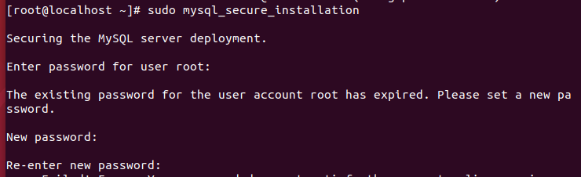
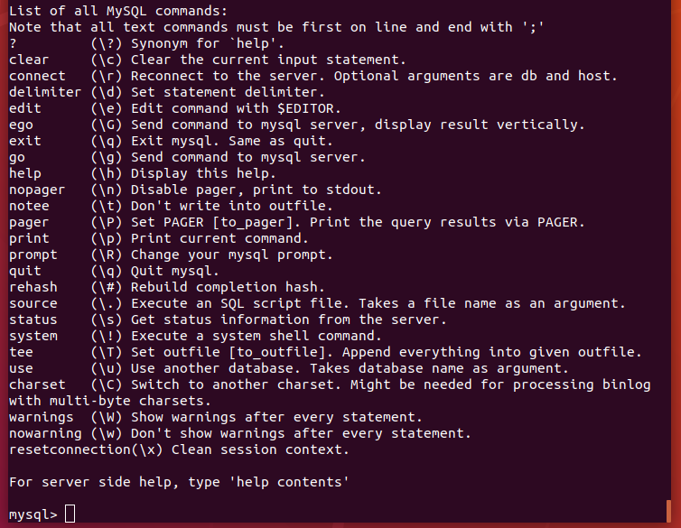
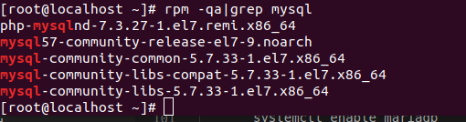

<h1 style="color:orange">Cài đặt MySQL</h1>
<h2 style="color:orange">1. Tải và chuẩn bị MySQL repository</h2>

1. Kiểm tra xem hệ thống đã được cập nhật

       # yum install update
2. Sau đó hãy cài MySQL  repositories. Các phiên bản khác có thể tìm thấy [tại đây](https://dev.mysql.com/downloads/repo/yum/):

       # wget http://dev.mysql.com/get/mysql57-community-release-el7-9.noarch.rpm
3. Cài đặt package từ repository:

       # sudo rpm -Uvh mysql57-community-release-el7-9.noarch.rpm
100% là có thể cài đặt MySQL
<h2 style="color:orange">2. Cài MySQL trên server</h2>

Cài đặt MySQL:

       # sudo yum install -y mysql-server
<h2 style="color:orange">3. Khởi động MySQL</h2>

1. Khởi động mysql:

       # systemctl start mysqld
2. Xem tình trạng hoạt động mysql

       # systemctl status mysqld
3. Dừng mysql:

       # systemctl stop mysqld
4. Khởi động mysql mỗi khi bật server:

       # systemctl enable mysqld
       # systemctl disable mysqld (để ngăn khởi động mysql mỗi khi reboot)
<h2 style="color:orange">4. Đổi mật khẩu</h2>
Khi cài MySQL CentOS 7, một mật khẩu tạm cho root được tạo ra. Nhập lệnh sau để thấy nó:

     # sudo grep 'password' /var/log/mysqld.log
 
Thay đổi mật khẩu của MySQL:
1. Đầu tiên, chạy lệnh:
     
       # sudo mysql_secure_installation
 
2. Gõ mật khẩu đủ mạnh (Mật khẩu mạnh là 8-12 ký tự, bao gồm số, ký tự đặc biệt, in hoa, in thường.) để mysql chấp nhận.

3. Làm theo các bước trên màn hình và nhấn "y" để hoàn tất các bước cài đặt.
-----> Đã có MySQL để sử dụng 
<h2 style="color:orange">5. Đăng nhập MySQL</h2>
Sử dụng lệnh:

     # mysql -uroot -p
Với option -p để  yêu cầu đăng nhập password.
 

Gõ \h để xem các tùy chọn trong mysql.
 

Lưu ý: 
1. Tất cả lệnh trong MySQL đều kết thúc bằng dấu chấm phẩy (;), nếu không có chấm phẩy sẽ không thực thi lệnh.
2. Mặc dù không cần thiết, lệnh trong MySQL sẽ được VIẾT HOA; bảng, database, text, tên user sẽ được viết thường để dễ nhận biết. Tuy vậy,MySQL command line không nhạy cảm viết hoa hay thường
<h2 style="color:orange">6. Kết nối đến MySQL-server</h2>

- Cách 1: Đăng nhập trực tiếp trên Console ssh
- Cách 2: Sử dụng phpMyadmin Hướng dẫn cài đặt phpmyadmin
- Cách 3: Sử dụng Client như MySQL Workbench
Đối với Cách 1 và 2 chúng ta không cần phải chỉnh sửa quyền đăng nhập của user vì chúng thực hiện hoàn toàn trên localhost của MySQL server

Đối với Cách 3 thì chúng ta phải chỉnh sửa lại quyền đăng nhập của user để có thể kết nối từ bên ngoài vào.
<h1 style="color:orange">Cài đặt Mariadb</h1>
Mặc định CentOS7 không có repo của Mariadb dùng lệnh:

       vim /etc/yum.repos.d/mariadb.repo
để đặt repository cho Mariadb

Dán nội dung sau vào file

       [mariadb]
       name = MariaDB
       baseurl = http://yum.mariadb.org/10.5.9/rhel7-amd64/
       gpgkey=https://yum.mariadb.org/RPM-GPG-KEY-MariaDB
       gpgcheck=1
để cài mariadb 10.5.9. Ngoài ra cũng có thể tìm bản mới nhất của mariadb tại đây http://yum.mariadb.org
<h2 style="color:orange">1. Cài đặt Mariadb</h2>

1. Để gỡ các phiên bản Mariadb hoặc MySQL trước và các gói liên quan

       yum erase mysql
Ngoài ra còn phải dùng lệnh 

       # rpm -qa|grep mysql
Nó sẽ liệt ra tất cả những package mysql trong hệ thống 
 
Sau đó dùng lệnh 

       # yum remove <tên package>
       vd: # yum remove mysql-community-common-5.7.33-1.el7.x86_64
để remove hết tất cả packages mysql cũ

2. Dùng lệnh để cài Mariadb

       yum -y install MariaDB-server MariaDB-client
3. Tương tự Mysql các lệnh điều khiển mariadb

       systemctl start mariadb
       systemctl enable mariadb
4. Để cài đặt Mariadb

       mysql_secure_installation
Đăng nhập lần đầu không cần password. Ấn enter.
 
Nếu có lỗi không thể kết nối đến file /var/lib/mysql/mysql.sock như trên:

Tạo file mysql.sock trong /var/lib/mysql:

       touch /var/lib/mysql/mysql.sock
       Gán quyền : chmod 777 mysql.sock
       Đổi user: chown mysql:mysql /var/lib/mysql/mysql.sock
Sau đó vào file vim /etc/my.cnf 
 
thêm dòng

      [mysql]
      socket = /var/lib/mysql/mysql.sock
-----> systemctl restart mariadb để mariadb nhận file config

Sau đó mysql_secure_installation triển khai bình thường

 

Tắt plugin unix_socket trong file /etc/my.cnf.d/server.cnf
    
      [mariadb]
      ...
      unix_socket=OFF
5. Khởi động lại mariadb

      systemctl restart mariadb
<h2 style="color:orange">2. Đăng nhập Mariadb</h2>

      mysql -uroot -p
Gõ password 
 