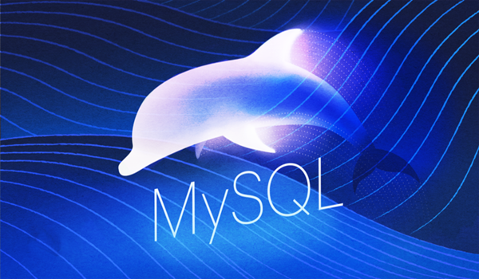
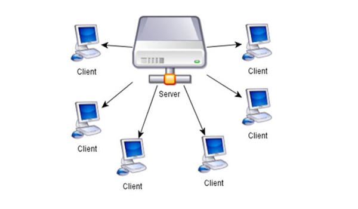
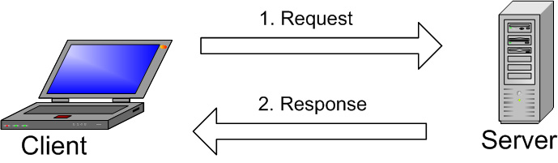
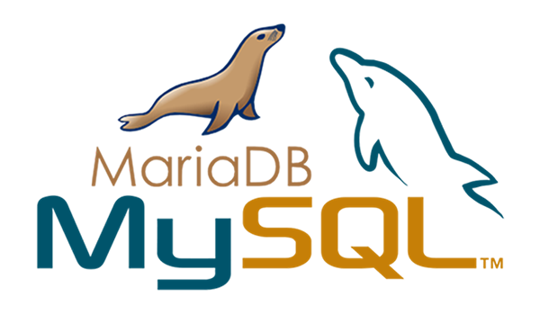

<h1 style="color:orange">MySQL</h1>
MySQL là một hệ thống quản trị cơ sở dữ liệu mã nguồn mở, gọi tắt là RDBMS(Relational Database Management System) hoạt động theo mô hình client-server. MySQL được tích hợp apache, PHP. MySQL quản lý dữ liệu thông qua các cơ sở dữ liệu. Mỗi cơ sở dữ liệu có thể có nhiều bảng quan hệ chứa dữ liệu. MySQL cũng có cùng một cách truy xuất và mã lệnh tương tự với ngôn ngữ SQL (Structured Query Language. Ví dụ như PHP, Python)

 
MySQL được viết bằng C và C++ và có thể truy cập và có sẵn trên hơn 20 nền tảng, bao gồm Mac, Windows, Linux và Unix. RDBMS hỗ trợ cơ sở dữ liệu lớn với hàng triệu bản ghi và hỗ trợ nhiều loại dữ liệu bao gồm các số nguyên có chữ ký hoặc không dấu có độ dài 1, 2, 3, 4 và 8 byte(s); FLOAT; DOUBLE; CHAR; VARCHAR; BINARY; VARBINARY; TEXT; BLOB; DATE; TIME; DATETIME; TIMESTAMP; YEAR; SET; ENUM; và các kiểu OpenGIS. Các loại chuỗi có độ dài cố định và biến đổi cũng được hỗ trợ.
<h2 style="color:orange">1. Lịch sử phát triển MySQL</h2>
Quá trình hình thành và phát triển của MySQL được tóm tắt như sau:

- Công ty Thuy Điển MySQL AB phát triển MySQL vào năm 1994.
- Phiên bản đầu tiên của MySQL phát hành năm 1995
- Công ty Sun Microsystems mua lại MySQL AB trong năm 2008
- Năm 2010 tập đoàn Oracle thâu tóm Sun Microsystems. Ngay lúc đó, đội ngũ phát triển của MySQL tách MySQL ra thành 1 nhánh riêng gọi là MariaDB. Oracle tiếp tục phát triển MySQL lên phiên bản 5.5.
- 2013 MySQL phát hành phiên bản 5.6
- 2015 MySQL phát hành phiên bản 5.7
- MySQL đang được phát triển lên phiên bản 8.0 
MySQL hiện nay có 2 phiên bản miễn phí (MySQL Community Server) và có phí (Enterprise Server).
<h2 style="color:orange">2. Ưu và nhược điểm MySQL</h2>
<h3 style="color:orange">2.1. Ưu điểm MySQL</h3>

- Dễ sử dụng: MySQL là cơ sở dữ liệu tốc độ cao, ổn định, dễ sử dụng và hoạt động trên nhiều hệ điều hành cung cấp một hệ thống lớn các hàm tiện ích rất mạnh.
- Độ bảo mật cao:  MySQL rất thích hợp cho các ứng dụng có truy cập CSDL trên Internet khi sở hữu nhiều nhiều tính năng bảo mật thậm chí là ở cấp cao.
- Đa tính năng: MySQL hỗ trợ rất nhiều chức năng SQL được mong chờ từ một hệ quản trị cơ sở dữ liệu quan hệ cả trực tiếp lẫn gián tiếp.
Khả năng mở rộng và mạnh mẽ: MySQL có thể xử lý rất nhiều dữ liệu và hơn thế nữa nó có thể được mở rộng nếu cần thiết.
- Nhanh chóng: Việc đưa ra một số tiêu chuẩn cho phép MySQL để làm việc rất hiệu quả và tiết kiệm chi phí, do đó nó làm tăng tốc độ thực thi.
<h3 style="color:orange">2.2. Nhược điểm MySQL</h3>

- Giới hạn: Theo thiết kế, MySQL không có ý định làm tất cả và nó đi kèm với các hạn chế về chức năng mà một vào ứng dụng có thể cần.
- Độ tin cậy: Cách các chức năng cụ thể được xử lý với MySQL (ví dụ tài liệu tham khảo, các giao dịch, kiểm toán,…) làm cho nó kém tin cậy hơn so với một số hệ quản trị cơ sở dữ liệu quan hệ khác.
- Dung lượng hạn chế: Nếu số bản ghi của bạn lớn dần lên thì việc truy xuất dữ liệu của bạn là khá khó khăn, khi đó chúng ta sẽ phải áp dụng nhiều biện pháp để tăng tốc độ truy xuất dữ liệu như là chia tải database này ra nhiều server, hoặc tạo cache MySQL.
<h2 style="color:orange">3. Các thuật ngữ trong MySQL</h2>
<h3 style="color:orange">3.1. Database</h3>
Database là tập hợp dữ liệu theo cùng một cấu trúc. Cơ sở dữ liệu (database), là nơi chứa và sắp đặt dữ liệu. Dữ liệu được đặt trong một bộ dữ liệu chung, dataset, được tổ chức sắp xếp giống như một bảng tính vậy. Mỗi “bảng” này có liên hệ với nhau theo cách nào đó. Vì vậy từ Relational (liên hệ) trong RDBMS có ý nghĩa như vậy. Nếu phần mềm không hỗ trợ mô hình dữ liệu quan hệ với nhau như vậy thì gọi là DBMS.
<h3 style="color:orange">3.2. Opensource</h3>
Opensource (mã nguồn mở) ai cũng có thể tải về từ internet và sử dụng. Tuy nhiên, giấy phép GPL (GNU Public License) quyết định bạn có thể làm gì tùy vào điều kiện nhất định. Phiên bản thương mại cũng được xuất bản nếu bạn cần thêm chủ quyền linh hoạt và hỗ trợ cao cấp.
<h2 style="color:orange">4. Mô hình client-server</h2>

 
Máy tính cài đặt và chạy phần mềm RDBMS được gọi là client (máy khách). Mỗi khi chúng cần truy cập dữ liệu, chúng kết nối tới máy chủ (server) RDBMS. Cách thức này chính là mô hình “client-server”.
<h3 style="color:orange">4.1. MySQL server</h3>
MySQL Server là máy tính hay một hệ các máy tính cài đặt phần mềm MySQL dành cho server để giúp bạn lưu trữ dữ liệu trên đó, để máy khách có thể truy cập vào quản lý. Dữ liệu này được đặt trong các bảng, và các bảng có mối liên hệ với nhau.
<h3 style="color:orange">4.1. MySQL client</h3>
MySQL client không hẵn phải cài phần mềm MySQL của Oracle mà là nói chung của mọi phần mềm có thể thực hiện truy vấn lên một MySQL server và nhận kết quả trả về. MySQL client điển hình là đoạn mã PHP script trên một máy tính hay trên cùng server dùng để kết nối tới cơ sở dữ liệu MySQL database. Phpmyadmin cũng là một MySQL client có giao diện người dùng. Một số công cụ miễn phí dùng làm MySQL là:

- MySQL Workbench (Mac, Windows, Linux), Miễn phí, mã nguồn mở
- Sequel Pro (Mac), miễn phí, mã nguồn mở
- HeidiSQL (Windows; chạy trên Mac hoặc Linux bằng WINE emulator), miễn phí
- phpMyAdmin (web app), miễn phí, mã nguồn mở
<h2 style="color:orange">5. SQL là gì</h2>
MySQL là một trong các phần mềm RDBMS, hoạt động theo mô hình client-server. Nhưng, làm thế nào client và server liên lạc với nhau trong môi trường của RDBMS? 
Chúng sử dụng ngôn ngữ truy vấn có cấu trúc chung – Structured Query Language (SQL). Nếu bắt gặp một thương hiệu nào đó có SQL kèm theo, như PostgreSQL, Microsoft SQL server, chúng thường là những thương hiệu sử dụng syntax của SQL.

Ví dụ điển hình của SQL là PHP
<h2 style="color:orange">6. MySQL hoạt động như thế nào?</h2>

 
1. MySQL tạo ra bảng để lưu trữ dữ liệu, định nghĩa sự liên quan giữa các bảng đó.
2. Client sẽ gửi yêu cầu SQL bằng một lệnh đặc biệt trên MySQL.
3. Ứng dụng trên server sẽ phản hồi thông tin và trả về kết quả trên máy client.
<h2 style="color:orange">7. So sánh MySQL và SQL server</h2>

- `SQL Server`, cũng được gọi là Microsoft SQL Server, đã tồn tại thậm chí còn lâu hơn MySQL. Microsoft phát triển SQL Server từ giữa thập niên 80s, với lời hứa RDBMS cung cấp giải pháp đáng tin cậy và có thể mở rộng. Việc này trở thành đặc tính đáng giá của SQL Server cho tới tận bây giời, vì nó là một nền tảng được-chọn cho những phần mềm doanh nghiệp cần-mở-rộng-lớn theo thời gian.

SQL Server được lập trình viên sử dung khi dùng với .NET, đối trọng của PHP và MySQL. Cả .NET và SQL server đều được bảo vệ dưới cái tên Microsoft.
- MySQL là database mã nguồn mở, lập trình viên có thể dễ dàng bắt đầu với MySQL, và chỉnh sửa code nếu họ cần làm vậy. MySQL thường được dùng đồng thời với PHP và Apache Web Server.
<h1 style="color:orange">MariaDB</h1>
MariaDB là hệ quản trị cơ sở dữ liệu miễn phí được phát triển từ hệ quản trị cơ sở dữ liệu mã nguồn mở MySQL. MariaDB được phát triển nhằm thay thế công nghệ cơ sở dữ liệu MySQL, vì thế nó tương thích và cho một hiệu suất cao hơn so với MySQL.

 
MariaDB được Michael “Monty” Widenius, developer hàng đầu của MySQL dẫn dắt và phát triển. Ưu điểm lớn nhất của hệ quản trị này là tương thích với nhiều hệ điều hành, bao gồm Linux CentOS, Ubuntu và Window với các gói cài đặt tar, zip, MSI, rpm cho cả 32bit và 64bit với hiệu suất cao hơn so với MySQL.
-----> MariaDB đang có xu hướng dần thay thế MySQL.
<h2 style="color:orange">1. Lịch sử phát triển MariaDB</h2>
Nền móng cơ sở đầu tiên của MariaDB được phát triển bởi “trụ cột” của MySQL AB là Michael “Monty” Widenius. Năm 2008, sau khi Sun mua lại MySQL AB, Michael “Monty” Widenius rời khỏi MySQL AB và tiếp tục phát triển một hệ cơ sở quản trị mới của mình.

Đầu năm 2009, Michael cùng với 1 vài đồng nghiệp khác bắt đầu tiến hành dự án chuyên sâu về công cụ lưu trữ MySQL, sau này trở thành MariaDB. Tên gọi MariaDB được đặt tên theo tên con gái út của Widenius – Maria. Sau nhiều lần nâng cấp và phát triển, hiện tại MariaDB đã ra mắt phiên bản mới nhất là MariaDB 10.1.
<h2 style="color:orange">2. Ưu điểm MariaDB</h2>
MariaDB được hình thành dựa trên nền tảng của MySQL, vì thế nó kế thừa được hầu hết các chức năng cơ bản cần thiết của MySQL. Bên cạnh đó, MariaDB cũng phát triển thêm nhiều tính năng mới và có sự nâng cấp hơn về cơ chế lưu trữ, tối ưu máy chủ.

MariaDB có 2 bản trả phí và không cần trả phí. Tuy nhiên, với phiên bản không trả phí, người dùng vẫn có thể sử dụng đầy đủ các tính năng mà không ảnh hưởng đến việc chạy hệ thống.

Không phải ngẫu nhiên mà MariaDB được nhiều người yêu thích và sử dụng đến vậy. Những ưu điểm lớn nhất của hệ quản trị này phải kể đến bao gồm:

- Hoàn toàn miễn phí
- Khắc phục những hạn chế của MySQL
- Bổ sung thêm nhiều Engine hơn
- Kết hợp cả SQL và NoSQL
- Hỗ trợ tiếng Việt