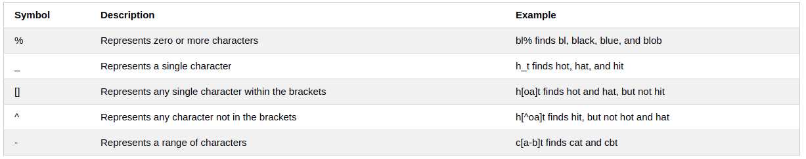

<h1 style="color:orange">SQL</h1>

Tài liệu tham khảo từ [w3school](https://www.w3schools.com/sql/default.asp) 
SQL (Structured Query Language) là ngôn ngữ để truy cập và điều khiển database.

SQL có thể:
- Thực thi truy vấn với database.
- Lấy dữ liệu từ database.
- Nhập những bản ghi vào database.
- Update những bản ghi vào database.
- Xóa bản ghi khỏi database.
- Tạo database mới
- Tạo bảng trong database
- Tạo những tiến trình được lưu trữ trong database
- Tạo dạng xem trong cơ sở dữ liệu
- Cấp quyền cho bảng, tiến trình, dạng xem.
<h1 style="color:orange">Lệnh SQL</h1>
Hầu hết hành động với database đều được thực thi bởi lệnh SQL. 
Lệnh sau hiển thị tất cả mọi thứ được ghi trong bảng:

     SELECT * FROM table name;
- SQL không phải ngôn ngữ nhạy cảm viết hoa hay viết thường. VD: select = SELECT. nhưng thường lệnh thì viết HOA còn tên bảng, tên database, các trường thì viết thường. Tuy vậy, với tên của bảng, các trường: potluck khác POTLUCK hay Potluck.
- Trong SQL, dấu chấm phẩy `;` luôn được dùng để kết thúc câu lệnh.

Những câu lệnh quan trọng nhất trong SQL:

- SELECT - lấy dữ liệu từ database
- UPDATE - updates dữ liệu trong database
- DELETE - xóa data trong database
- INSERT INTO - thêm dữ liệu mới vào database
- CREATE DATABASE - tạo mới database
- ALTER DATABASE - thay đổi một database
- CREATE TABLE - tạo bảng mới
- ALTER TABLE - thay đổi 1 bảng
- DROP TABLE - xóa bảng
- CREATE INDEX - tạo 1 index (từ khóa tìm kiếm)
- DROP INDEX - xóa 1 index
<h2 style="color:orange">1. SELECT</h2>

     SELECT column1, column2, ...
     FROM table_name;
     vd: SELECT CustomerName, City FROM Customers;
Truy xuất dữ liệu của cột CustomerName và cột City từ bảng Customers.
- `SELECT DISTINCT:`

     SELECT Country FROM Customers;
Lấy dữ liệu của cột Country từ bảng Customers; tuy vậy những mục bị trùng lặp bị loại bỏ.
<h2 style="color:orange">2. WHERE</h2>

     SELECT * FROM Customers
     WHERE Country='Mexico';
Truy xuất dữ liệu từ bảng Customers nơi có Country = 'Mexico'

Tương tự với số:

     SELECT * FROM Customers
     WHERE CustomerID=1;

Các option của WHERE: 
- `=`	Equal	
- `>`	Greater than	
- `<`	Less than	
- `>=`	Greater than or equal	
- `<=`	Less than or equal	
- `<>`	Not equal. Note: In some versions of SQL this operator may be written as `!=`	
- `BETWEEN`	Between a certain range	
- `LIKE`	Search for a pattern	
- `IN`	To specify multiple possible values for a colum
Nguồn tham khảo tại [đây](https://www.w3schools.com/sql/sql_where.asp)
<h2 style="color:orange">3. AND, OR và NOT</h2>

    SELECT * FROM Customers
    WHERE Country='Germany' AND City='Berlin';
Truy xuất dữ liệu từ bảng Customers nơi có Country = 'Germany' `và` city='Berlin'

    SELECT * FROM Customers
    WHERE City='Berlin' OR City='München';
Truy xuất dữ liệu từ bảng Customers nơi có City='Berlin' `hoặc` City='München'

    SELECT * FROM Customers
    WHERE NOT Country='Germany';
Truy xuất dữ liệu từ bảng Customers nơi Country `không` ='Germany'

- Có thể kết hợp giữa AND, OR và NOT, 1 số ví dụ:
    
      SELECT * FROM Customers
      WHERE Country='Germany' AND (City='Berlin' OR City='München');
      
      SELECT * FROM Customers
      WHERE NOT Country='Germany' AND NOT Country='USA';
<h2 style="color:orange">4. Sắp xếp theo ASC hoặc DESC</h2>

- ASC là sắp xếp theo thứ tự số từ thấp đến cao, theo bảng chữ cái.
- DESC là ngược lại của ASC 
VD:   
    
      SELECT * FROM Customers
      ORDER BY Country;
Truy xuất dữ liệu từ bảng Customers với cột Country sắp xếp theo thứ tự mặc định ASC.
      
      SELECT * FROM Customers
      ORDER BY Country DESC;
Truy xuất dữ liệu từ bảng Customers với cột Country sắp xếp theo thứ tự DESC (ngược lại bảng chữ cái).

      SELECT * FROM Customers
      ORDER BY Country, CustomerName;
[ket-qua](https://www.w3schools.com/sql/trysql.asp?filename=trysql_select_orderby2)

      SELECT * FROM Customers
      ORDER BY Country ASC, CustomerName DESC;
[ket-qua](https://www.w3schools.com/sql/trysql.asp?filename=trysql_select_orderby3)
<h2 style="color:orange">5. INSERT INTO</h2>
Thêm một hàng vào bảng với mẫu:

      INSERT INTO Customers (CustomerName, ContactName, Address, City, PostalCode, Country)
      VALUES ('Cardinal', 'Tom B. Erichsen', 'Skagen 21', 'Stavanger', '4006', 'Norway');
 
Ngoài ra, có thể không cần phải thêm toàn bộ giá trị:

      INSERT INTO Customers (CustomerName, City, Country)
      VALUES ('Cardinal', 'Stavanger', 'Norway');
 
<h2 style="color:orange">6. NULL</h2>
NULL là giá trị rỗng. 
Không thể định dạng NULL bằng các ký tự: =, <>, <, >,... 
VD: 

     SELECT column_names
     FROM table_name
     WHERE column_name IS NULL;

     SELECT column_names
     FROM table_name
     WHERE column_name IS NOT NULL;

     SELECT CustomerName, ContactName, Address
     FROM Customers
     WHERE Address IS NOT NULL;
Trả về kết quả không phải NULL
<h2 style="color:orange">7. UPDATE</h2>
Cú pháp:

     UPDATE table_name
     SET column1 = value1, column2 = value2, ...
     WHERE condition;
VD:

    UPDATE Customers
    SET ContactName = 'Alfred Schmidt', City= 'Frankfurt'
    WHERE CustomerID = 1;
Đổi giá trị ContactName=Alfred Schmidt và City=Frankfurt tại hàng có giá trị CustomerID=1.

     UPDATE Customers
     SET ContactName='Juan'
     WHERE Country='Mexico';
Đổi ContactName của tất cả hàng có Country=Mexico thành Juan.

     UPDATE Customers
     SET ContactName='Juan';
Đổi tất cả ContactName thành Juan.
<h2 style="color:orange">8. DELETE</h2>

     DELETE FROM Customers WHERE CustomerName='Alfreds Futterkiste';
Xóa 1 hàng trong bảng: xóa hàng có CustomerName=Alfreds Futterkiste trong bảng Customers.

      DELETE FROM table_name;
Xóa toàn bộ nội dung trong 1 bảng.
<h2 style="color:orange">9. SELECT TOP</h2>
Câu lệnh SELECT TOP để xác định số hàng trả về. 
Câu lệnh SELECT TOP hiệu quả với những bảng có hàng ngàn hàng. Trả về nhiều kết quả có thể cải thiện hiệu quả.

Cú pháp SELECT TOP với mỗi kiểu storage:
1. SQL Server / MS Access Syntax:

       SELECT TOP number|percent column_name(s)
       FROM table_name
       WHERE condition;

       SELECT TOP 3 * FROM Customers;
Hiển thị 3 hàng đầu 

       SELECT TOP 3 * FROM Customers
       WHERE Country='Germany';
2. MySQL Syntax:

        SELECT column_name(s)
        FROM table_name
        WHERE condition
        LIMIT number;

        SELECT * FROM Customers
        LIMIT 3;
Hiển thị hàng đầu tiên đến 3

        SELECT * FROM Customers
        WHERE Country='Germany'
        LIMIT 3;
3. Oracle Syntax:
        
        SELECT column_name(s)
        FROM table_name
        WHERE ROWNUM <= number;

        SELECT * FROM Customers
        WHERE ROWNUM <= 3;
Hiển thị giới hạn 3 hàng đầu

        SELECT * FROM Customers
        WHERE Country='Germany' AND ROWNUM <= 3; 
- Hiển thị TOP PERCENT

        SELECT TOP 50 PERCENT * FROM Customers;
<h2 style="color:orange">10. MIN và MAX</h2>
     
     SELECT MIN(column_name)
     FROM table_name
     WHERE condition;

     SELECT MIN(Price) AS SmallestPrice
     FROM Products;
Truy xuất dữ liệu nhỏ nhất từ cột Price trong table Products;

     SELECT MAX(column_name)
     FROM table_name
     WHERE condition;

     SELECT MAX(Price) AS LargestPrice
     FROM Products;
Truy xuất dữ liệu lớn nhất từ cột Price trong table Products;
<h2 style="color:orange">11. COUNT, AVG và SUM</h2>

1. Hàm COUNT đếm số hàng

       SELECT COUNT(column_name)
       FROM table_name
       WHERE condition;

       SELECT COUNT(ProductID)
       FROM Products;
2. Hàm AVG (average) trả về trung bình các giá trị
 
        SELECT AVG(column_name)
        FROM table_name
        WHERE condition;
        
        SELECT AVG(Price)
        FROM Products;
3. Hàm SUM (summary) trả về tổng các giá trị

        SELECT SUM(column_name)
        FROM table_name
        WHERE condition;

        SELECT SUM(Quantity)
        FROM OrderDetails;
- Lưu ý: giá trị NULL bị bỏ qua bởi cả 3 hàm.
<h2 style="color:orange">12. Toán tử LIKE</h2>

Toán tử `LIKE` được dùng ở vị trí hàm WHERE để tìm mẫu chỉ định trong table. 
Có 2 ký tự đại diện thường được dùng với toán tử `LIKE`.
- % - phần trăm đại diện 0,1, nhiều ký tự.
- _ - dấu gạch dưới đại diện 1 ký tự duy nhất

        SELECT column1, column2, ...
        FROM table_name
        WHERE columnN LIKE pattern;
Các trường hợp của 2 ký tự % và _
 

VD:

     SELECT * FROM Customers
     WHERE CustomerName LIKE '%or%';
Hiển thị các hàng có chữ `or` nằm ở bất kì đâu trong giá trị của cột CustomerName trong table Customers

      SELECT * FROM Customers
      WHERE CustomerName LIKE 'a__%';
Hiển thị giá trị có `a` ở đầu và dài ít nhất 3 kí tự
      
      SELECT * FROM Customers
      WHERE CustomerName NOT LIKE 'a%';
Hiển thị giá trị không có `a` ở đầu
<h3 style="color:orange">12.1. Wildcard</h3>
1 ký tự wildcard dùng để thay thế 1 hay nhiều ký tự trong 1 chuỗi. 
Ký tự wildcard được dùng với toán tử LIKE. Toán tử LIKE dùng trong hàm WHERE để tìm giá trị trong 1 cột. 

1. Ký tự wildcard trong MS Access
 
2. Ký tự wildcard trong SQL Server
 
<h3 style="color:orange">12.2. Sử dụng [charlist]</h3>

      SELECT * FROM Customers
      WHERE City LIKE '[bsp]%';
Tìm giá trị bắt đầu bằng b hoặc s hoặc p trong cột City

      SELECT * FROM Customers
      WHERE City LIKE '[a-c]%';
Tìm giá trị bắt đầu bằng từ a đến c (a,b,c) trong cột City
<h3 style="color:orange">12.3. Sử dụng [!charlist]</h3>
Dấu ! thể hiện bằn với NOT

      SELECT * FROM Customers
      WHERE City LIKE '[!bsp]%';
Tìm giá trị không phải bắt đầu bằng b hoặc s hoặc p trong cột City

      SELECT * FROM Customers
      WHERE City NOT LIKE '[bsp]%';
Ý nghĩa tương tự ví dụ trên
<h2 style="color:orange">13. Toán tử IN</h2>
Toán tử IN cho phép chỉ định nhiều giá trị trong hàm WHERE 
Toán tử IN dùng nhanh thay cho OR

      SELECT column_name(s)
      FROM table_name
      WHERE column_name IN (value1, value2, ...);
hoặc 
      
      SELECT column_name(s)
      FROM table_name
      WHERE column_name IN (SELECT STATEMENT);
Ví dụ:

      SELECT * FROM Customers
      WHERE Country IN ('Germany', 'France', 'UK');
Hiển thị dòng có Country = Germany, France và UK

      SELECT * FROM Customers
      WHERE Country NOT IN ('Germany', 'France', 'UK');
Hiển thị dòng không có Country = Germany, France và UK

      SELECT * FROM Customers
      WHERE Country IN (SELECT Country FROM Suppliers);
Hiển thi dòng trong table Customers mà có Country trùng với cột Country trong table Suppliers.
<h2 style="color:orange">14. BETWEEN</h2>
Toán tử BETWEEN chọn giá trị giữa 1 khoảng. Giá trị có thể là số, text, ngày.
      
      SELECT column_name(s)
      FROM table_name
      WHERE column_name BETWEEN value1 AND value2;

      SELECT * FROM Products
      WHERE Price BETWEEN 10 AND 20;
Hiển thị hàng có giá trị từ 10 đến 20 trong cột Price.

      SELECT * FROM Products
      WHERE Price BETWEEN 10 AND 20
      AND CategoryID NOT IN (1,2,3);
Hiển thị hàng có giá trị từ 10 đến 20 trong cột Price và CategoryID không phải 1,2 và 3.

     SELECT * FROM Products
     WHERE ProductName BETWEEN 'Carnarvon Tigers' AND 'Mozzarella di Giovanni'
     ORDER BY ProductName;
ORDER BY để sắp xếp theo bảng chữ cái.

     SELECT * FROM Orders
     WHERE OrderDate BETWEEN '1996-07-01' AND '1996-07-31';
Sắp xếp theo ngày tháng.
[Tài liệu tham khảo](https://www.w3schools.com/sql/sql_between.asp)
<h2 style="color:orange">15. Aliases(biệt hiệu)</h2>
Aliases được dùng để cho table gọi ra 1 cái tên tạm thời. 
Thường được dùng để cho kết quả hiển thị dễ đọc và chỉ tồn tại trong lúc gọi giá trị.

1. Alias cho cột

       SELECT column_name AS alias_name
       FROM table_name;

Cho ví dụ: 
Cho bảng customers: 
 
và bảng 
 

       SELECT CustomerID AS ID, CustomerName AS Customer
       FROM Customers;
Hiển thị cột CustomerID thành ID, CustomerName thành Customer từ table Customers.

       SELECT CustomerName AS Customer, ContactName AS [Contact Person]
       FROM Customers;
Nếu alias có dấu cách ở tên thì cần phải cho vào dấu ngoặc vuông.

     SELECT CustomerName, Address + ', ' + PostalCode + ' ' + City + ', ' + Country AS Address
     FROM Customers;
Câu lệnh SQL trên hiển thị cột CustomerName; và cột Address + cột PostalCode + cột City + cột Country tổng hợp thành 1 cột Address.

 
 
Để lệnh trên chạy trên MySQL thì dùng lệnh:

     SELECT CustomerName, CONCAT(Address,', ',PostalCode,', ',City,', ',Country) AS Address
     FROM Customers;
2. Alias cho các bảng

       SELECT column_name(s)
       FROM table_name AS alias_name;

       VD: SELECT o.OrderID, o.OrderDate, c.CustomerName
       FROM Customers AS c, Orders AS o
       WHERE c.CustomerName='Around the Horn' AND c.CustomerID=o.CustomerID;
Tập hợp lệnh SQL trên chọn tất cả order từ customerID =4 (Around the Horn) bằng cách sử dụng table `Customers` thay bằng `c` và table `Orders` thay bằng `o`. 
Với điều kiện CustomerID ở bảng `c` bằng CustomerID ở bảng `o`.

Tham khảo : [tại đây](https://www.w3schools.com/sql/trysql.asp?filename=trysql_select_alias_no)
 

Tập hơp lệnh sau đây có tác dụng như trên nhưng không dùng alias      
      
     SELECT Orders.OrderID, Orders.OrderDate, Customers.CustomerName
     FROM Customers, Orders
     WHERE Customers.CustomerName='Around the Horn' AND Customers.CustomerID=Orders.CustomerID;
- Alias có tác dụng khi:
   
   + Có nhiều hơn 1 table khi truy vấn
   + Tên cột dài và khó đọc
   + 2 hay nhiều cột kết hợp với nhau cho ra kết quả.
<h2 style="color:orange">16. Toán tử UNION</h2>
Toán tử UNION được dùng để kết hơp hai câu lệnh SELECT.
- Mỗi câu lệnh SELECT với UNION phải có số cột bằng nhau
- Các cột phải có cùng kiểu dữ liệu
- Các cột trong câu lệnh SELECT phải có cùng thứ tự sắp xếp.

      SELECT column_name(s) FROM table1
      UNION
      SELECT column_name(s) FROM table2;

      SELECT City FROM Customers
      UNION
      SELECT City FROM Suppliers
      ORDER BY City;
Kết quả hiển thị tên thành phố từ 2 table sắp xếp theo thứ tự a->z.

      SELECT City FROM Customers
      UNION ALL
      SELECT City FROM Suppliers
      ORDER BY City;
Tương tự tập hợp câu lệnh trên. Tuy vậy, liệt kê cả những thành phố bị trùng (ở đây là 2 lần)

1 số ví dụ:
1. UNION với WHERE

       SELECT City, Country FROM Customers
       WHERE Country='Germany'
       UNION
       SELECT City, Country FROM Suppliers
       WHERE Country='Germany'
       ORDER BY City;
2. UNION nhiều cột

       SELECT 'Customer' AS Type, ContactName, City, Country
       FROM Customers
       UNION
       SELECT 'Supplier', ContactName, City, Country
       FROM Suppliers;
<h2 style="color:orange">17. GROUP BY</h2>
Câu lệnh GROUP nhóm các hàng có cùng giá trị vào một hàng tổng hợp, như "tìm số customer của mỗi country. 
Câu lệnh GROUP thường dùng với các hàm tổng hợp (COUNT,MAX,MIN,SUM,AVG) để nhóm các kết quả từ 1 hay nhiều cột.

       SELECT column_name(s)
       FROM table_name
       WHERE condition
       GROUP BY column_name(s)
       ORDER BY column_name(s);

       SELECT COUNT(CustomerID), Country
       FROM Customers
       GROUP BY Country;
Đếm số CustomerID của từng Country trong bảng Customers
 
VD Ở đây Argentina có 3 CustomerID và Austria có 2 CustomerID. 
Nếu không có dòng GROUP BY Country. 
 

1 ví dụ khác:

       SELECT Shippers.ShipperName, COUNT(Orders.OrderID) AS NumberOfOrders 
       FROM Orders
       LEFT JOIN Shippers ON Orders.ShipperID = Shippers.ShipperID
       GROUP BY ShipperName;
<h2 style="color:orange">17.1. HAVING</h2>
Câu lệnh HAVING được thêm vào GROUP BY vì WHERE không có chức năng tổng hợp.

       SELECT column_name(s)
       FROM table_name
       WHERE condition
       GROUP BY column_name(s)
       HAVING condition
       ORDER BY column_name(s);

       SELECT COUNT(CustomerID), Country
       FROM Customers
       GROUP BY Country
       HAVING COUNT(CustomerID) > 5;
Chỉ ra những Country có CustomerID lớn hơn 5

1 số ví dụ:

       SELECT Employees.LastName, COUNT(Orders.OrderID) AS NumberOfOrders
       FROM Orders
       INNER JOIN Employees ON Orders.EmployeeID = Employees.EmployeeID
       WHERE LastName = 'Davolio' OR LastName = 'Fuller'
       GROUP BY LastName
       HAVING COUNT(Orders.OrderID) > 25;
<h2 style="color:orange">18. EXISTS</h2>
Toán tử EXISTS dùng để kiểm tra sự tồn tại của kết quả truy vấn 
Toán tử EXISTS trả về true nếu kết quả truy vấn có 1 hay nhiều giá trị.

       SELECT column_name(s)
       FROM table_name
       WHERE EXISTS
       (SELECT column_name FROM table_name WHERE condition);

       SELECT SupplierName
       FROM Suppliers
       WHERE EXISTS (SELECT ProductName FROM Products WHERE Products.SupplierID = Suppliers.supplierID AND Price < 20);
<h2 style="color:orange">19. ANY và ALL</h2>
Toán tử ANY và ALL dùng với hàm WHERE và HAVING. 
ANY trả về kết quả nếu như có bất kì giá trị nào của 1 giá trị của cột khớp với truy vấn. 
ALL trả về kết quả nếu như tất cả giá trị của 1 giá trị của cột khớp với truy vấn. 

1. ANY

       SELECT column_name(s)
       FROM table_name
       WHERE column_name operator ANY
       (SELECT column_name FROM table_name WHERE condition);

       SELECT ProductName
       FROM Products
       WHERE ProductID = ANY (SELECT ProductID FROM OrderDetails WHERE Quantity = 10);
Hiển thị ProductName của ProductID từ table Products nếu bất kì giá trị Quantity nào của ProductID từ table OrderDetails =10.

2. ALL

       SELECT column_name(s)
       FROM table_name
       WHERE column_name operator ALL
       (SELECT column_name FROM table_name WHERE condition);

       SELECT ProductName
       FROM Products
       WHERE ProductID = ALL (SELECT ProductID FROM OrderDetails WHERE Quantity = 10);
Hiển thị ProductName của ProductID từ table Products nếu tất cả giá trị Quantity nào của ProductID từ table OrderDetails =10.
<h2 style="color:orange">20. SELECT INTO</h2>
Câu lệnh SELECT INTO copy dữ liệu một table sang 1 table mới. Lưu ý cả hai phải trong cùng 1 database.

      SELECT *
      INTO newtable [IN externaldb]
      FROM oldtable
      WHERE condition;

      SELECT * INTO CustomersBackup2017
      FROM Customers;
Copy 1 vài cột sang table mới:

      SELECT column1, column2, column3, ...
      INTO newtable [IN externaldb]
      FROM oldtable
      WHERE condition;

      SELECT CustomerName, ContactName INTO CustomersBackup2017
      FROM Customers;

1 số ví dụ:

      SELECT * INTO CustomersBackup2017 IN 'Backup.mdb'
      FROM Customers;
Dùng toán tử IN copy table sang 1 table mới ở 1 database khác.

      SELECT * INTO CustomersGermany
      FROM Customers
      WHERE Country = 'Germany';
Copy dữ liệu mà chỉ có Country=Germany sang bảng mới

      SELECT Customers.CustomerName, Orders.OrderID
      INTO CustomersOrderBackup2017
      FROM Customers
      LEFT JOIN Orders ON Customers.CustomerID = Orders.CustomerID;
Copy dữ liệu các cột từ nhiều bảng vào 1 bảng mới.

      SELECT * INTO newtable
      FROM oldtable
      WHERE 1 = 0;
Ngoài ra, có thể tạo bảng trống mới với cấu trúc tương tự bảng cũ bằng cách thay dữ liệu từ 1 -> 0.
<h2 style="color:orange">21. INSERT INTO SELECT</h2>
Câu lệnh INSERT INTO SELECT copy dữ liệu từ 1 table và nhập vào 1 bảng khác. 
Câu lệnh yêu cầu dữ liệu từ 2 cột tương ứng và số cột phải giống nhau. 
Dữ liệu có sẵn ở table được copy vào sẽ không bị thay đổi. 

      INSERT INTO table2
      SELECT * FROM table1
      WHERE condition;

      INSERT INTO table2 (column1, column2, column3, ...)
      SELECT column1, column2, column3, ...
      FROM table1
      WHERE condition;
Ví dụ:

      INSERT INTO Customers (CustomerName, City, Country)
      SELECT SupplierName, City, Country FROM Suppliers;

      INSERT INTO Customers (CustomerName, City, Country)
      SELECT SupplierName, City, Country FROM Suppliers
      WHERE Country='Germany';
<h2 style="color:orange">22. CASE</h2>
Sử dụng tương tự IF ELSE trong C

    CASE
    WHEN condition1 THEN result1
    WHEN condition2 THEN result2
    WHEN conditionN THEN resultN
    ELSE result
    END;
Ví dụ:

    SELECT OrderID, Quantity,
    CASE
    WHEN Quantity > 30 THEN 'The quantity is greater than 30'
    WHEN Quantity = 30 THEN 'The quantity is 30'
    ELSE 'The quantity is under 30'
    END AS QuantityText
    FROM OrderDetails;
Kết quả :
 
Chú ý sau END nên để hàm AS(alias) nếu không sẽ in ra kết quả như này 
 
<h2 style="color:orange">23. IFNULL</h2>
Ví dụ:

 
     
     SELECT ProductName, UnitPrice * (UnitsInStock + UnitsOnOrder)
     FROM Products;
Nếu giá trị "UnitsonOrders" là NULL, thì kết quả in ra sẽ là null. 
Để thay thế giá trị null được in ra này, với MySQL:

     SELECT ProductName, UnitPrice * (UnitsInStock + IFNULL(UnitsOnOrder, 0))
     FROM Products;
<h2 style="color:orange">24. Lưu câu lệnh</h2>
Nếu có 1 câu lệnh mà bạn phải dùng nhiều lần, có thể lưu lại để thực thi bằng các câu lệnh tắt. 
Câu lệnh tạo procedure
     
     CREATE PROCEDURE procedure_name
     AS
     sql_statement
     GO;
Câu lệnh thực thi:

     EXEC procedure_name;

Ví dụ:
     
     CREATE PROCEDURE SelectAllCustomers
     AS
     SELECT * FROM Customers
     GO;
     
     EXEC SelectAllCustomers;
hoặc có thể thêm lệnh WHERE
     
     CREATE PROCEDURE SelectAllCustomers @City nvarchar(30), @PostalCode nvarchar(10)
     AS
     SELECT * FROM Customers WHERE City = @City AND PostalCode = @PostalCode
     GO;

     EXEC SelectAllCustomers @City = 'London', @PostalCode = 'WA1 1DP';
<h2 style="color:orange">25. Tạo comment</h2>

- Để biến 1 dòng thành comment thêm ký tự `--` ở đầu dòng.
- Để biến nhiều đoạn thành comment thêm ký tự `/*` ở đầu và `*/` ở cuối. 
-----> SQL sẽ bỏ qua những dòng comment.
<h2 style="color:orange">26. Các toán tử</h2>

1. Toán học
 
2. Thay thế toán tử AND, OR
 
3. Toán tử so sánh
 
4. Toán tử logic
 
