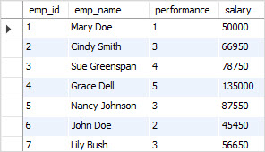
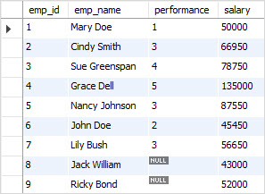
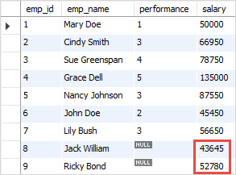

<h1 style="color:orange">UPDATE JOIN</h1>
Syntax:

      UPDATE T1, T2,
      [INNER JOIN | LEFT JOIN] T1 ON T1.C1 = T2. C1
      SET T1.C2 = T2.C2, 
      T2.C3 = expr
      WHERE condition
<h2 style="color:orange">Ví dụ</h2>
Tạo database empdb có 2 bảng:

- Table employees chứa dữ liệu nhân viên với employee id, name, performance and salary.
- Table merits chứa employee performance và merits'percentage.

      CREATE DATABASE IF NOT EXISTS empdb;

      USE empdb;

      -- create tables
      CREATE TABLE merits (
      performance INT(11) NOT NULL,
      percentage FLOAT NOT NULL,
      PRIMARY KEY (performance)
      );

      CREATE TABLE employees (
      emp_id INT(11) NOT NULL AUTO_INCREMENT,
      emp_name VARCHAR(255) NOT NULL,
      performance INT(11) DEFAULT NULL,
      salary FLOAT DEFAULT NULL,
      PRIMARY KEY (emp_id),
      CONSTRAINT fk_performance FOREIGN KEY (performance)
      REFERENCES merits (performance)
      );
Insert dữ liệu vào table merit.

      INSERT INTO merits(performance,percentage)
      VALUES(1,0),
      (2,0.01),
      (3,0.03),
      (4,0.05),
      (5,0.08);
Insert dữ liệu vào employees table

       INSERT INTO employees(emp_name,performance,salary)      
      VALUES('Mary Doe', 1, 50000),
      ('Cindy Smith', 3, 65000),
      ('Sue Greenspan', 4, 75000),
      ('Grace Dell', 5, 125000),
      ('Nancy Johnson', 3, 85000),
      ('John Doe', 2, 45000),
      ('Lily Bush', 3, 55000);

Giả sử bạn muốn tăng lương cho employees dựa trên performance.

performance percentage được lưu trữ trong bảng thành tích, do đó, bạn phải sử dụng câu lệnh UPDATE INNER JOIN để điều chỉnh mức lương của nhân viên trong bảng nhân viên dựa trên phần trăm được lưu trữ trong bảng thành tích.

    UPDATE employees
        INNER JOIN
    merits ON employees.performance = merits.performance 
    SET 
    salary = salary + salary * percentage;

Query hoạt động như thế nào?

Chúng tôi chỉ xác định table employee sau mệnh đề UPDATE vì chúng tôi chỉ muốn update dữ liệu trong table employee

Đối với mỗi hàng trong bảng nhân viên, truy vấn kiểm tra giá trị trong cột performance so với giá trị trong cột performance trong bảng thành tích. Nếu nó trùng khớp, nó sẽ lấy phần trăm trong bảng thành tích và cập nhật cột lương trong bảng nhân viên.

Bởi vì chúng tôi bỏ qua mệnh đề WHERE trong câu lệnh UPDATE, tất cả các bản ghi trong bảng nhân viên sẽ được cập nhật.

<h2 style="color:orange">Update với left join</h2>
Giả sử công ty có thêm 2 thành viên

      INSERT INTO employees(emp_name,performance,salary)
      VALUES('Jack William',NULL,43000),
      ('Ricky Bond',NULL,52000);
 

Vì là nhân viên mới nên chưa có performance ---> lúc này left join sẽ có tác dụng

       UPDATE employees
        LEFT JOIN
        merits ON employees.performance = merits.performance 
      SET 
      salary = salary + salary * 0.015
      WHERE
      merits.percentage IS NULL;
 
<h1 style="color:orange">DELETE JOIN</h1>
Chúng ta thường dùng hàm LEFT JOIN trong hàm DELETE để xóa những hàng ở table bên trái có hàng không match những hàng ở bảng bên phải

Syntax xóa những hàng từ table1 mà không tương ứng hàng ở table 2

      DELETE T1 
      FROM T1
        LEFT JOIN
       T2 ON T1.key = T2.key 
      WHERE
       T2.key IS NULL;
Ví dụ:

      DELETE customers 
      FROM customers
        LEFT JOIN
      orders ON customers.customerNumber = orders.customerNumber 
      WHERE
       orderNumber IS NULL;