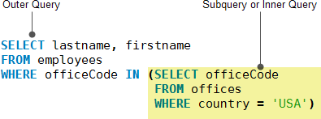

<h1 style="color:orange">Sub-query</h1>
Sub-query là một query trong 1 query khác. subquery còn được gọi là query trong và query chứa nó là query ngoài.

Ví dụ:

     SELECT 
       lastName, firstName
     FROM
       employees
     WHERE
       officeCode IN (SELECT 
            officeCode
        FROM
            offices
        WHERE
            country = 'USA');
Trong ví dụ:
- Subquery trả về officeCode của nhừng offices ở Mỹ.
- Query ngoài trả về last name và first name từ table employees từ officeCode của subquery

<h2 style="color:orange">1 số ví dụ Sub-query</h2>
     
     SELECT 
      customerNumber, 
      checkNumber, 
      amount
    FROM
      payments
    WHERE
      amount = (SELECT MAX(amount) FROM payments);

    
    SELECT 
      customerName
    FROM
      customers
    WHERE
      customerNumber NOT IN (SELECT DISTINCT
            customerNumber
        FROM
            orders);

    SELECT 
     MAX(items), 
     MIN(items), 
     FLOOR(AVG(items))
    FROM
    (SELECT 
        orderNumber, COUNT(orderNumber) AS items
    FROM
        orderdetails
    GROUP BY orderNumber) AS lineitems;