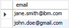

<h1 style="color:orange">Insert ignore</h1>
Khi thêm nhiều hàng vào table, hàm INSERT IGNORE thêm vào hàng phù hợp các constraint hoặc datatype; còn các hàng vi phạm thì bị loại bỏ.

Ví dụ: 
Tạo bảng:

     CREATE TABLE subscribers (
     id INT PRIMARY KEY AUTO_INCREMENT,
     email VARCHAR(50) NOT NULL UNIQUE
     );
Insert thông tin vào bảng 

     INSERT INTO subscribers(email)
     VALUES('john.doe@gmail.com');
Insert tiếp:

     INSERT INTO subscribers(email)
     VALUES('john.doe@gmail.com'), 
      ('jane.smith@ibm.com');
MySQL trả về kết quả error

     Error Code: 1062. Duplicate entry 'john.doe@gmail.com' for key 'email'

Tuy vậy khi dùng hàm INSERT IGNORE

     INSERT IGNORE INTO subscribers(email)
     VALUES('john.doe@gmail.com'), 
    ('jane.smith@ibm.com');
MySQL trả về kết quả:

     1 row(s) affected, 1 warning(s): 1062 Duplicate entry 'john.doe@gmail.com' for key 'email' Records: 2  Duplicates: 1  Warning: 1
khi dùng select * from thì bảng chỉ thêm 1 giá trị phù hợp điều kiện:
