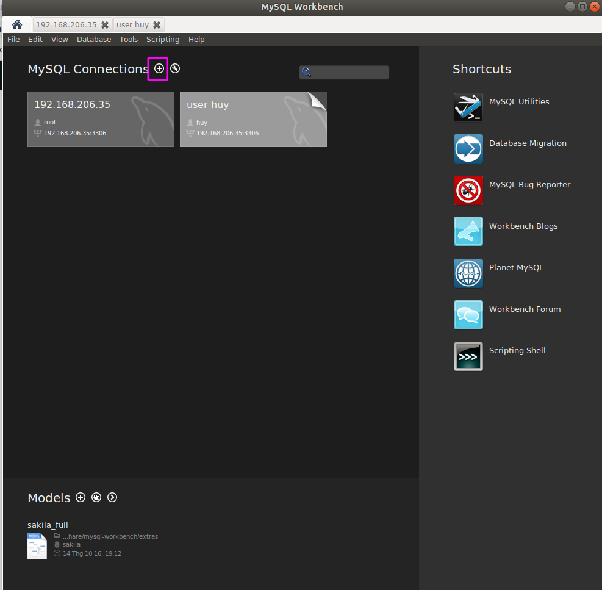
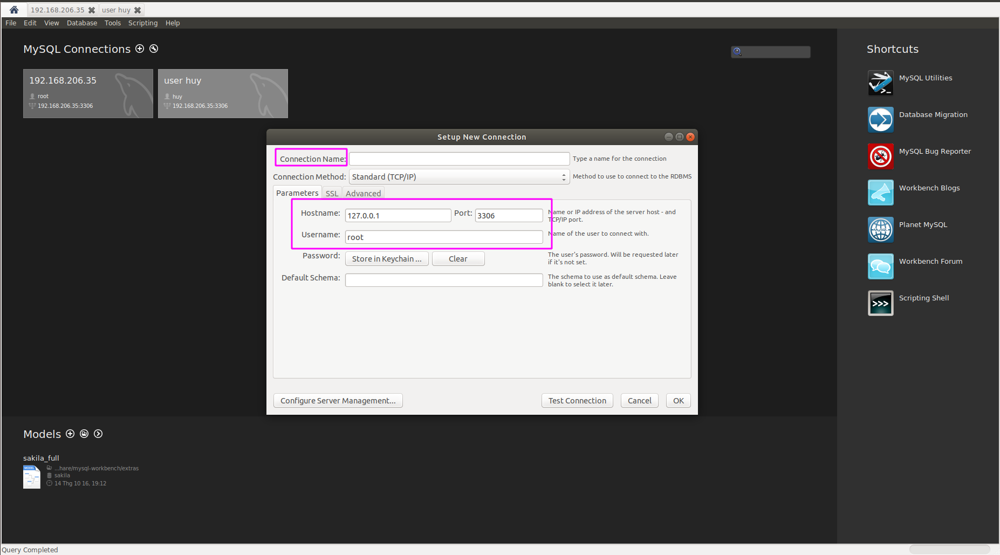
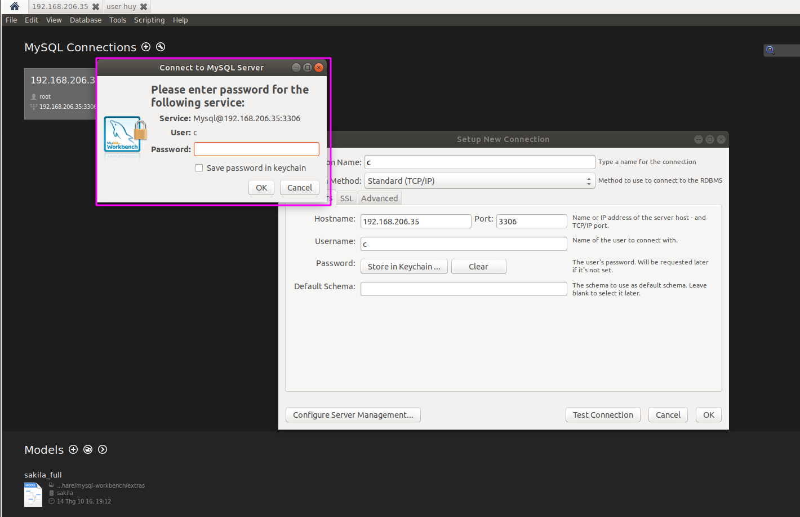
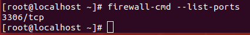
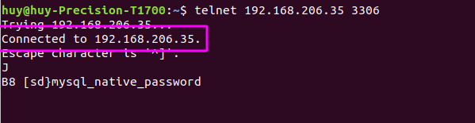
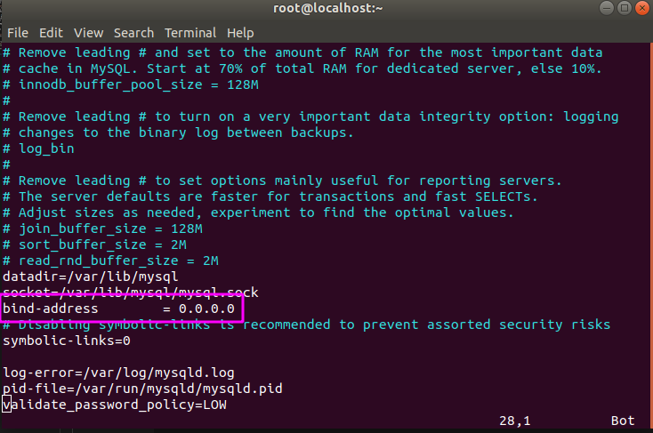
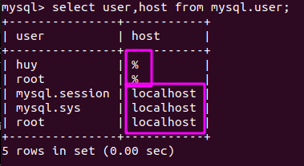

<h1 style="color:orange">Đăng nhập MySQL từ máy khác </h1>
<h2 style="color:orange">Sử dụng MySQL workbench</h2>
Để tải MySQL workbench trên ubuntu sử dụng câu lệnh

     # sudo apt-get -y install mysql-workbench
<h2 style="color:orange">Tạo kết nối từ MySQL workbench đến MySQL database</h2>

1. 

Ấn vào dấu + như trên hình 

2. Hiện ra hình
 
- Connection name là tên kết nối
- Host name là địa chỉ ip của máy chứ Mysql database
- username là tên user trong mysql
- port của mysql là 3306
- Ấn vào test connection để xem có thể kết nối được không

 
Nếu là lần đầu kết nối vào user thì mysql workbench sẽ yêu cầu mật khẩu của user
3. Done

<h2 style="color:orange">Setup từ server MySQL server</h2>
Mặc định MySQL chỉ cho phép localhost kết nối vào database. Vì vậy, để cho phép MySQL workbench kết nối đến database từ server MySQL ta phải thực hiện một số bước sau

1. Mở port 3306/tcp của MySQL trên server chứa MySQL

       firewall-cmd --zone=public --add-port 3306/tcp
KIểm tra xem port 3306 đã được add

       firewall-cmd --list-port
 
2. Từ máy chứa MySQL workbench thử kết nối đến server MySQL server

      telnet 192.168.206.35 3306
Ở đây id server mysql là 192.168.206.35 
 
Đã connect.

3. Từ server mysql dùng lệnh

         vim /etc/my.cnf
         hoặc /etc/mysql/my.cnf
Tìm dòng bind-address và đổi thành bind-address = 0.0.0.0
 
0.0.0.0 đại diện cho tất cả địa chỉ. 
4. Từ MySQL khi tạo user mới thì phải dùng ký tự '%' thay cho localhost

        mysql> mysql> CREATE USER 'new_user'@'%' IDENTIFIED BY 'password';
- 'localhost' thể hiện cho việc user này chỉ cho phép kết nối trên localhost
- '%' thể hiện user này có thể kết nối đến mysql từ bất cứ địa chỉ nào hoặc cũng có thể nêu địa chỉ cố định như 192.168.206.136 để cố định user này chỉ có thể sử dụng từ host 192.168.206.136
 
5. trao quyền cho user muốn điều khiển từ xa

        mysql> GRANT ALL PRIVILEGES ON *.* TO 'username'@'%'