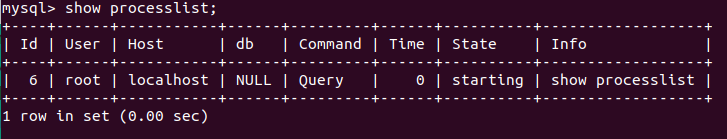

<h1 style="color:orange">MariaDB Replication</h1>
Với các cơ sở dữ liệu có nhu cầu lưu trữ lớn thì đòi hỏi về tính toàn vẹn, không bị mất mát dữ liệu trước những sự cố ngoài dự đoán là rất cao. Vì vậy, người ta nghĩ ra khái niệm replication – nhân bản. Đây là một tính năng cho phép bạn tạo một phiên bản cơ sở dữ liệu giống hệt cơ sở dữ liệu đang tồn tại, và lưu trữ ở một nơi khác, đề phòng có sự cố.

Server chứa dữ liệu gốc được gọi là Master, server chứa dữ liệu nhân bản được gọi là Slave. Quá trình nhân bản từ master sang slave gọi là replication.

Bạn có thể kiểm soát dữ liệu cần sao chép. Tất cả các cơ sở dữ liệu, một hoặc nhiều cơ sở dữ liệu hoặc các bảng trong cơ sở dữ liệu đều có thể được sao chép có chọn lọc.
<h2 style="color:orange">1. Ưu điểm MariaDB Replication</h2>

- Khả năng mở rộng – Scalability: Bằng cách có một hoặc nhiều server slave, việc đọc có thể được trải rộng trên nhiều server, giảm tải cho master. Kịch bản phổ biến nhất cho môi trường đọc cao, viết thấp là có một master, trong đó tất cả các ghi xảy ra, sao chép thành nhiều slave, xử lý hầu hết các lần đọc.
- Phân tích dữ liệu – Data analysis: phân tích dữ liệu có thể ảnh hưởng nhiều đến master server do đó ta có thể sử dụng slave server để phân tích dữ liệu mà vẫn đảm bảo master server hoạt động bình thường.
- Hỗ trợ sao lưu – Backup assistance:
- Phân phối dữ liệu – Distribution of data: Thay vì được kết nối với một master server từ xa, ta có thể sao chép dữ liệu từ slave và làm việc từ dữ liệu này.
<h2 style="color:orange">2. Cách hoạt động Master - Slave</h2>

 
Cơ chế hoạt động trong replication là `binary log` - nhật ký nhị phân. Nếu ghi nhật ký nhị phân được bật, tất cả các cập nhật cho cơ sở dữ liệu (thao tác dữ liệu và định nghĩa dữ liệu) được ghi vào binary log dưới dạng các sự kiện binlog. Các slave đọc binary log trên master để truy cập dữ liệu để sao chép. Một `relay log` – bản ghi tiếp được tạo ra trên slave server, sử dụng định dạng giống như các binary log, và điều này được sử dụng để thực hiện sao chép.  Khi không còn cần thiết, các relay log file cũ sẽ được gỡ bỏ.

Một slave server sẽ theo dõi vị trí của sự kiện binlog cuối được ghi trong binary log của master dựa trên tham số “position”. Điều này cho phép slave server kết nối lại và tiếp tục lại từ nơi nó đã dừng lại ban đầu. Nó cũng cho phép một slave ngắt kết nối, tạo nhân bản và sau đó slave mới tiếp tục replication từ cùng một master.

Master và Slave không cần kết nối liên tục với nhau. Bạn có thể để server offline hoặc ngắt kết nối khỏi mạng và khi chúng quay lại hoạt động thì quá trình replication sẽ bắt đầu từ nơi nó dừng lại.
<h2 style="color:orange">3. Quá trình hoạt động trong Replication</h2>
<h3 style="color:orange">3.1. Trên Master</h2>
Đầu tiên master phải ghi các sự kiện nhân bản vào một tập tin log đặc biệt gọi là binary log. Sau đó các slave sẽ đọc dữ liệu nhân bản từ tập tin này.

Bất cứ khi nào slave kết nối với master, master sẽ tạo một luồng kết nối mới (Binary Log Dump Thread) và thực hiện các hành động mà slave yêu cầu. Thread này có thể được nhận ra bằng cách sử dụng câu lệnh SHOW PROCESSLIST và tìm thấy nó ở nơi có thread command là "Binlog Dump". Bạn có thể biết được slave nào đang được kết nối đến master bằng cách sử dụng câu lệnh SHOW SLAVE HOSTS.

      mysql> show processlist;
      mysql> show slave hosts;

Các slave mới kết nối có thể đọc các sự kiện được lưu trong bộ nhớ cache của hệ điều hành trên master chứ không đọc trên bộ nhớ vật lý của master. Tuy nhiên, khi một slave được kết nối sau đó vài giờ, thậm chí là vài ngày, nó sẽ bắt đầu đọc các sự kiện được ghi trên tập tin binary log – khi đó việc đọc được thực hiện trên bộ nhớ vật lý vì bộ nhớ cache không còn lưu trữ dữ liệu cần thiết.
<h3 style="color:orange">3.2. Trên Slave</h2>
Khi quá trình Replication hoạt động, có 2 luồng chạy trên slave:

1. Luồng nhập xuất(I/O thread): Kết nối với master, đọc các sự kiện trong binary log và sao chép vào tập tin relay log.

Mặc dù chỉ có một luồng vừa đọc binary log từ master và vừa ghi vào relay log trên slave, rất hiếm khi sự kiện sao chép làm cho quá trình nhân bản chậm đi. Quá trình này chỉ kéo dài khoảng vài trăm mili giây. Sử dụng lệnh show master status\G để kiểm tra luồng nhập xuất hiện hành:

       mysql> show master status\G
- Master_Log_File: tập tin cuối cùng được sao chép từ master (hầu như là giống với binary log cuối cùng được tạo ra bởi master) 
- Read_Master_Log_Pos : binary log của master được sao chép vào relay log trên slave đến vị trị hiện tại
So sánh với cùng lệnh này ở máy master.
2. Luồng SQL(SQL Thread): đọc các sự kiện từ relay log được lưu trữ cục bộ trên slave (tập tin được ghi bởi luồng IO) và thực thi các sự kiện đó nhanh nhất có thể.

Để xem trạng thái của luồng SQL, thực thi lệnh show slave status\G:

        mysql> show slave status\G
- Relay_Master_Log_File : tập tin binary log trên master mà luồng SQL đang đọc (thực ra là đọc trên relay log)
- Exec_Master_Log_Pos: vị trí trên file binary log nơi được thực thi bởi luồng SQL.