<h1 style="color:orange">Cấu hình Mariadb Replication</h1>
<h2 style="color:orange">1. Mô hình chuẩn bị</h2>
2 máy có cùng dải IP và đều có cài sẵn Mariadb. 1 máy đóng vai trò làm master, 1 máy làm slave

- Máy 1: 192.168.206.41/24 (master)
- Máy 2: 192.168.206.157/24 (slave)
<h2 style="color:orange">2. Cấu hình trên master</h2>

Cấu hình firewall, cho phép lắng nghe port 3306

       firewall-cmd --add-port=3306/tcp --zone=public --permanent
Reload xác nhận cấu hình.

       firewall-cmd --reload
Chỉnh sửa file /etc/my.cnf

      vim /etc/my.cnf
Đảm bảo 2 dòng sau được xóa bỏ hoặc biến  thành comment:

      #skip-networking
      #bind-address=127.0.0.1
Trong phần [mariadb] thêm các dòng sau:
 
    [mariadb]
    server-id=1
    log-bin=master
    binlog-format=row
    binlog-do-db=replica_db

Trong đó :
- `server_id` là tùy chọn được sử dụng trong replication cho phép master server và slave server có thể nhận dạng lẫn nhau. Server_id Với mỗi server là khác nhau, nhận giá trị từ 1 đến 4294967295(mariadb >=10.2.2) và 0 đến 4294967295(mariadb =<10.2.1)
- `log-bin hay log-basename` là tên cơ sở nhật ký nhị phân để tạo tên tệp nhật ký nhị phân. binlog-format là định dạng dữ liệu được lưu trong file bin log.
- `binlog-do-db` là tùy chọn để nhận biết cơ sở dữ liệu nào sẽ được replication. Nếu muốn replication nhiều CSDL, bạn phải viết lại tùy chọn binlog-do-db nhiều lần. Hiện tại không có option cho phép chọn toàn bộ CSDL để replica mà bạn phải ghi tất cả CSDL muốn replica ra theo option này.

Restart lại dịch vụ mariadb để nhận cấu hình mới 

      systemctl restart mariadb
Đăng nhập vào Mariadb

      mysql - uroot -p
Tạo cơ sở dữ liệu có tên replica_db

      create database replica_db;
Tạo slave user, password và gán quyền cho user đó. Ví dụ username là slave_user và password '@Huy123456'.

      > create user 'slave_user'@'%' identified by '@Huy123456';
      > stop slave;
      > GRANT REPLICATION SLAVE ON *.* TO 'slave_user'@'%' IDENTIFIED BY '@Huy123456';
      > FLUSH PRIVILEGES;
Sử dụng câu lệnh dưới đây để chắc chắn rằng không có bất cứ điều gì được ghi vào master database trong quá trình replication dữ liệu. Ghi nhớ filename and position của binary log để có thể thực hiện cấu hình trên slave.

     FLUSH TABLES WITH READ LOCK;
Tiến hành backup CSDL trên master server và chuyển nó đến slave server

     mysqldump --all-databases -uroot -p --master-data > masterdatabase.sql
Dùng lệnh: ls -l để kiểm tra file
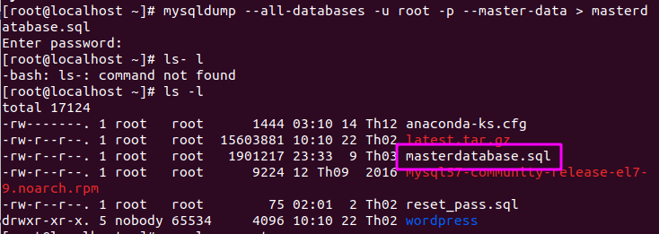

Đăng nhập vào Mariadb và thực hiện unlock table bằng lệnh:

      > UNLOCK TABLES;
Copy masterdatabase.sql file tới Slave server

      # scp masterdatabase.sql root@192.168.206.157:/root/masterdatabase.sql
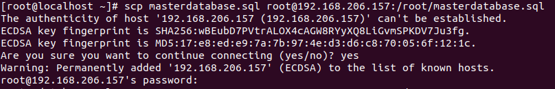 
Kiểm tra trạng thái master

      Mariadb> show master status;
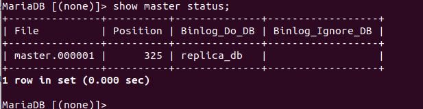 
<h2 style="color:orange">3. Cấu hình trên slave</h2>

Cấu hình firewall, cho phép lắng nghe port 3306

      firewall-cmd --permanent --zone=public --add-port=3306/tcp
Reload xác nhận cấu hình

      firewall-cmd --reload
Chỉnh sửa /etc/my.cnf

      vim /etc/my.cnf
Sau đó thêm các dòng:

      [mariadb]
      server-id = 2
      replicate-do-db=replica_db
Nếu muốn replicate thêm db ngoài replica_db thì phải thêm dòng 

      replicate-do-db= tên-db
`Lưu ý`: phải chỉnh sửa trong file my.cnf; nếu tạo file mới trong my.cnf.d thì sẽ gây ra lỗi conflict server-id.

      mysql> select @@global.server_id;
Import CSDL master. Enter password của root user trong Mariadb

     mysql -uroot -p < /root/masterdatabase.sql
     
     Enter password:
Restart Mariadb service để tiếp nhận thay đổi

     systemctl restart mariadb
Sử dụng root user đăng nhập vào Mariadb Server

     mysql -uroot -p
Hướng dẫn Slave tìm file Master Log file và Start Slave

    > STOP SLAVE;
    > CHANGE MASTER TO MASTER_HOST='192.168.206.41',
    MASTER_USER='slave_user', MASTER_PASSWORD='@Huy123456', MASTER_USE_GTID=current_pos,MASTER_LOG_FILE='master.000001', MASTER_LOG_POS=325;
    > START SLAVE;
Kiểm tra trạng thái của Slave:

    > show slave status\G;
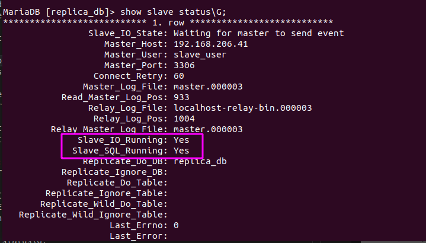
Nếu 2 dòng sau hiển thị Yes thì replication hoạt động bình thường 
Slave_IO_Running: Yes 
Slave_SQL_Running: Yes 
<h2 style="color:orange">4. Cấu hình thêm slave vào hệ thống</h2>
<h3 style="color:orange">4.1. Cấu hình trên master</h3>
Bật tính năng read only để không ghi thêm dữ liệu mới vào CSDL và tắt replication:

     # mysql -uroot -p
     > stop slave;
     > flush table with read lock;
Tiến hành backup CSDL trên master server và chuyển nó đến slave server

     mysqldump --all-databases --user=root --password --master-data > masterdatabase.sql
Đăng nhập vào MariaDB với root user và thực hiện unlock table bằng lệnh sau

      unlock tables;
Copy masterdatabase.sql file tới Slave server.

     scp masterdatabase.sql root@192.168.206.x:/root/masterdatabase.sql
<h3 style="color:orange">4.2. Cấu hình trên slave mới</h3>
Thực hiện tương tự slave 1 
Lưu ý: Phần chỉnh sửa trong file /etc/my.cnf ở mục server-id phải đặt khác với id master và id của slave 1.
<h2 style="color:orange">5. Back up khi cả 2 node đều sập </h2>
Khi master gặp sự cố mất mát dữ liệu (record, Table, Schema v.v..) dẫn đến việc Slave cũng đồng bộ theo và khiến cho dữ liệu hệ thống mất đi.

Sử dụng bản backup gần nhất để khôi phục dữ liệu trên Master và kiểm tra xem Slave có đồng bộ lại không hay sẽ phải import lại CSDL trên Slave như khi mới khởi tạo Master-Slave
<h3 style="color:orange">5.1. Quy trình</h3>
Sử dụng câu lệnh để backup dữ liệu

    mysqldump -u root -p [dbname] > [backupfile.sql]
Trong đó :
- [dbname] : Tên của database
- [backupfile.sql] : Tên file backup muốn lưu 

Sử dụng câu lệnh sau để restore dữ liệu

    mysql -u root -p [dbname] < [backupfile.sql]
<h2 style="color:orange">6. Chuyển từ slave sang master</h2>

 Chuyển từ slave sang master dùng trong viễn cảnh master chính gặp vấn đề hoặc muốn nâng cấp master và để 1 slave lên thành master tạm thời.

 <h3 style="color:orange">6.1. Master</h3>
 Trên con master hiện tại kiểm tra:

    mariadb> show master status;
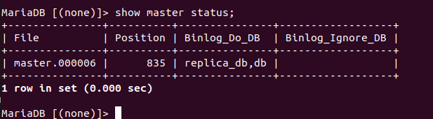

Trên các slave kiểm tra:

    mariadb> show slave status\G;
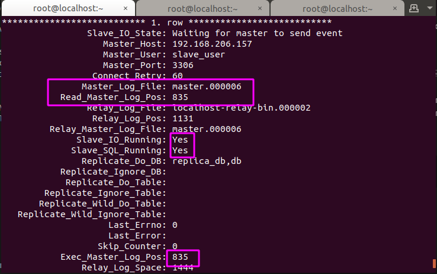 
Thấy trùng khớp với master có nghĩa là dữ liệu trên các slave đã đồng nhất với master. 

Trên master gõ

    mariadb> SHUTDOWN;
lúc này mariadb sẽ xóa file mysql.sock trong /var/lib/mysql và khi đăng nhập lại sẽ có lỗi 
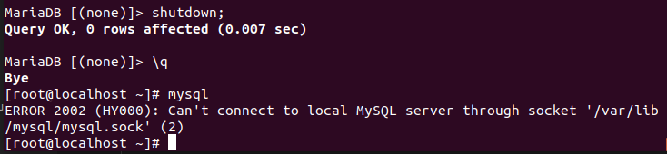 
 <h3 style="color:orange">6.2. Trên slave muốn chuyển thành master</h3>

Vào file config:

    # vim /etc/my.cnf
đổi từ 
    
    [mariadb]
    server-id = 3
    replicate-do-db=replica_db
sang
     
    [mariadb]
    server-id = 3
    log-bin=master
    binlog-format=row
    binlog-do-db=replica_db
    bind-address=0.0.0.0

    # systemctl restart mysql

Vào mariadb kiểm tra:

    mariadb> show master status;
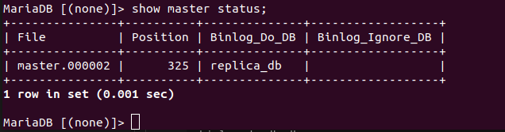 
 <h3 style="color:orange">6.3. Trên các slave khác</h3>
 Vào mariadb kiểm tra

    mariadb> show slave status\G;
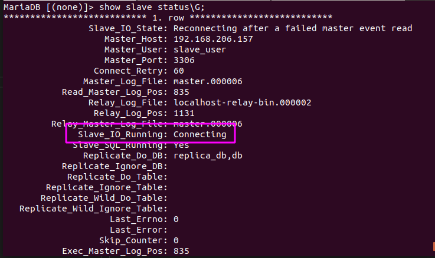 
không kêt nối được đến master cũ

Cấu hình:

    # systemctl restart mysql
    mariadb> stop slave;
    mariadb> CHANGE MASTER TO MASTER_HOST='192.168.206.94', MASTER_USER='slave_user', MASTER_PASSWORD='@Huy123456', MASTER_USE_GTID=current_pos,MASTER_LOG_FILE='master.000002', MASTER_LOG_POS=325;
    mariadb> start slave;
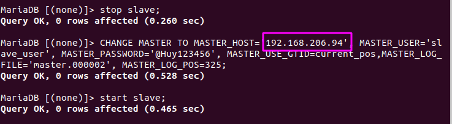 
- 192.168.206.94 là địa chỉ master mới 

      mariadb> show slave status\G;
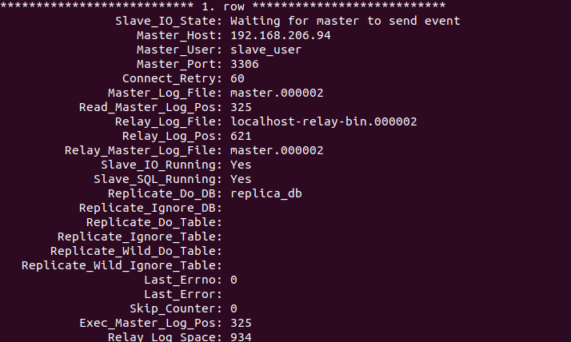 
<h3 style="color:orange">6.4. Biến master cũ thành slave</h3>
Tạo lại file mysql.sock:

    touch /var/lib/mysql/mysql.sock
    chmod 777 mysql.sock
    chown mysql:mysql mysql.sock
----->

    # systemctl restart mysql
Vào file config:

    # vim /etc/my.cnf
đổi từ 

    [mariadb]
    server-id = 1
    log-bin=master
    binlog-format=row
    binlog-do-db=replica_db
    bind-address=0.0.0.0
sang
    
    [mariadb]
    server-id = 1
    replicate-do-db=replica_db
 
   
    
    # systemctl restart mysql
Sau đó vào mariadb cấu hình:

    mariadb> stop slave;
    mariadb> CHANGE MASTER TO MASTER_HOST='192.168.206.94', MASTER_USER='slave_user', MASTER_PASSWORD='@Huy123456', MASTER_USE_GTID=current_pos,MASTER_LOG_FILE='master.000002', MASTER_LOG_POS=325;
    mariadb> start slave;
Lúc này master cũ đã thành slave

Lưu ý: 
- lúc này các slave vẫn dùng file masterdatabase.sql làm binlog nên không cần phải mysqldump hay scp mới.
- mỗi khi muốn replicate thêm db thì phải cấu hình trong file my.cnf trước rồi mới tạo db sau. Nếu tạo db trước khi cấu hình thì thường xảy ra lỗi.
<h3 style="color:orange">6.5. Biến master cũ thành master</h3>
Giả sử trong lúc master cũ shutdown, master mới đã thêm vào 1 số dữ liệu trong database replica_db. Vậy khi master cũ on lên thì sẽ không có những dữ liệu đó ----> làm sao để đồng bộ dữ liệu?

1. Trên master mới tạo file binlog mới:

       ​mysqldump --all-databases -uroot -p --master-data > masterdatabase1.sql
Lưu ý: file masterdatabase1.sql khác file binlog masterdatabase.sql cũ 

Chuyển file này sang master cũ
       
    scp masterdatabase1.sql root@192.168.206.41:/root/masterdatabase1.sql
2. Trên master cũ:

       mysql -uroot -p < /root/masterdatabase1.sql
-----> đồng bộ dữ liệu -----> cấu hình chuyển master như trên

3. Chuyển các slave phục tùng master cũ 

Trên master mới,

      scp masterdatabase1.sql root@192.168.206.157:/root/masterdatabase1.sql
Sau đó, tương tự như trên, trên slave

       mysql -uroot -p < /root/masterdatabase1.sql
-----> đồng bộ dữ liệu, chuyển master như trên

       # systemctl restart mysql
       mariadb> stop slave;
       mariadb> CHANGE MASTER TO MASTER_HOST='192.168.206.41', MASTER_USER='slave_user', MASTER_PASSWORD='@Huy123456', MASTER_LOG_FILE='master.000002', MASTER_LOG_POS=325;
       mariadb> start slave;
Tuy vậy không sử dụng MASTER_USE_GTID=current_pos vì sẽ gây ra conflict với GTID của nhóm master slave cũ 
Khi dùng: 
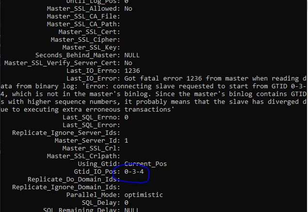 
Khi không dùng: 
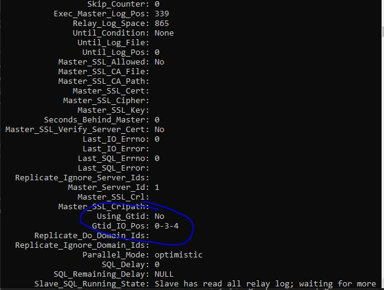 
0-3-4 là GTID của nhớm master-slave cũ

GTID là global transaction ID: https://mariadb.com/kb/en/gtid/