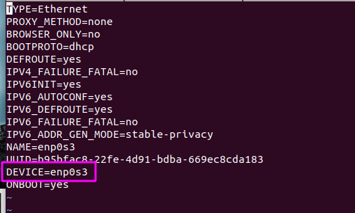
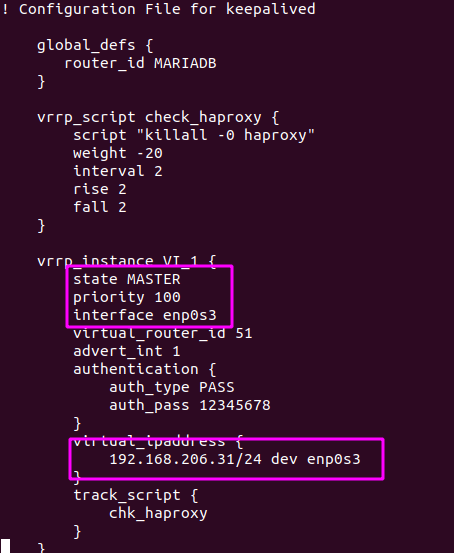
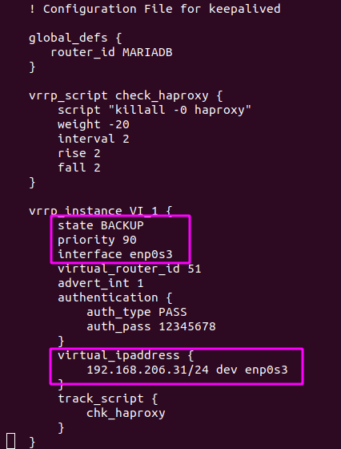

<h1 style="color:orange">Keepalived</h1>
<h2 style="color:orange">1. Giới thiệu</h2>
Keepalived là một phần mềm định tuyến, được viết bằng ngôn ngữ C. Chương trình keepalived cho phép nhiều máy tính cùng chia sẻ một địa chỉ IP ảo với nhau theo mô hình Active – Passive (ta có thể cấu hình thêm một chút để chuyển thành mô hình Active – Active).

Khi người dùng cần truy cập vào dịch vụ, người dùng chỉ cần truy cập vào địa chỉ IP ảo dùng chung này thay vì phải truy cập vào những địa chỉ IP thật của các thiết bị kia.

Một số đặc điểm của phần mềm Keepalived:

- Keepalived không đảm bảo tính ổn định của dịch vụ chạy trên máy chủ, nó chỉ đảm bảo rằng sẽ luôn có ít nhất một máy chủ chịu trách nhiệm cho IP dùng chung khi có sự cố xảy ra.
- Keepalived thường được dùng để dựng các hệ thống HA (High Availability) dùng nhiều router/firewall/server để đảm bảo hệ thống được hoạt động liên tục.
- Keepalived dùng giao thức VRRP (Virtual Router Redundancy Protocol) để liên lạc giữa các thiết bị trong nhóm.
<h2 style="color:orange">1.1. Giới thiệu VRRP</h2>

Virtual router đại diện cho một nhóm thiết bị sẽ có một virtual IP và một đỉa chỉ MAC (Media Access Control) đặc biệt là 00-00-5E-00-01-XX. Trong đó, XX là số định danh của router ảo – Virtual Router Identifier (VRID), mỗi virtual router trong một mạng sẽ có một giá trị VRID khác nhau. `Vào mỗi thời điểm nhất định, chỉ có một router vật lý dùng địa chỉ MAC ảo này.` Khi có ARP request gởi tới virtual IP thì router vật lý đó sẽ trả về địa chỉ MAC này.

Các router vật lý sử dụng chung VIP phải liên lạc với nhau bằng địa chỉ multicast 224.0.0.18 bằng giao thức VRRP. Các router vật lý sẽ có độ ưu tiên (priority) trong khoảng từ 1 – 254, và router có độ ưu tiên cao nhất sẽ thành Master, các router còn lại sẽ thành các Slave/Backup, hoạt động ở chế độ chờ.
<h2 style="color:orange">1.2. Cơ chế VRRP</h2>
Như đã nói ở trên, các router/server vật lý dùng chung VIP sẽ có 2 trạng thái là MASTER/ACTIVE và BACKUP/SLAVE. Cơ chế failover được xử lý bởi giao thức VRRP, khi khởi động dịch vụ, toàn bộ các server dùng chung VIP sẽ gia nhập vào một nhóm multicast. Nhóm multicast này dùng để gởi/nhận các gói tin quảng bá VRRP. Các router sẽ quảng bá độ ưu tiên (priority) của mình, server với độ ưu tiên cao nhất sẽ được chọn làm MASTER. Một khi nhóm đã có 1 MASTER thì MASTER này sẽ chịu trách nhiệm gởi các gói tin quảng bá VRRP định kỳ cho nhóm multicast.

Nếu vì một sự cố gì đó mà các server BACKUP không nhận được các gói tin quảng bá từ MASTER trong một khoảng thời gian nhất định thì cả nhóm sẽ bầu ra một MASTER mới. MASTER mới này sẽ tiếp quản địa chỉ VIP của nhóm và gởi các gói tin ARP báo là nó đang giữ địa chỉ VIP này. Khi MASTER cũ hoạt động bình thường trở lại thì router này có thể lại trở thành MASTER hoặc trở thành BACKUP tùy theo cấu hình độ ưu tiên của các router.

`Vào mỗi thời điểm nhất định, chỉ có một router vật lý dùng địa chỉ MAC ảo này.`
<h2 style="color:orange">2. Cấu hình</h2>
<h3 style="color:orange">2.1. Chuẩn bị</h3>

192.168.206.41: mariadb1 và haproxy1 (haproxy cài chung trên mariadb1) 
192.168.206.157: mariadb2 và haproxy2 (haproxy cài chung trên mariadb2) 
192.168.206.94: mariadb3 
Cài đặt cluster galera trên 3 server có mariadb đã cho sẵn. 
Cài đặt trên phiên bản CentOS7 3.10.0-1160.11.1, Mariadb 10.5.9, haproxy 1.5.18-9 
<h3 style="color:orange">2.2. Cài đặt keepalived</h3>

1. Truy cập vào 2 con haproxy

       # yum install -y keepalived
2. Lấy tên card mạng:
       
       # vim /etc/sysconfig/network-scripts/ifcfg-enp0s3 (enp0s3 là tên card mạng của máy haproxy)
 
Lấy tên DEVICE=enp0s3
<h3 style="color:orange">2.3. Cấu hình mẫu keepalived</h3>
Một cấu hình mẫu của keepalived

       ! Configuration File for keepalived

       global_defs {
          notification_email {
             admin@cuongquach.com
          }
          notification_email_from keepalived-web1@cuongquach.com
          smtp_server x.x.x.x
          smtp_connect_timeout 30
       }
 
       vrrp_script chk_haproxy {
               script "command"     
               interval <time>
               weight <n>
       }
 
       vrrp_instance string {
           state MASTER|BACKUP
           interface string
           mcast_src_ip @IP
           virtual_router_id num
           priority num
           advert_int num
           smtp_alert
           authentication {
               auth_type PASS|AH
               auth_pass string
           }
           virtual_ipaddress { # Block limited to 20 IP addresses
               @IP
               @IP
           }
           notify_master "/path_to_script/script_fault.sh <arg_list>"
           notify_backup "/path_to_script/script_fault.sh <arg_list>"
           notify_fault "/path_to_script/script_fault.sh <arg_list>"
       }

Chú thích :
- `global_defs:` cấu hình thông tin toàn cục (global) cho keepalived như gởi email thông báo tới đâu, tên của cluster đang cấu hình.
- `vrrp_script:` chứa script, lệnh thực thi hoặc đường dẫn tới script kiểm tra dịch vụ (Ví dụ: nếu dịch vụ này down thì keepalived sẽ tự chuyển VIP sang 1 server khác).
- `vrrp_instance:` thông tin chi tiết về 1 server vật lý trong nhóm dùng chung VRRP. Gồm các thông tin như interface dùng để liên lạc của server này, độ ưu tiên để, virtual IP tương ứng với interface, cách thức chứng thực, script kiểm tra dịch vụ…
- Chú thích cấu hình block vrrp_instance
       + `state (MASTER|BACKUP):` chỉ trạng thái MASTER hoặc BACKUP được sử dụng bởi máy chủ. Nếu là MASTER thì máy chủ này có nhiệm vụ nhận và xử lý các gói tin từ host đi lên. Nếu con MASTER tèo, những con BACKUP này sẽ dựa vào 1 cơ chế bầu chọn và nhảy lên làm Master.
       + `interface:` chỉ định cổng mạng nào sẽ sử dụng cho hoạt động IP Failover – VRRP
       + `mcast_src_ip:` địa chỉ IP thực của card mạng Interface của máy chủ tham gia vào VRRP. Các gói tin trao đổi giữa các VRRP Router sử dụng địa chỉ thực này.
       + `virtual_router_id:` định danh cho các router (ở đây là máy chủ dịch vụ) thuộc cùng 1 nhóm VRRP. Hiểu nôm na là 1 router có thể tham gia nhiều nhóm VRRP (các nhóm hoạt động động lập nhau), và VRRP-ID là tên gọi của từng nhóm. Thường đặt là 50+
       + `priority`: Priority có giá trị từ 0 đến 255. Nguyên tắc có bản: Priority cao nhất thì nó là Master, nếu priority bằng nhau thì IP cao hơn là Master.
       + `advert_int:` thời gian giữa các lần gởi gói tin VRRP advertisement (đơn vị giây).
       + `smtp_alert:` kích hoạt thông báo bằng email SMTP khi trạng thái MASTER có sự thay đổi.
       + `authentication:` chỉ định hình thức chứng thực trong VRRP. ‘auth_type‘, sử dụng hình thức mật khẩu plaintext hay mã hoá AH. ‘auth_pass‘, chuỗi mật khẩu chỉ chấp nhận 8 kí tự.
       + `virtual_ipaddress:` Địa chỉ IP ảo của nhóm VRRP đó. Các gói tin trao đổi, làm việc với host đều sử dụng địa chỉ ảo này.
       + `notify_master:` chỉ định chạy shell script nếu có sự kiện thay đổi về trạng thái MASTER.
       + `notify_backup:` chỉ định chạy shell script nếu có sự kiện thay đổi về trạng thái BACKUP.
       + `notify_fault:` chỉ định chạy shell script nếu có sự kiện thay đổi về trạng thái thất bại (fault).

<h3 style="color:orange">2.4. Cấu hình keepalived haproxy</h3>
Cấu hình trên haproxy 1:

    ! Configuration File for keepalived

    global_defs {
       router_id MARIADB
    }

    vrrp_script check_haproxy {
        script "killall -0 haproxy"
        weight -20
        interval 2
        rise 2
        fall 2
    }

    vrrp_instance VI_1 {
        state MASTER
        priority 100
        interface enp0s3
        virtual_router_id 51
        advert_int 1
        authentication {
            auth_type PASS
            auth_pass 12345678
        }
        virtual_ipaddress {
            192.168.206.31/24 dev enp0s3
        }
        track_script {
            chk_haproxy
        }
    }
 
Trong đó :
- Priority càng cao thì khi khởi động keepalived sẽ làm master
- Lưu ý : 192.168.206.31/24 subnetmask phải cùng subnet với dải địa chỉ haproxy1 và 2

Tương tự cấu hình haproxy 2

 

3. Sau đó start keepalived trên cả 2 con haproxy

       # systemctl start keepalived
       # systemctl stop keepalived
       # systemctl status keepalived
       # systemctl enable keepalived
       # ip a để kiểm tra
Trong cùng 1 thời điểm, chỉ có duy nhất 1 server có địa chỉ VIP trong cụm server

 
<h3 style="color:orange">2.4. Kiểm tra</h3>

1. Trên 1 server haproxy, truy cập vào db của VIP:

       # mysql -u root -p -h 192.168.206.31 -P 3030 (Ở đây haproxy dùng port 3030 để kết nối đến MariaDB)
 

2. Kiểm tra qua http 

       http://192.168.206.31:9000/stats
 

Lưu ý : đôi khi có thể xảy ra lỗi keepalived không chạy và có  VIP ip ở trên cả 2 máy. Lỗi có thể là do switch cấp phát địa chỉ dhcp cho máy chặn bản tin vrrp truyền. 
-------> để test lab thành công, tạo card mạng trên máy ảo sử dụng host only thay vì bridge.