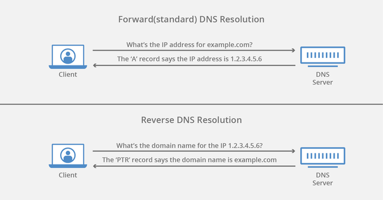
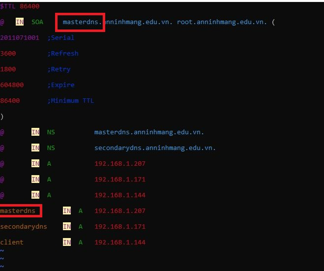

<h1 style="color:orange">Cài đặt DNS trên CentOS7</h1>

- Mục đích: biến 1 server thành local domain name server, các client khác sẽ sử dụng địa chỉ của local domian name server làm DNS.
<h2 style="color:orange">1. Chuẩn bị</h2>
Server DNS 1: 192.168.206.41/24 
Server DNS 2(dự phòng): 192.168.206.157/24 
Máy client: 192.168.206.94 
<h2 style="color:orange">2. Trên server DNS</h2>

1. Cài đặt gói bind

       # yum install bind bind-utils –y
2. Cấu hình file /etc/named.conf

       # vim /etc/named.conf
paste vào cấu hình 

    //
    // named.conf
    //
    // Provided by Red Hat bind package to configure the ISC BIND named(8) DNS
    // server as a caching only nameserver (as a localhost DNS resolver only).
    //
    // See /usr/share/doc/bind*/sample/ for example named configuration files.
    //

    options {
            listen-on port 53 { 127.0.0.1; 192.168.206.41;}; ### Master DNS IP ###
            #    listen-on-v6 port 53 { ::1; };
            directory     "/var/named";
            dump-file     "/var/named/data/cache_dump.db";
            statistics-file "/var/named/data/named_stats.txt";
            memstatistics-file "/var/named/data/named_mem_stats.txt";
            recursing-file  "/var/named/data/named.recursing";
            secroots-file   "/var/named/data/named.secroots";
            allow-query     { localhost; 192.168.206.0/24;}; ### IP Range ###
            allow-transfer{ localhost; 192.168.206.157;};   ### Slave DNS IP ###

            /*
             - If you are building an AUTHORITATIVE DNS server, do NOT enable recursion.
             - If you are building a RECURSIVE (caching) DNS server, you need to enable recursion.
             - If your recursive DNS server has a public IP address, you MUST enable access control to limit queries to your legitimate users. Failing to do so will cause your server to become part of large scale DNS amplification attacks. Implementing BCP38 within your network would greatly reduce such attack surface
            */
            recursion yes;
     
            dnssec-enable yes;
            dnssec-validation yes;

            /* Path to ISC DLV key */
            bindkeys-file "/etc/named.root.key";

            managed-keys-directory "/var/named/dynamic";

            pid-file "/run/named/named.pid";
            session-keyfile "/run/named/session.key";
    };

    logging {
            channel default_debug {
                    file "data/named.run";
                    severity dynamic;
            };
    };

    zone "." IN {
            type hint;
            file "named.ca";
    };

    zone "anninhmang.edu.vn" IN {
    type master;
    file "forward.anninhmang";
    allow-update { none; };
    };

    zone "206.168.192.in-addr.arpa" IN {
    type master;
    file "reverse.anninhmang";
    allow-update { none; };
    };

    include "/etc/named.rfc1912.zones";
    include "/etc/named.root.key";

<h3 style="color:orange">2.1. Forward DNS-Reverse DNS là gì?</h3>
 Quá trình gán các bản ghi DNS cụ thể cho một tên miền còn được gọi là "Chuyển tiếp DNS" (Forward DNS) - điều này giúp dẫn tên miền đến server đích chính xác. Tuy nhiên, cũng có một quá trình ngược lại, được gọi là "Reverse DNS".

 Hiểu đơn giản quá trình biến tên miền thành địa chỉ IP là Forward DNS

 

1. Tại sao bạn cần một thiết lập Reverse DNS cho DNS server? 

Nếu không cấu hình Reverse DNS cho tên miền, không cấu hình DNS Forward sẽ có nguy cơ rơi vào tình huống rắc rối với thiết lập Reverse DNS cho máy chủ của bạn.

Reverse DNS giúp đảm bảo rằng bạn sẽ không gặp phải bất kỳ vấn đề nào với hầu hết các hệ thống quản lý doanh nghiệp, lệnh r (r-commands), máy chủ SMTP hoặc hệ thống back up network của bạn. Reverse DNS là một trong những yêu cầu cơ bản để chạy một số giao thức Internet. Nó cũng được sử dụng như một bộ lọc thư rác để xác định xem địa chỉ IP của thư đến có khớp với tên miền đã được xác thực hay không và sẽ tiến hành chặn thư nếu nó không thỏa mãn tính xác thực trên.

2. Bạn có thể cấu hình Reverse DNS (rDNS) bằng cách xác định bản ghi PTR trong máy chủ DNS. Các bản ghi PTR được quản lý bởi thực thể kiểm soát địa chỉ IP được gán cho bạn. Nó có thể là máy chủ của bạn hoặc chính bạn, nếu máy chủ lưu trữ đã ủy nhiệm Reverse DNS cho IP space (có chứa một hoặc nhiều địa chỉ IP) cho bạn. Bản ghi PTR thường đại diện cho IP được nhập ngược, theo sau là một mục entry in-addr.arpa.

3. Ví dụ:

       host 66.40.65.49

49.65.40.66.in-addr.arpa domain name pointer www.ntchosting.com.

Các bản ghi DNS PTR đảo ngược (Reverse DNS PTR records) có thể được đặt cho cả địa chỉ IP IPv4 và IPv6. Khi tra cứu Reverse DNS được thực hiện cho địa chỉ IPv6, toàn bộ IP phải được chỉ định trong bản ghi PTR, với mỗi số hoặc chữ được phân cách bằng dấu chấm. Các số 0, thường bị bỏ qua trong địa chỉ IPv6, được hiển thị trong Reverse DNS Lookup.
4. Các công cụ tra cứu Reverse DNS giống như các công cụ DNS thông thường. Cách dễ nhất để kiểm tra các bản ghi Reverse DNS của domain là lệnh "nslookup".

<h3 style="color:orange">2.2. Cấu hình file Forward DNS</h3>

    # vi /var/named/forward.anninhmang
      
    $TTL 86400
    @   IN  SOA     masterdns.anninhmang.edu.vn. root.anninhmang.edu.vn. (
            2011071001  ;Serial
            3600        ;Refresh
            1800        ;Retry
            604800      ;Expire
            86400       ;Minimum TTL
    )
       
    @       IN  NS          masterdns.anninhmang.edu.vn.
    @       IN  NS          secondarydns.anninhmang.edu.vn.
    @       IN  A           192.168.206.41
    @       IN  A           192.168.206.157
    @       IN  A           192.168.206.94

     masterdns       IN  A   192.168.206.41
     secondarydns    IN  A   192.168.206.157
     client          IN  A   192.168.206.94
 
Lưu ý: chỗ được khoanh đỏ phải giống nhau
<h3 style="color:orange">2.3. Cấu hình file Reverse DNS</h3>

     # vi /var/named/reverse.anninhmang
     
     $TTL 86400
     @   IN  SOA     masterdns.anninhmang.edu.vn. root.anninhmang.edu.vn. (
             2011071001  ;Serial
             3600        ;Refresh
             1800        ;Retry
             604800      ;Expire
             86400       ;Minimum TTL
     )
     @        IN  NS          masterdns.anninhmang.edu.vn.
     @        IN  NS          secondarydns.anninhmang.edu.vn.
     @        IN  PTR         anninhmang.edu.vn.
     
     masterdns       IN  A   192.168.206.41
     secondarydns    IN  A   192.168.206.157
     client          IN  A   192.168.206.94
     1     IN  PTR         masterdns.anninhmang.edu.vn.
     2     IN  PTR         secondarydns.anninhmang.edu.vn.
     3     IN  PTR         client.anninhmang.edu.vn.
<h3 style="color:orange">2.4. Khởi động server</h3>

1. Khởi chạy DNS server
     
       # systemctl enable named
       # systemctl start named
2. Cấu hình firewall
       
       # firewall-cmd --permanent --add-port=53/tcp
       # firewall-cmd --permanent --add-port=53/udp
       # firewall-cmd –reload
3. Cấu hình SELinux, Permissions, Ownership:
 
       # chgrp named -R /var/named
       # chown -v root:named /etc/named.conf
       # restorecon -rv /var/named
       # restorecon /etc/named.conf
<h3 style="color:orange">2.5. Test</h3>

     # named-checkconf /etc/named.conf
Nếu dòng lệnh không có gì trả về, tức là bạn đã cấu hình đúng.
1. Check forward zone và reverse zone

       # named-checkzone anninhmang.edu.vn /var/named/forward.anninhmang
       # named-checkzone anninhmang.edu.vn /var/named/reverse.anninhmang
Kết quả trả về 

    zone anninhmang.edu.vn/IN: loaded serial 2011071001
    OK
<h3 style="color:orange">2.6. ADD DNS server vào cấu hình card mạng</h3>

1. 
    
     # vi /etc/sysconfig/network-scripts/ifcfg-enp0s3
Thêm dòng
    DNS="192.168.206.41"
Lưu ý:
- IP dùng phải là ip static chứ không phải dhcp
- Xóa các DNS khác như 1.1.1.1, 8.8.8.8,...
2. Vào edit file /etc/resolv.conf

       # vim /etc/resolv.conf
Thêm vào địa chỉ server

     nameserver 192.168.206.41
     :wq!
3. Restart lại dịch vụ

       # systemctl restart network
<h3 style="color:orange">2.7. Test DNS</h3>

    # dig masterdns.anninhmang.edu.vn
    # nslookup anninhmang.edu.vn
Kết quả trả về có dòng

    ;; SERVER: 192.168.206.41#53(192.168.206.41)
là thành công
<h2 style="color:orange">3. Trên secondary DNS</h2>

    # yum install bind bind-utils –y
Tương tự con DNS 1 cấu hình file /etc/named.conf tuy vậy thay đổi những dòng sau đây

    # vim /etc/named.conf

    options {
        listen-on port 53 { 127.0.0.1; 192.168.206.157;}; ### Master DNS IP ###
        #    listen-on-v6 port 53 { ::1; };
        directory     "/var/named";
        dump-file     "/var/named/data/cache_dump.db";
        statistics-file "/var/named/data/named_stats.txt";
        memstatistics-file "/var/named/data/named_mem_stats.txt";
        recursing-file  "/var/named/data/named.recursing";
        secroots-file   "/var/named/data/named.secroots";
        allow-query     { localhost; 192.168.206.0/24; };
    ...
    zone "." IN {
         type hint;
         file "named.ca";
    };
   
    zone "anninhmang.edu.vn" IN {
    type slave;
    file "slaves/anninhmang.fwd";
    masters { 192.168.206.41; };
    };

    zone "206.168.192.in-addr.arpa" IN {
    type slave;
    file "slaves/anninhmang.rev";
    masters { 192.168.206.41; };
    };

    include "/etc/named.rfc1912.zones";
    include "/etc/named.root.key";
Khởi động dịch vụ DNS:

    # systemctl enable named
    # systemctl start named
Bây giờ thì các vùng Forward và Reserve sẽ tự động đồng bộ từ DNS Master sang DNS Slave ở thư mục ‘/var/named/slaves/’:

    # ls /var/named/slaves/
Kết quả trả về sẽ được như sau :
    
    anninhmang.fwd  anninhmang.rev
Cấu hình Card mạng để thêm vào máy chủ DNS :

    # vim /etc/sysconfig/network-scripts/ifcfg-enp0s3
Thêm vào
    
    DNS1=192.168.206.41
    DNS2=192.168.206.157
Mở và chỉnh sửa file /etc/resolv.conf

    # vim /etc/resolv.conf
    nameserver      192.168.206.41
    nameserver      192.168.206.157
Cấu hình firewall

    # firewall-cmd --permanent --add-port=53/tcp
    # firewall-cmd --permanent --add-port=53/udp
    # firewall-cmd --reload
Cấu hình SELinux, Permission, Ownership :

    # chgrp named -R /var/named
    # chown -v root:named /etc/named.conf
    # restorecon -rv /var/named
    # restorecon /etc/named.conf
<h3 style="color:orange">3.1. Test DNS2</h3>
   
    # dig masterdns.anninhmang.edu.vn
    # dig secondarydns.anninhmang.edu.vn
    # nslookup anninhmang.edu.vn
Kết quả trả về

    ;; SERVER: 192.168.206.157#53(192.168.206.157)
là thành công
<h2 style="color:orange">4. Trên client DNS</h2>

    # vi /etc/resolv.conf
Thêm vào địa chỉ các DNS

    nameserver 192.168.206.41
    nameserver 192.168.206.157
    :wq!

    # systemctl restart network
<h2 style="color:orange">5. Ngoài ra còn có cấu hình external DNS (cấu hình cho địa chỉ public)</h2>

https://www.server-world.info/en/note?os=CentOS_8&p=dns&f=2